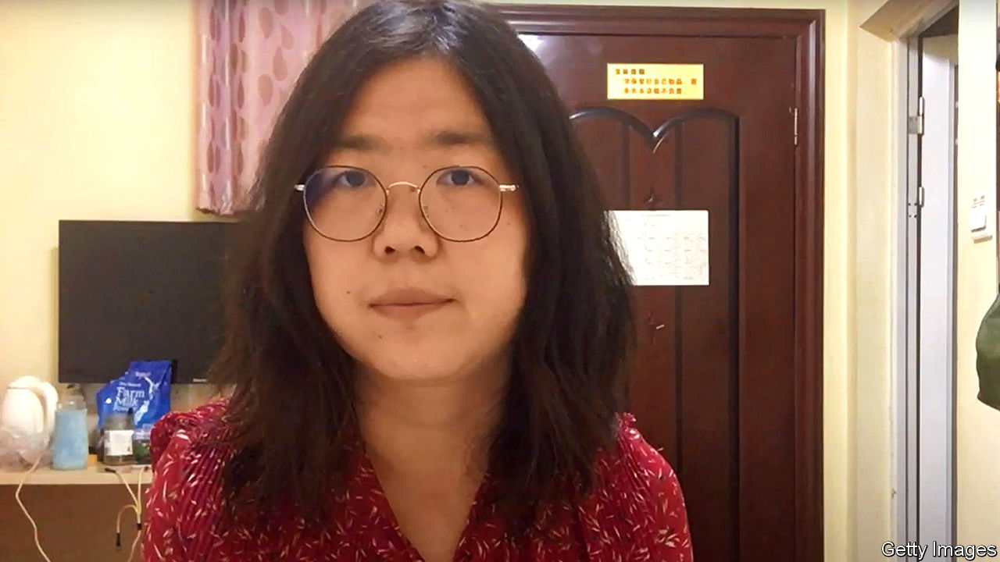

###### A witness silenced

# China jails a citizen journalist for vlogging about covid 

##### Zhang Zhan got a four-year sentence for her attempt to report independently from Wuhan 

 

> Jan 2nd 2021 


IN A VIDEO posted in February to YouTube, Zhang Zhan (pictured) insisted that people in China had the right to speak freely and monitor officials. She was reflecting on efforts by officials to silence those, like her, who had dared to report independently on the epidemic of covid-19 then engulfing the city of Wuhan. A court in Shanghai plainly disagrees. On December 28th it sentenced Ms Zhang, who has been on a prolonged hunger strike, to four years in prison for “picking quarrels and causing trouble”.


Editor’s note: Some of our covid-19 coverage is free for readers of The Economist Today, our daily . For more stories and our pandemic tracker, see our 

