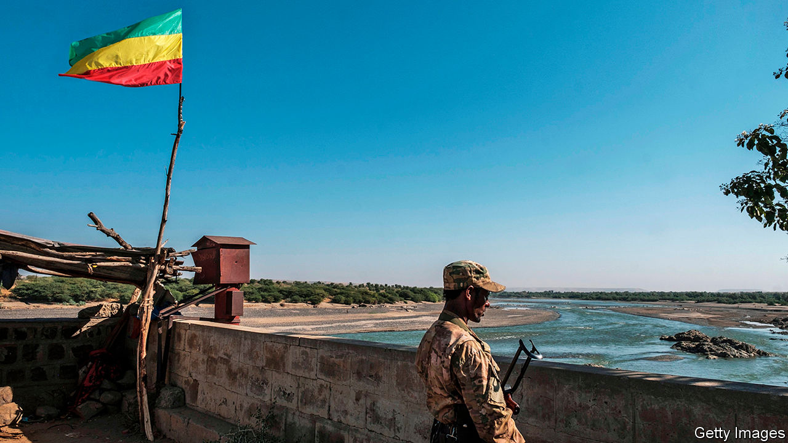

###### War in the Horn

# Evidence mounts that Eritrean forces are in Ethiopia 

##### Their presence will make it harder to bring peace to Tigray 

 

> Jan 2nd 2021 


FIRST COME muffled sobs, gradually growing louder with each new voice that joins the chorus. A woman in a black shawl begins to wail, her body rocking towards the portrait of a smiling young man in the middle of the room. Abraham was 35 years old when he was shot, says an older brother who is hosting mourning relatives on the outskirts of Addis Ababa, the Ethiopian capital. Last month armed men arrived at the family home in Adwa, a town in the northern region of Tigray. By then many of the town’s residents had fled, but not Abraham, who had a young child and a sick, ageing father. When the gunmen tried to steal two of the family’s trucks, Abraham resisted. He was shot dead on the spot, in front of his father.


According to his family, Abraham’s killers were from Eritrea, a neighbouring country whose troops have been fighting alongside Ethiopian government forces against the recently-ousted rulers of Tigray. There is little reason to doubt their claim. Although phone lines to Adwa have been cut since the fighting started in early November, they know what happened to Abraham from a family friend who met his father, as well as neighbours who escaped to Mekelle, the regional capital.


Abiy Ahmed, Ethiopia’s prime minister, has consistently denied enlisting the help of soldiers from Eritrea, the gulag state next door. But Abiy’s denials ring hollow in the face of a growing number of claims like those of Abraham’s family, as well as by foreign diplomats and governments. In December America said reports of Eritrea’s involvement were “credible” and urged it to withdraw. Belgian journalists who made a rare trip into Tigray found video footage apparently showing an Eritrean tank loaded with plunder.

 


Exposing Eritrea’s involvement matters because both governments have gone to such lengths to deny it. Abiy told António Guterres, the secretary-general of the UN, that no Eritrean soldiers had entered Ethiopia. His government says Tigray’s now-renegade ruling party, the Tigrayan People’s Liberation Front (TPLF), made fake Eritrean uniforms to spread misinformation. Eritrea’s foreign minister told Reuters that Eritrea was not a party to the conflict.


Others say that Eritrea’s involvement is not only real but highly significant. It won independence from Ethiopia in 1993. The two countries fought a bloody border war in the late 1990s followed by two decades of low-level conflict that ended with a peace deal in 2018 (for which Abiy won the Nobel peace prize in 2019). Much of the fighting was along Tigray’s border, leading to bitter enmity between Eritreans and the TPLF.


This bitterness may explain the destruction that Eritrean forces have left in their wake. They are accused of killing civilians, looting, laying waste to farmland and abducting some of the 100,000 Eritrean refugees who had fled their own totalitarian government and sought safety in camps in Tigray.


Using foreign troops to fight a war on his own soil besmirches Abiy’s reputation and will complicate efforts to pacify Tigray. “The government will never admit it,” says an Ethiopian analyst. “Because they know they could never justify it to the Tigrayans.”


Awet Tewelde Weldemichael, an Eritrean academic at Queen’s University in Canada, says that in recent weeks there seems to have been a phased withdrawal of Eritrean troops. If true, it might suggest Abiy has had enough of them. Or it might mean that Issaias Afwerki, Eritrea’s dictator, is confident that his old foes in the TPLF have been routed. Although fighting is reported to be continuing in several parts of Tigray, the TPLF leadership—thought to be holed up somewhere in the mountains—has been mostly silent for weeks. On December 18th the Ethiopian government offered a reward worth the equivalent of $260,000 for information on their whereabouts.


It is not just Eritrea that has a stake in Ethiopia’s civil war. Clashes between Sudanese forces and militias from Amhara, a region to the south of Tigray, have turned deadly in recent weeks. They are fighting over a large slice of fertile farmland that is within Sudan’s borders but long occupied by Amhara farmers. Shortly after the war began in Tigray, Sudanese troops moved into positions that had previously been held by the Ethiopian army. Since then each side has accused the other of upping the ante. On December 22nd Ethiopia’s deputy prime minister accused Sudanese forces of looting. Sudan’s information minister countered by accusing the Ethiopian army of taking part in border attacks. Talks and a visit to Addis Ababa in December by Abdalla Hamdok, Sudan’s prime minister, have failed to resolve the matter.


These tensions are unlikely to blow up into a full-scale war between the two states. But if the border conflict is not resolved, Sudan could prolong the fighting in Tigray by, for instance, turning a blind eye to arms and other supplies crossing the border. That would be a headache for Abiy, whose forces are already overstretched trying to locate the TPLF’s guerrilla forces while also battling armed insurgents and quelling inter-ethnic fighting elsewhere in the country.


On December 23rd more than 200 civilians, mostly Amharas, were massacred by heavily armed ethnic militiamen in the western region of Benishangul-Gumuz. Similar incidents have been reported in western Oromia in recent weeks. Ethnic Somalis and Afars in the country’s east are also trading deadly blows. Ethiopia, already a tinder box, risks igniting a wider conflagration across the Horn of Africa. ■

