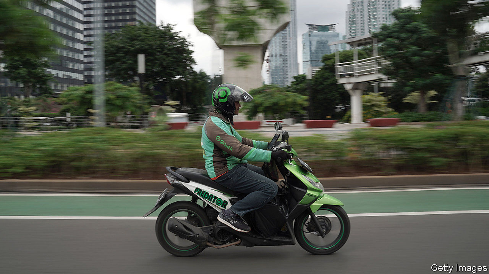
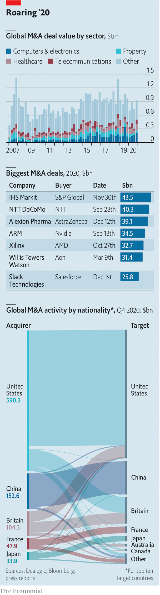

###### An M&A revival

# Corporate nuptials are back on 

##### The year got off to a scorching start with the announcement of two mega-deals in less than a week 

 

> Jan 9th 2021 


 


AFTER A pandemic lull, $900bn-worth of deals were announced in late 2020. This year got off to a hot start, with mgm Resorts’ $11bn bid for Entain, a British betting-shop operator, and a potential $18bn tie-up of Gojek and Tokopedia, two Indonesian tech darlings.■

