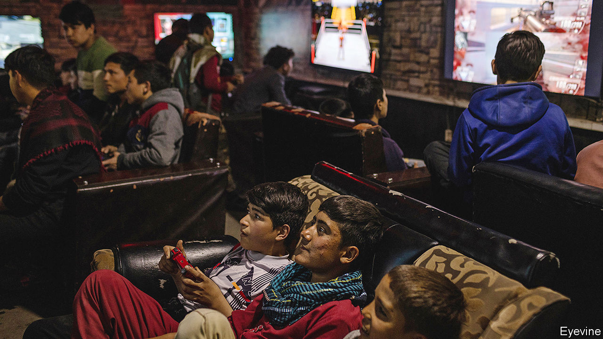

###### A war over Battlegrounds

# A popular video game sparks a moral panic in Afghanistan 

##### The telecoms regulator has banned an online shoot-’em-up for corrupting the youth 

 

> Jan 14th 2021 


IN A BASEMENT webcafé in Kabul, Kazem Rahimi directs a scurrying armed figure around his screen. Scouring his sunlit online world, he hunts for rivals to shoot, while chatting to fellow players on a headset. Just a few miles outside the city, genuine fighting of a similar sort is an everyday occurrence, as Taliban guerrillas battle the Afghan security forces. In Kabul itself, bombs and assassinations are common. Yet for Mr Rahimi, the game is a form of escapism. He enjoys the teamwork and it improves his English, he explains. Moreover, he is jobless, so has little else to do.


The game Mr Rahimi is playing, “PlayerUnknown’s Battlegrounds”, has been a global hit. It is mostly used as a smartphone app, not in dim underground gaming dens but in bedrooms and living rooms. It racked up worldwide sales of around $2bn in the first nine months of 2020.


But in Afghanistan the popularity of the game, known as PUBG (pronounced Pub-G), has caused a moral panic. Mobile-phone operators estimate that around 100,000 Afghans play it at once at peak times. Many also do so in the wee hours, when the internet is fastest. The game is thought to take up a huge chunk of national mobile-data traffic. The closure of schools and universities because of covid-19 seems to have supercharged its popularity.


Critics worry that it is further desensitising a generation already exposed to constant violence and is keeping young students from their studies. Freshta Karim, an educationist who runs a mobile library, says she cut the internet in her home to stop her nephews playing. “It looked so real, and for us, it looks more real because the war is going on,” she says.


The Ministry of Haj and Religious Affairs has piled in, declaring the game harmful to mental health and warning that it could create a violent mindset. On December 17th the telecoms regulator said it was banning the game, though it gave little indication of how it would enforce a ban or what the penalties for breaching one would be. It says it is discussing with telecoms firms how to put the ban into effect.


Mohammad Reza, a regular player sitting next to Mr Rahimi, is dismissive of the ban. “Is PUBG the real problem with Afghanistan?” he says, rolling his eyes. The country, he and his friends say, has far more serious troubles, and young people in particular face grave difficulties. Kabul has precious few parks or recreational facilities, and the risk of violence on the streets makes parents reluctant to let their children go out. While the intractability of the 40-year civil war makes the future lookgrim enough, the UN estimates that four in ten young Afghans are neither working nor studying. A dispiriting number think their only hope of a better life is to flee to Europe.


Zakria Ayubi, who runs a gaming den in Kabul, says PUBG offers a welcome distraction. One of his friends, an unemployed law graduate, plays through the night and sleeps all day. “He says, ‘I have looked for jobs and there’s nothing. What more can I do?’” The ban infuriates Mr Ayubi. “What has the government done for us? They try to ban PUBG, but can you see any services from the government for young people?” ■

