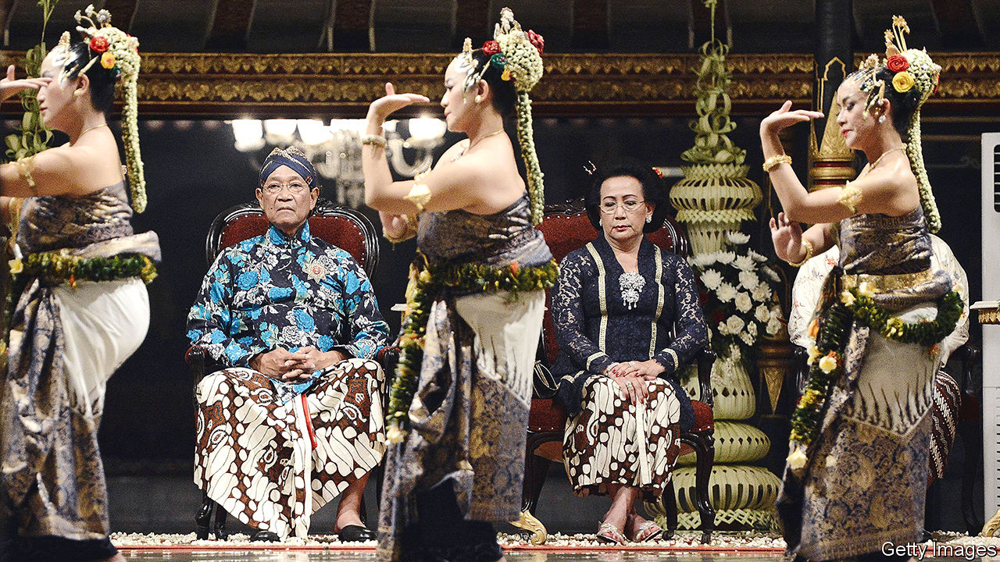
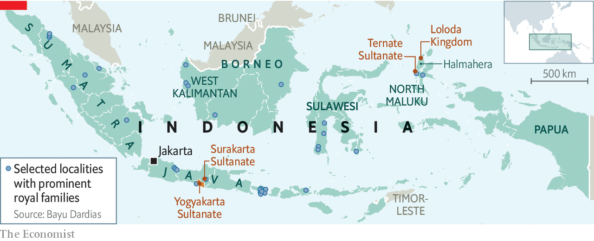

###### Strutting sultans

# Defunct royal families are making a comeback in Indonesia 

##### But their revived standing raises awkward questions 

 

> Jan 14th 2021 


SUAIB SYAMSUDIN SJAH recalls how uneasy he felt as his extended family began to chant on the fateful day. They had gathered by a sacred spring on a beach on the island of Halmahera to discover who among them would become kolano (king) of the Lolodans, a local ethnic group. Mr Suaib was worried that he would be chosen. As they recited a holy mantra, the spirit of Mr Suaib’s great-grandfather, the last king of Loloda, possessed an elderly relative, who put on the dead king’s robes and picked up his sceptre. He approached each eligible descendant in turn, passing over them until he arrived at Mr Suaib, to whom he did indeed give his ancestor’s blessing. 


Mr Suaib has been kolano of Loloda for four years now. The crown “is a burden for me”, he says. The job comes with many responsibilities but few perks. The stipend from the provincial government is not so generous that he can quit his day job, as a policeman. He works in a city six hours by boat from his kingdom. But his subjects would rather a “weekend sultan” than none at all. When the kolano visits, “there’s a euphoria that you can feel among the people,” says Ronal Tuandali, chief of the local council of a village in the kingdom. 


At least Mr Suaib has peers with whom to commiserate. For centuries the Indonesian archipelago was ruled by myriad Hindu rajas and Muslim sultans. By 1914 some 340 of these principalities had become protectorates within the Dutch East Indies. During the struggle for independence, many petty potentates were killed for collaborating with the Dutch, or fled. Later most had their land seized. By this century the few aristocrats who held on to their palaces had become glorified caretakers of “run-down tourist attractions”, writes Gerry van Klinken of the University of Queensland in Australia.


In 1998 Indonesia’s strongman of more than 30 years, Suharto, was overthrown. Like just over half of Indonesians, he was from the island of Java. To cement his control, he had suppressed local identities and crushed revered institutions elsewhere in the archipelago. After his fall, many communities began to revive old rituals and forms of governance, encapsulated by the word adat, or tradition. Ex-royals, embodying a sense of place, fitted perfectly into this revival, Mr van Klinken notes.


Some began dusting off their old regalia and reclaiming their prerogatives. Others had to be begged by their would-be subjects to move back into the boarded-up palace, or scarcely remembered their claim. (A local historian had to be enlisted to trace the descendants of the last king of Loloda, who died in 1915.) Bayu Dardias of Gadjah Mada University suspects there are well over 100 village rajahs across the country today. He counts 35 sultanates and kingdoms that are influential at district level or higher (see map). Most sultans have no formal role or rights, but many have political ambitions. At least four royals hold political office, including a provincial governor and two vice-governors. 

 


Changes in the structure of government after Suharto’s fall created incentives to revive sultanates. In 1999 parliament devolved much authority from the centre to localities, turning Indonesia into one of the world’s most decentralised countries, says Marcus Mietzner of Australian National University. The regions’ share of government spending rose rapidly, from 16% in 2000 to 50% in 2017, according to the World Bank. Politicians lobbied for provinces to be split into ever more administrative units, each entitled to its own slice of these riches. Between 1999 and 2013 more than 200 new districts were formed.


Politicians seeking local office quickly realised that the backing of a sultan would lend them prestige and legitimacy. Ethnic activists also saw value in having a sultan on side. Struggles between Malays and Dayaks, the two main local ethnicities, over control of newly autonomous districts in West Kalimantan province prompted Malays to revive three long-extinguished local sultanates, in the hope that these potentates would serve as symbols of their identity and cause.


Two lucky royals have even succeeded in reviving their kingdoms in a semi-formal sense. Hamengkubuwono X, the sultan of Yogyakarta, was elected governor of the “special administrative region” of the same name in 1998. In 2012 the national parliament, at his behest, decreed that he and the ruler of a neighbouring principality would be governor and deputy governor respectively for life, and that those posts would be passed on to their heirs.


Sultans often win praise for defending adat. Fadriah Suaib, an artist from Ternate, an island in North Maluku province, is willing to overlook the local royals’ occasional snobbery and abuse of their standing. “I still believe that having a sultan is very important,” she argues. “Continuing the tradition, cultures and customs and norms—it can only be done by the sultan.”


The royals’ peculiar status raises some awkward questions. In Yogyakarta, Mr Bayu writes, “The democratically elected parliament rarely criticises, let alone challenges, the sultan.” “The governor must be accountable,” declares Princess Wandansari, sister of the sultan of nearby Surakarta. “What if he makes a mistake? But how can a sultan go to prison?”


The authority sultans have accrued is in part a reflection of popular disillusionment with elected politicians. Take Loloda. Residents complain they have not been sufficiently compensated for land being mined for gold. Mr Ronal says they have repeatedly complained to the company concerned, and to the provincial government, to no avail. The experience has shaken Lolodans’ faith in the system, says L.G. Saraswati Putri of the University of Indonesia. They have turned to the kolano for help. He, in turn, has declared that the land in question belongs to his kingdom. ■

