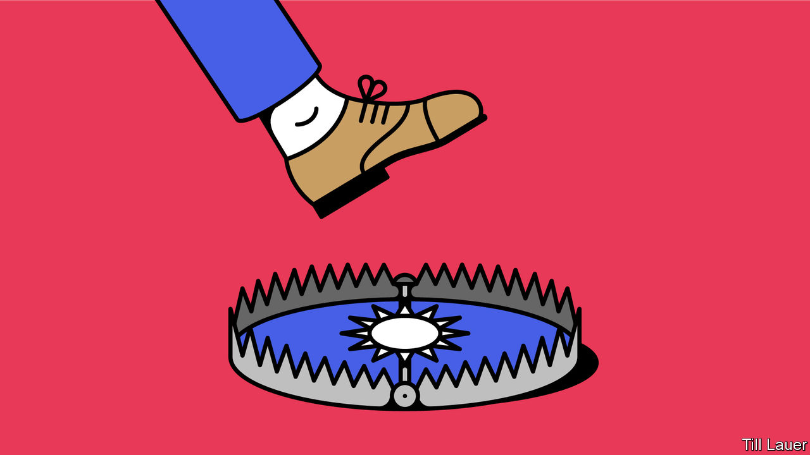

###### Banyan

# Have departing American officials made Taiwan into a booby trap? 

##### New rules on mutual ties could make trouble for both America and Taiwan 

 

> Jan 14th 2021 


TECHNICALLY SPEAKING, the United States has not had diplomatic relations with Taiwan since it initiated them with the People’s Republic of China, in 1979. But diplomats or no, America promises to maintain close economic and cultural ties and provide arms “of a defensive character”. It also reserves the right to come to Taiwan’s aid in the event of any coercion against the island nation (presumably by China, which threatens force to reclaim what it insists is part of the motherland). This much is laid out in the foundational text governing bilateral ties, the Taiwan Relations Act, passed by Congress the same year. But crucially, these links, close as they are, have all supposedly been “unofficial”.


That word is a figleaf, says Douglas Paal of the Carnegie Endowment for International Peace, who is a former head of America’s de facto embassy in Taipei. The leaf has grown over time and hides much that goes on so as not to give China unnecessary grounds for pique. A thicket of dialogues has sprouted between officials of the two countries, and the boundaries of the unofficial have been cautiously stretched. Only a decade ago were the Stars and Stripes first raised outside the American Institute in Taiwan (AIT), an embassy in all but name. (Taiwan even now refrains from flying its national flag outside its equivalent office in Washington.)


President Donald Trump’s administration seemed to want to tear the figleaf away. Mr Trump himself cares not a jot about Taiwan (though as president-elect he made waves by taking a congratulatory phone call from his Taiwanese counterpart, Tsai Ing-wen). Yet his administration housed appointees whose fervent support of democratic Taiwan is the flipside of their Manichaean view of the evils of China.


Poking China in the eye is part of the mission. Hence the easing of rules that prevented Taiwanese and American officials visiting one another’s offices. In 2019 the AIT’s director, Brent Christensen, held a press conference with Taiwan’s foreign minister, Joseph Wu, in his ministry. Last year Mr Christensen’s counterpart, Hsiao Bi-khim, made a well-publicised call on an assistant secretary of state, David Stilwell. In August the health secretary, Alex Azar, became the highest-ranking American official to visit Taiwan since 1979.


Nothing, however, tears at the figleaf as much as a brief statement on January 9th by the outgoing secretary of state, Mike Pompeo. In it, he declared all constraints on contacts between American and Taiwanese officials to be “null and void”. America had imposed such constraints to “appease the Communist regime in Beijing”, he said. “No more.”


Mr Stilwell has argued that the unshackling of constraints is the culmination of a considered review of a rag-tag set of protocols (many of which are unwritten). Yet Asia hands in Washington, both Republican and Democratic, say it is a booby trap for President-elect Joe Biden. Either he embraces the move, in which case he starts off on the wrong foot with China, or he gets flak at home for not standing up for gallant little Taiwan.


Worse, Evan Medeiros, a former head of policy on China and Taiwan for Barack Obama who is now at Georgetown University, sees Mr Pompeo’s move as a trap for Taiwan, too. Over the past few years China has increased its bullying of Taiwan with military posturing and diplomatic isolation. Crossing China now might prompt it to conduct even more air sorties or pick off Taiwan’s remaining diplomatic allies. If you really care about Taiwan, argues Mr Medeiros, you should not expose it to more military pressure.


That is a risk that many of Taiwan’s leaders seem happy to take. On social media Ms Hsiao and William Lai, the vice-president, have cheered Mr Pompeo’s declaration. In the past they flirted with the idea of Taiwan’s declaring itself formally independent from China—a move China threatens would lead to war. To advance the cause of independence there is “no briar patch they wouldn’t jump into”, one Asia hand observes.


By contrast, the president, Tsai Ing-wen, is more cautious. She has refrained from commenting on Mr Pompeo’s ruling. Not least, says her ally Wang Ting-yu, co-chairman of parliament’s foreign-affairs and national-defence committee, Taiwan should give Mr Biden room to complete the transition, which is also a sensitive time for President Xi Jinping of China. Taiwan does not want to be a “troublemaker”, Mr Wang says, but a reliable partner of America’s. One, in other words, that will don a figleaf when required.

