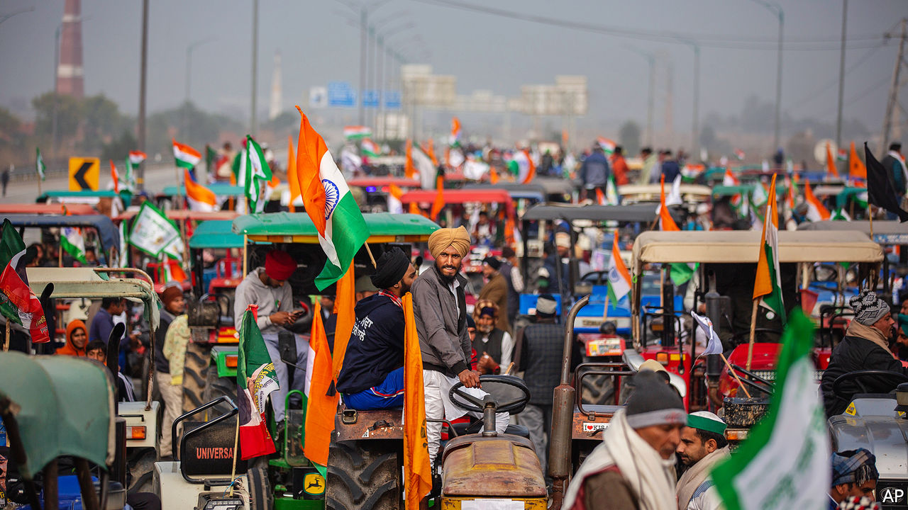

###### Ploughing on

# India’s Supreme Court suspends the government’s farm reforms 

##### But that does not seem to be enough to placate angry farmers 

 

> Jan 14th 2021 


THE STEAM and smoke that billow through the encampments that circle India’s capital are even thicker than the city’s wintertime smog. Hundreds of thousands of angry farmers descended on Delhi seven weeks ago. Stopped at the borders, they pitched tents, blocked traffic, sharpened slogans—and began to cook. Mobile generators power giant automated chapati-making machines. Vats of steaming mustard greens hiss at January’s chilly dampness. To mark Lohri, a regional festival, the protesters built the usual bonfires, throwing in copies of the three farm-reform acts that Narendra Modi, the prime minister, rushed through parliament in September. Their leaders say they will stay put until the three laws are revoked.


On January 12th they almost got their way. The Supreme Court issued an “extraordinary order of stay of implementation of the farm laws”. The chief justice, Sharad Arvind Bobde, is presenting the judiciary as an impartial mediator, but would clearly like the farmers to go home. “While we may not stifle a peaceful protest,” he said, he nonetheless hoped that the court’s order would be “perceived as an achievement” by the farmers and that their leaders would “convince their members to get back to their livelihood.”


The Supreme Court did not say how long the suspension would last, or what the legal justification for it was. Instead, it named a committee of four experts to ponder the worthiness of the laws. All four of its members, however, have already made statements in defence of the reforms.


The farmers welcomed the suspension, but said it was not enough to persuade them to disperse. They have vowed to drive their tractors into Delhi on January 26th, in a rival cavalcade to the annual Republic Day parade presided over by the prime minister. Mr Modi’s Bharatiya Janata Party (BJP) towers over national politics, having won a second term in government in 2019 with the biggest majority in 35 years. But whereas rival parties trouble it very little, protest movements like that of the farmers, or the people who demonstrated against discriminatory new rules on citizenship a year ago, are different. They are harder both to anticipate and to face down.


The cheery but determined faces in the camps have attracted sympathy from across the country, despite the complexity of the policies involved, and the relative wealth of the protesters, most of whom come from the states of Punjab and Haryana, where farmers’ incomes are more than twice the national average. Agronomists and economists are in nearly uniform agreement with the thrust of the new laws, which do away with restrictions on where and to whom farmers can sell their crops, and seek to make it easier to invest in storage and distribution, in particular. These new freedoms should benefit farmers in the long run.


But the protesters are worried that Mr Modi’s allies in big business will find a way to game the new system. They also fear that the changes presage the shrinking or scrapping of especially generous subsidies for those growing wheat and rice, the main crops in Haryana and Punjab, despite the government’s assurances to the contrary. The government has managed to inflame matters further by claiming, without any evidence, that many of the protesters are really Sikh separatists, working to undermine the state. BJP functionaries have been circulating old pictures of Sikhs waving secessionist placards, falsely asserting that they are part of the current protests.


The Supreme Court appears to be trying to help the government out of this impasse, by providing the farmers with a face-saving victory that may dampen the protests without necessarily undoing the reforms. It is not clear how soon its committee will report, whether it will recommend any changes and what weight its findings will carry. The government must hope that the protests in the meantime will lose momentum. It was recently saved from surprisingly big and persistent demonstrations against the citizenship law by the advent of covid-19. But the farmers, with their generators and communal kitchens, look ready for a long stay. Whatever the Supreme Court’s intention, its ruling has done little to clear the air. ■

