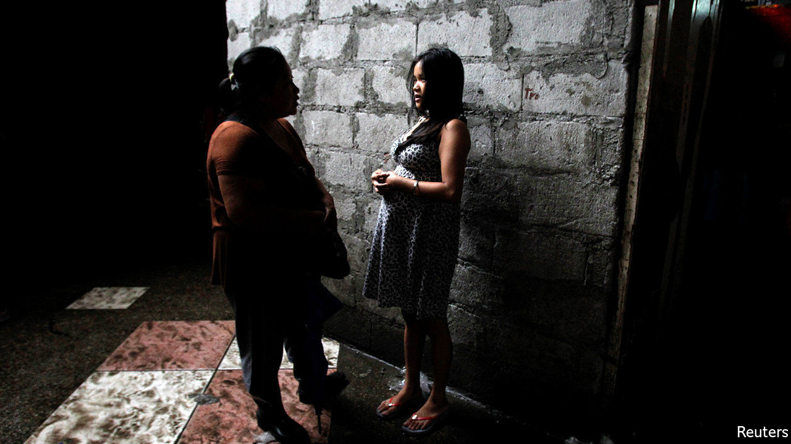
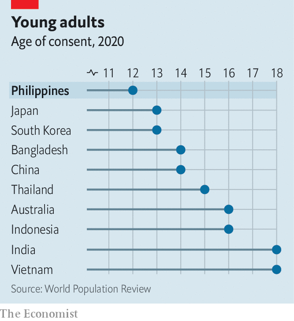

###### Predating pre-teens

# Sex with 12-year-olds is legal in the Philippines 

##### But a push to raise the age of consent is nearing fruition 

 

> Jan 14th 2021 


IT IS PERFECTLY legal in the Philippines—but almost nowhere else—for an adult to engage in consensual sex with a preteen. For as long as the country has had an age of sexual consent, it has been fixed at 12, among the lowest in the world (see chart).


The Philippines is a deeply religious, largely Catholic country. It remains the only place in the world, other than the Vatican, where divorce is illegal (except for Muslim Filipinos). The low age of consent is not a sign of sexual liberalism, but the reverse: it is a holdover from the patriarchal mores instilled by Spanish colonialists, who had little compunction about men marrying young girls.


Campaigners see a link between the age of consent and the many sexual horrors suffered by Filipino children. More rapes are committed against children than adult women. Roughly one child in five has experienced sexual abuse of some sort. The abuse of children for dissemination online has grown rapidly recently, especially during covid-related lockdowns last year.

 


Pressure groups for children have long campaigned to raise the age of consent, as a simple way to combat all this. It would mean that sex with young teens was illegal by definition, making rape much easier to prosecute. It would also spare children the trauma of cross-examination in a courtroom, the prospect of which discourages many victims from coming forward, says Alberto Muyot of Save the Children Philippines, a charity. And since parents or relatives often play a part in the sexual exploitation of children, it would allow the authorities to charge the perpetrators even when the victim did not want to.


After years of shilly-shallying, politicians are at last taking the idea seriously. In December the House of Representatives passed a bill raising the age of consent to 16, by a vote of 207-3. A similar bill is making its way through the Senate. The president, Rodrigo Duterte, who will also have to approve any reform, is not expected to object. He claims to have been abused by a priest as a child himself.


Congress had shrugged off previous attempts to raise the age of consent on the ground that the country already had laws to deal with sexual abuse. But the legislators leading the current effort, says Bernadette Madrid, who runs the Child Protection Unit at the Philippine General Hospital in Manila, have young children of their own. “It speaks to them emotionally, not only intellectually,” says Dr Madrid.


What is more, the internet seems to be exacerbating the problem. In 2014 some five in every 10,000 Filipino internet addresses were used for child sex abuse, according to International Justice Mission, a Christian charity. By 2017 that proportion had jumped to 69. An analysis of cases of possible online abuse referred to authorities abroad by American, British, Canadian and Nordic law-enforcement agencies between 2010 and 2017 found that the Philippines received nearly nine times as many referrals as the second-ranked country, Mexico, and 47 times as many as the next South-East Asian country, Thailand.


The factors that contribute to this state of affairs are normally seen as reasons to be optimistic about the Philippine economy. English is widely spoken, enabling easy communication with the outside world. Internet access is widespread and inexpensive. And the Philippines’ legions of migrant workers mean the country has an extensive network of payment and remittance services. Widespread poverty and a lack of opportunity outside the big cities, meanwhile, provide an incentive for online abuse.


Raising the age of consent is only the beginning, campaigners say. Passing the law will be relatively easy; changing people’s attitudes will be harder. Many parents still see corporal punishment as a good way to discipline children, even though it’s illegal, points out Isabelle Ereñeta of ChildFund, another charity. “These things take a really long time to change when it’s so deeply ingrained in our culture.” ■

