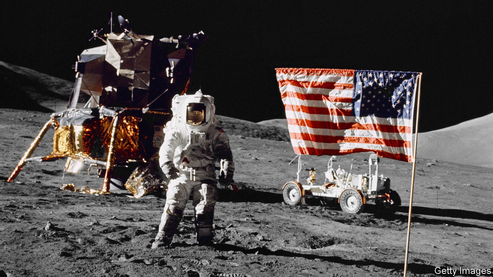

###### Fly me to the Moon

# Mariana Mazzucato wants to revive the Apollo spirit 

##### But is today’s America equipped for the effort recommended in “Mission Economy”? 

 

> Jan 16th 2021 


Mission Economy. By Mariana Mazzucato.Harper Business; 256 pages; $29.99. Allen Lane; £20.


IN JULY 1969 America launched three astronauts into space, landed two of them on the surface of the Moon and safely returned all three to Earth. A remarkable demonstration of American might, the achievement still dazzles more than half a century later; no country on Earth could replicate the feat today. The contrast with America’s bumbling response to covid-19 could scarcely be more glaring.


In “Mission Economy” Mariana Mazzucato argues that societies ought to abjure tired ideologies and embrace the policy approach that put astronauts on the Moon. By setting grand missions for themselves, she writes, and deploying the power of the state in practical ways, they can become more prosperous and equitable. It is an appealing idea, even if America has rarely looked less capable of purposeful collective action.


Ms Mazzucato is an Italian-born economist of a heterodox bent, whose work has long challenged standard economic thinking about the role of markets and government in generating innovation. Her best-known book, “The Entrepreneurial State” (published in 2013), argued that American technological prowess is owed in large part to the strong influence of the federal government, which funded and bore the risk of the initial development of many critical 20th-century technologies. Conventional economic wisdom remains a target in her latest work, too.


Scepticism among dismal scientists about government involvement in markets is based on faulty assumptions, she insists. Common complaints about state meddling—that governments are less efficient than private firms, cannot pick winners, and are staffed by self-interested bureaucrats concerned only with their own status—are belied by an impressive record of government successes: developing the foundation of the internet, for instance, or extending financial assistance to Tesla. Not every public investment pays off. But, in Ms Mazzucato’s view, neither is the record of privatisation of public assets and outsourcing of public tasks an unmitigated triumph. In America and Britain they have produced plenty of wealthy consultants, she says, but not a revolution in public-service efficiency or vast savings.


A rethink is thus overdue, the author urges—and the Apollo programme reveals many ways in which a capable state can create economic value. The sense of purpose and urgency that infused the programme in the 1960s motivated the government agencies involved to innovate, Ms Mazzucato writes, as well as to improve communication and weed out inefficiencies. Retaining important technological capabilities in-house enabled NASA to engage in a more sophisticated fashion with private contractors and monitor their progress better. It also helped the government retain talent, since working for the state could involve meaningful engineering work, not just banal paper-pushing.


And the programme’s technological demands—like the need for smaller, more powerful and more reliable computers than were available at its inception—put pressure on contractors to innovate. They did so, fearlessly, because the state shouldered much of the risk associated with moonshot technologies. The government’s demand for cutting-edge kit sowed the seeds of the computing age to come. The MIT Instrumentation Laboratory, tapped to develop guidance and navigation systems for the mission, swept up 60% of America’s output of integrated circuits at the peak of the Apollo effort. For its part, NASA helped shape the industrial ecosystem of America’s tech sector: to avoid becoming too dependent on any one contractor, it spread business around, implanting know-how across many firms.


These points are compelling. State projects can certainly go wrong, but there is no mistaking the vital role governments played in facilitating the development of rich economies. Conversely, the weakening of state capacity—to provide badly needed infrastructure and basic services, educate citizens, root out corruption, and so on—has hurt America’s dynamism and the welfare of its people. There is no shortage of daunting global problems in need of solving; Ms Mazzucato singles out the fight against climate change, campaigns to improve public health and efforts to narrow the digital divide.


Yet in the end it is hard to feel inspired by her book. America launched the Apollo programme at what may well have been the zenith of its state capacity. Not only was the government at its most capable, but state initiatives enjoyed maximum public legitimacy and confidence. That proficiency had been forged during decades of crisis: two world wars, a devastating depression and an existential superpower stand-off against the Soviet Union. The bipartisan consensus that supported a strong state shattered long ago; a new sense of national unity and purpose cannot be conjured out of thin air.


Arresting as Ms Mazzucato’s views on economic development are, her book does not really offer a route back to that purpose and cohesion. But that is what America needs most. Sadly, those goals look as remote and inaccessible as the Moon. ■

