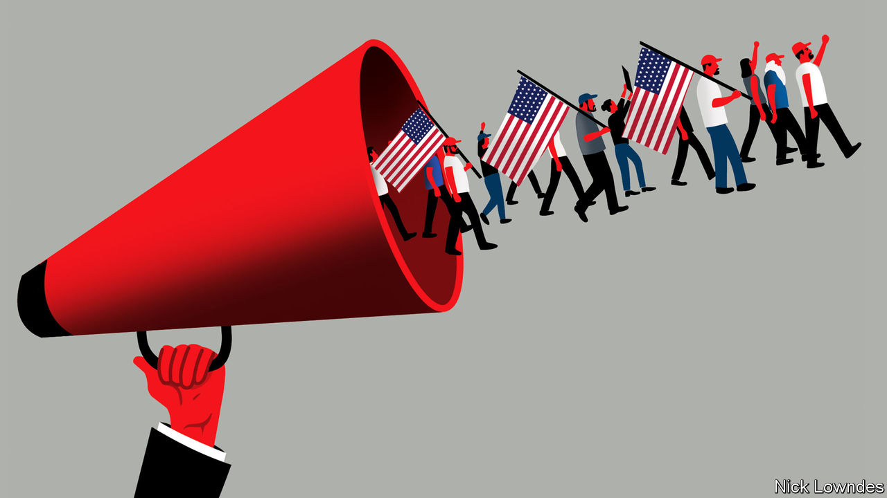

###### Johnson

# The language of incitement 

##### How to tell whether words can be held responsible for violence 

 

> Jan 14th 2021 


JOHNSON’S FIRST column after the election of Donald Trump in 2016 looked at “speech acts”, or what J.L. Austin, a philosopher, called “doing things with words”. Part of a president’s awesome power is that merely by opening his mouth he can set the official policy of the United States. Mr Trump, that column concluded, needed to learn to watch his words, given that they would soon constitute official acts.


He did not. Now he has been impeached for an offence grounded in speech: incitement of insurrection. On January 6th he delivered a tirade near the White House protesting that November’s election had been stolen from him. Soon the Capitol building at the other end of Pennsylvania Avenue, where legislators were certifying the vote, was ransacked by his audience. Five people died. Mr Trump’s accusers say he incited the violence, his defenders that he merely gave a typically barnstorming speech, and was not responsible for the mob.


Impeachment is a political process, not a criminal one, but the law offers some pointers for the neutral. To begin with, America’s First Amendment strongly protects speech—including much that would be illegal in other democracies. Incitement of hatred of races or religions, for example, is banned in many European countries—even though the thing being incited (hatred) is not itself a crime. American law does forbid “solicitation to commit a crime of violence”. But what that means in practice has been sharply circumscribed by the courts. Sometimes even actual calls for violence are protected.


The “solicitation” statute requires intent by the speaker that another person should commit a crime. In 1969 the Supreme Court added two further tests in Brandenburg v Ohio. It protected the right of a Ku Klux Klan leader to call for “revengeance” against African-Americans and Jews, finding that such calls were too abstract to be criminal. Such speech was bannable only if “directed to inciting or producing imminent lawless action” and “likely to incite or produce such action”.


Which of these three tests—the speaker’s intent, the imminence of a crime and its likelihood—are met in the case of the Capitol riot? Imminence, clearly: the mob was in the Capitol building within an hour of Mr Trump’s harangue. What he intended, though, is less starkly obvious.


The president used the word “fight” 20 times. But such words can be employed metaphorically—Mr Trump also referred to members of Congress who took his side in rejecting the election results as “warriors”. He never explicitly said “Ransack the Capitol”. The mob, in this defence, took matters into its own hands. Indeed, at one point Mr Trump said the crowd should “peacefully…make your voices heard”.


Yet a direct command is hardly required to persuade someone to do something. Paul Grice, like Austin a philosopher of language, noted that a tacit but virtually universal “co-operation principle” is observed between speakers and hearers. It involves a “maxim of quality” (be truthful) and a “maxim of relation” (do not waste an audience’s time). Expecting speakers to observe these conventions, hearers will try to interpret statements that seem to flout them in such a way that they still make sense.


What was the crowd thinking when Mr Trump said, “We must stop the steal”—and how was it likely to respond? Congress was hours from certifying Joe Biden’s win. Marching to the Capitol just to shout outside would stop nothing. Further guidance might have been found in Mr Trump’s assertion that “when you catch somebody in a fraud, you’re allowed to go by very different rules.” What rules? “You have to be strong,” he urged. “We fight like hell and if you don’t fight like hell, you’re not going to have a country any more.” The crowd—containing, as the president ought to have known, numerous avowed extremists—could assume either that his superabundant fighting talk was irrelevant, or that his single mention of peaceful protest was.


A luminary of classical liberalism, John Stuart Mill, defended speech that was hot-tempered even to a fault: “An opinion that corn-dealers are starvers of the poor…ought to be unmolested when simply circulated through the press,” Mill wrote. But such words “may justly incur punishment when delivered orally to an excited mob assembled before the house of a corn-dealer.” In that case, angry words are not merely words. Mr Trump surely knows how devoted his followers are. “Our president wants us here,” one said inside the Capitol. “We wait and take orders from our president.”

