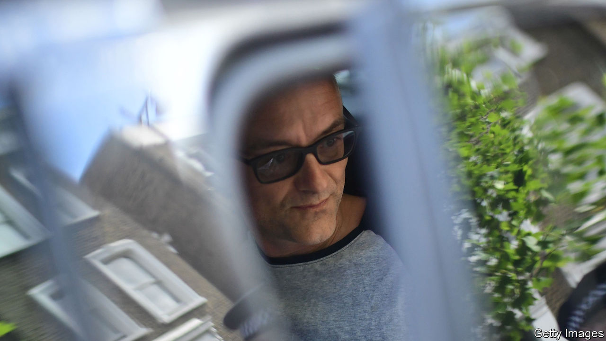

###### Government

# Britain’s civil service has weathered the Cummings revolution 

##### The blob won 

 

> Jan 14th 2021 


DOMINIC CUMMINGS was the Robespierre of the Brexit revolution. Toppling EU rule was just the start; he saved his reign of terror for what he regarded as the true enemy. The permanent civil service, in his view, was an “idea for the history books”, run by underskilled, risk-averse officials who thwart the plans of elected ministers. He wanted to replace them with specialists who would transform Whitehall into a dynamic machine.


During his tenure as Boris Johnson’s most senior aide, a slew of top civil servants were guillotined, among them Sir Mark Sedwill, the cabinet secretary, Sir Simon McDonald, the head of the foreign office, and Jonathan Slater, the permanent secretary at the Department for Education. Lurid briefings spouted from Downing Street: a “hard rain” would fall on Whitehall. Mr Cummings was said to keep a “shit list” of those he wanted out.


Mr Cummings met his Thermidor in November, and his reforms look less like creative destruction, more like idle vandalism. Some on his list have survived: Sir Tom Scholar, the permanent secretary of the Treasury, will have his contract extended when it comes up for renewal in July. Ousted mandarins have been replaced not by Silicon Valley whizzkids, but by a new generation of civil-service thoroughbreds: Simon Case, Sir Philip Barton, and Susan Acland-Hood. Ciaran Martin, the former head of the National Cyber Security Centre, a government agency, remarked that between the hostile rhetoric and the defenestrations, Mr Johnson’s government has thus far achieved “virtually nothing at all” by way of meaningful reform.


Along with the civil service, the media is one of the main constituents of “the blob” that revolutionaries fear swallows all attempts at radical reform. The planned war on the liberal media did not come to pass either. Charles Moore and Paul Dacre, former editors of right-wing newspapers, had been tipped to take charge of the BBC Trust and Ofcom respectively. Neither happened. The BBC job went to Richard Sharp, a former banker.


Substantive reforms are under way, but they are orthodox ideas—many promoted by the Institute for Government, the mandarins’ favourite think-tank—which will strengthen the permanent civil service. Michael Gove, the cabinet office minister, would like the government to train graduates better, slow the merry-go-round of civil servants between departments and end the practice of hiring management consultants to do the most interesting projects. There are plans to move 22,000 civil servants out of London. Doing so will save money, but the idea is hardly radical: prime ministers from Harold Wilson to Theresa May have been promising to decant Whitehall staff to Leeds, Manchester and Swansea, and sometimes even doing it.


Old faces are back. Francis Maude, who oversaw civil-service reform under David Cameron, is advising Mr Gove on how to improve functions such as human resources. On January 12th, the day before admitting that food parcels delivered to poor children by a contractor were unacceptably meagre, Mr Johnson announced that Sir Michael Barber will review the delivery of government services. Sir Michael ran Tony Blair’s Delivery Unit for five years. After the revolution, the restoration. ■

