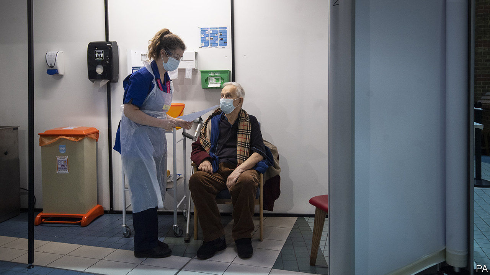
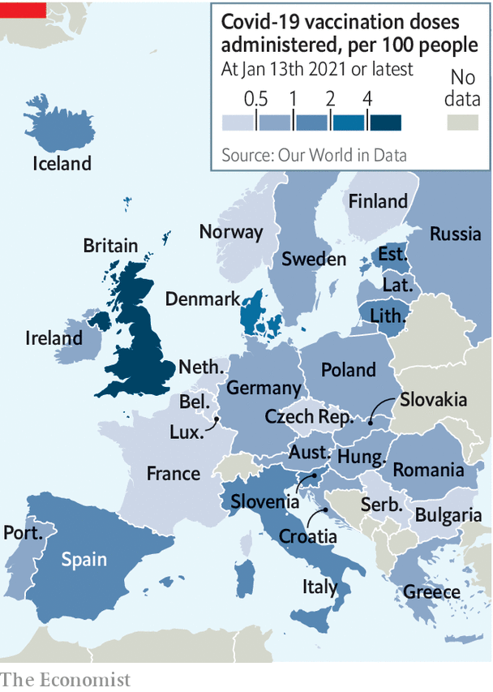

###### Quick jabs

# Britain’s vaccine roll-out gets off to a fast start 

##### Now it must accelerate to meet the government’s target 

 

> Jan 16th 2021 


WHEN IT COMES to the race to get out the covid-19 vaccine, there is Israel, which has given out 23 doses for every 100 people, and then there is everywhere else. In second and third place, some way behind, sit the United Arab Emirates and Bahrain, which are relying on a jab without published data from late-stage trials (see ). Next is Britain, the speediest big country.


British medics were quick off the mark with early approvals for the Pfizer-BioNTech and AstraZeneca-Oxford University vaccines, and the roll-out has recently sped up. On January 6th, 1.3m doses had been delivered. A week later, 3.1m had, a number equivalent to 4.5 doses per 100 people. Denmark, Britain’s nearest rival in Europe, has done 2.


Though fast, the pace still needs to accelerate further to meet the government’s target of offering everyone in a big group—which includes people over the age of 70 and front-line health- and social-care workers—a jab by the middle of February. To meet it, around 2.5m doses will have to go out each week. Ministers promise they will.

 


The roll-out is not without flaws. The government has provided little information on, for instance, who exactly has received jabs, although more is promised soon. Care-home vaccinations seem to be getting done more slowly than in other countries that got off to a quick start. And observers have raised concerns about the lack of ventilation in mass-vaccination centres, in which elderly and vulnerable people congregate.


These are serious problems. They are also ones most of Europe would love to have—which is not a position Britain has been in for most of the pandemic.


Editor’s note: Some of our covid-19 coverage is free for readers of The Economist Today, our daily . For more stories and our pandemic tracker, see our 

