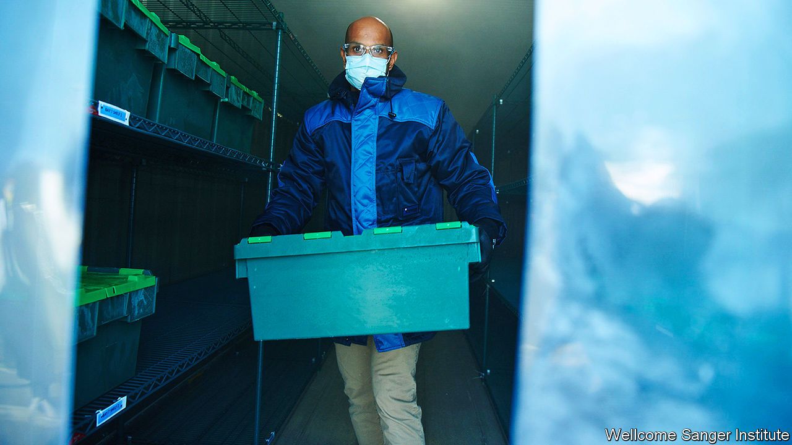

###### Genomics

# How Britain has done so much sequencing of the covid-19 genome 

##### An unusual sequence of events 

 

> Jan 16th 2021 


WHEN A NEW, more transmissible variant of the genome of SARS-CoV-2, the virus which causes covid-19, was identified in Britain in December, the discovery seemed to underline how badly the pandemic had hit the country. But a happier interpretation was also available: that the discovery had been made because of Britain’s impressive performance at sequencing the virus’s genome. With further mutations almost inevitable, that capacity is going to be at the forefront of the fight to suppress the pandemic.


This work is being undertaken because of a phone call on March 4th between Sharon Peacock, a professor at Cambridge University, and five other experts in the sequencing of pathogen genes. It was obvious to infectious-disease experts that covid was set to spread fast in Britain, even though only 84 cases were known of by then. Sequencing the genome of the virus that was causing covid-19 could help the public-health response by showing the geographical distribution of different variants, how those variants were changing over time thanks to natural selection and where new mutations were popping up.


Ms Peacock now heads Covid-19 Genomics UK Consortium (COG-UK), which resulted from that phone call. It is a collaborative effort between scientists which monitors the virus by regularly sequencing its genome, using samples collected from covid patients across Britain. To date, it has sequenced almost as many SARS-CoV-2 genomes as the rest of the world combined.


By March 15th the fledgling consortium had dropped a request on the desk of Sir Patrick Vallance, the government’s chief scientific adviser, for funding to speed up their sequencing effort. Three days later they had £20m of government money, pulled from the covid-19 “fight” fund established in early March. COG-UK’s membership is a Who’s Who of Britain’s top-rank medical institutions, comprising some 300 individual researchers. Unlike much of the rest of British health care, COG-UK’s partners work together and share data and systems across the devolved nations. All the genomes they sequence are published freely online, so that public-health systems worldwide can compare notes.


The consortium has worked quickly. COG-UK had already sequenced 280 genomes by the time its funding arrived. As of January 13th it had sequenced 190,352, about ten times more than the next-best sequencers, Australia and Denmark. In early December the consortium spotted a new variant of the virus spreading in Kent.


Whether the mutations that led to the new variant occurred in Britain is not known. Nor does it much matter. Spotting it early does. The broader search-beam provided by COG-UK, the world’s broadest by far, meant that Britain was the first to spot and react to it.


Ms Peacock identifies two related factors which gave Britain the ability to build that broader beam quickly. The scientific community in Britain has been at the cutting edge of genomic sequencing for some time. Back in 2013 the government gave tens of millions of pounds to genome sequencers focusing on infectious diseases. Ms Peacock was one of them. That meant that the disease-sequencers had the right political connections to get their project moving fast.


It also meant that COG-UK’s member institutions already had sequencing infrastructure in place when covid hit. Unlike the microbiology labs needed to test for the disease en masse, which the government had wound down over 20 years, COG-UK’s members had labs full of sequencing machines. About 70% of its sequencing has been done in one place, the Wellcome-Sanger laboratory near Cambridge, says Ms Peacock. This non-profit is named after Fred Sanger, a British biochemist who won two Nobel prizes—one for the fundamental advances in genomic sequencing that underpin the institute’s efforts.


Ms Peacock expects to find more mutations. “We’re going to see real complexity as more mutations accumulate in different combinations,” she says. That may well be bad news for the virus’ human hosts and the societies they comprise. But at least now, through COG, the world has a better chance of seeing that bad news coming.■


Editor’s note: Some of our covid-19 coverage is free for readers of The Economist Today, our daily . For more stories and our pandemic tracker, see our .

