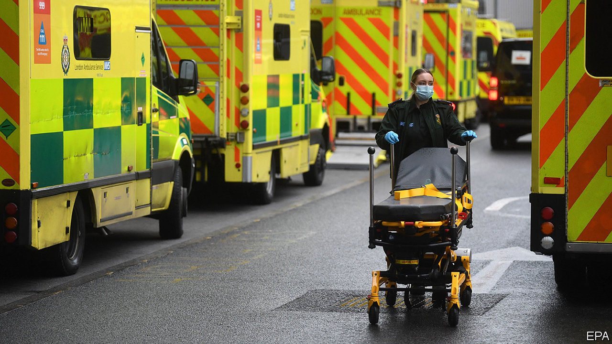

###### Long covid

# How the pressure is being felt in English hospitals 

##### Every day, medics are forced to take more risks 

 

> Jan 16th 2021 


TO THOSE WHO receive them, vaccines offer fast protection, with effects kicking in just a few weeks afterwards. For health-care systems, though, the protection takes a little longer—as those working in English hospitals are now acutely aware.


In all 32,689 National Health Service beds are currently occupied by people with covid-19, 50% more than in last year’s peak. Modelling by the Covid-19 Actuaries Response Group suggests that because of the slow start to the roll-out, even if everything goes to plan, hospital admissions will not decline sharply until early February.


Intensive-care admissions will take still longer. The government has jabbed the oldest first. Yet the elderly tend not to end up in intensive-care units, because they don’t do well on ventilators (the average age of covid-19 patients on critical-care wards is a sprightly 60). Thus the actuaries think intensive-care admissions won’t drop much until the end of February.


The modelling is based on the assumption that cases will remain at current levels. That is not too far off what many in the health service are now expecting. Growth in cases seems to have halted, but the lockdown may not force a fast decline in infections, because of the increased transmissibility of the new variant.


The result will be a period of sustained pressure on hospitals. London’s and the south-east’s have so far borne the brunt of this wave. Chris Hopson, chief executive of NHS Providers, a representative group, says he is worried about those in the north-west, which have patients in beds from the autumn, and the south-west, which has low capacity.


Politicians talk of the need to avoid “collapse”, implying a binary outcome where hospitals suddenly go from being able to provide care, to not. In reality there is a gradual ratcheting up of risk well in advance of such a moment. “It’s really important that nobody in the NHS should pretend that you will get the same quality of care or the same outcomes,” says Mr Hopson.


This can be seen in oxygen supplies. Since the first wave there has been a move to less-invasive breathing support, which requires lots of oxygen (as much as 60 litres a minute, compared with 15 for a ventilator). Piping—particularly in older institutions—is struggling, meaning some hospitals have reduced blood-oxygen targets to prevent systems from giving out. William Harrop-Griffiths of the Royal College of Anaesthetists says this is safe in itself, but leaves little wiggle room if, say, there is an interruption in the gas supply or if the patient’s lung function deteriorates.


It is a similar story in other areas of care. Some 6% of London’s ambulances are now delayed for longer than an hour, more than double the rate this time last year. Patient-to-staff ratios in critical care are rising, with reports suggesting three or four intensive-care patients to each specialist nurse in some places. That is lower than during the worst of the first wave, but well above the normal one-to-one ratio.


Efforts to free up capacity are getting increasingly unpleasant; ranging, in the capital, from booking hotel rooms for recuperating patients to cancelling cancer operations. The hope is that this will stop critical-care capacity being breached. Whether it works is still in the balance. Yet even if it does, it will come at a cost. ■


Editor’s note: Some of our covid-19 coverage is free for readers of The Economist Today, our daily . For more stories and our pandemic tracker, see our 

