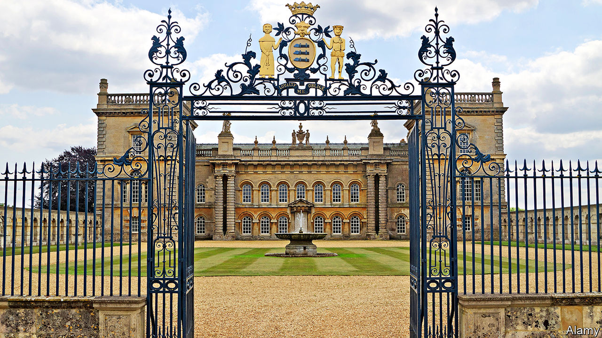

###### Art

# Private art collectors are building public galleries 

##### Wall power 

 

> Jan 16th 2021 


AFTER CLEANING up thanks to his invention of bagless vacuum cleaners, Sir James Dyson, one of Britain’s richest men, is planning a more glamorous legacy for himself. Last summer he and his wife Deirdre, who both studied art, applied for permission to build an exhibition space at Dodington Park, their Gloucestershire estate, to show their collection of pop art that includes Andy Warhol, Roy Lichtenstein, Yves Klein and David Hockney. The gallery will be open to the public, free of charge, for a month each year.


The Dysons are reviving a practice that used to be common. The National Gallery in London started in a town house in Pall Mall in 1824, when 38 old masters that had belonged to John Julius Angerstein, a Russian-born émigré banker, were put on show. The Walker and Lady Lever galleries were based on the collections of Liverpool businessmen, the Burrell Collection on a gift by a Glasgow shipping magnate, and the National Museum of Wales on the generosity of the two Davies sisters, Gwendoline and Margaret, who had collected fabulous impressionist paintings. But war and taxes took the stuffing out of artistic philanthropy, and the tradition faded.


In the art-market boom that began in the 1980s, galleries that were shopfronts for trading in art, such as Charles Saatchi’s, flourished. In 2014, Hauser &amp; Wirth (H&amp;W), a Swiss art dealer with global ambitions, opened a rural outpost in Somerset, its sixth gallery on two continents, proving that contemporary art was not just a metropolitan affair. The move put the small town of Bruton on the art-lovers’ map; it has become so popular that H&amp;W now charges as much as £1,375 ($1,875) a night for a double bedroom in the nearby farmhouse it has turned into a small hotel. But the revival of private galleries established for the public good in Britain is recent.


In this, Britain is behind the curve, according to the Global Private Museum Network. The J. Paul Getty Museum in Los Angeles has long been a model for wealthy Americans, and over the past couple of decades, rich Germans have taken to it. Karen and Christian Boros, for instance, have turned a massive (and massively ugly) Nazi-era air-raid shelter into a private-home-cum-public-gallery in central Berlin. The Chinese are doing it too, though often in order to boost the value of property developments.


Britain may start to catch up. Charles Saumarez Smith, a former chief executive of the Royal Academy, reckons that country-house owners are keener on collecting contemporary art these days, but the good taste and benevolence of the rich are not entirely responsible. Planners are more likely to grant permission for grand buildings if the public is given access.


In addition to the Dysons, Cate Blanchett, an Australian actress living in Britain, has recently been given permission to build a gallery in the grounds of her house in East Sussex to replace a dilapidated oast house. Nouveaux riches are not the only benefactors. Jane Heathcote-Drummond-Willoughby, 28th Baroness Willoughby de Eresby, has got permission to build a new exhibition space at Grimsthorpe Castle, her family’s home since the 16th century. The 86-year-old grand-daughter of Nancy Astor has accumulated a fantastic collection, which includes paintings by Lucian Freud, her lover until his death in 2011. The Lincolnshire flatlands over which her castle looms are rich in cabbages but not in culture, so her plan to seed them with art will no doubt be welcome.■

