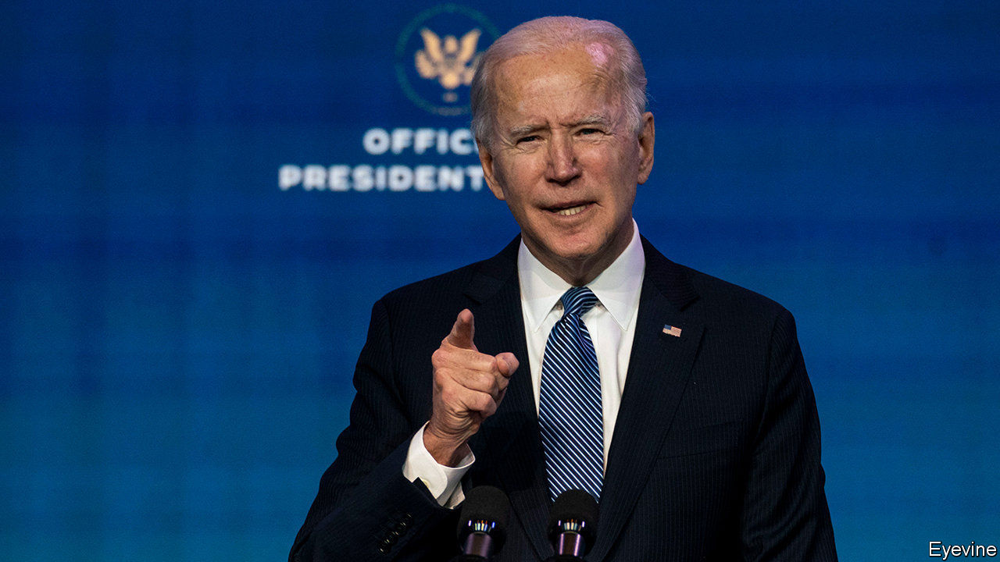
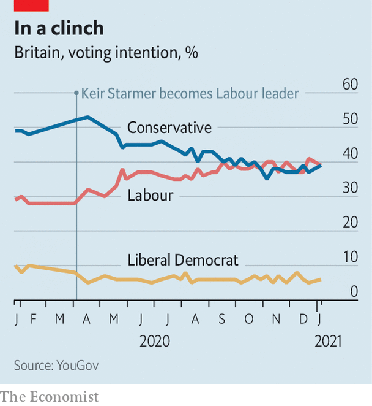

###### Politics

# What the Labour Party is learning from Joe Biden 

##### How to manage a divided left 

 

> Jan 14th 2021 


THE LABOUR PARTY has long spied the future through a telescope across the Atlantic. New Labour was entranced by Bill Clinton’s New Democrats. Ed Miliband was a keen student of Barack Obama’s campaign. Jeremy Corbyn and Bernie Sanders were mutual admirers. American politics is more exciting than Europe’s these days, which is why Labour wonks can recite with greater ease the names of Democratic senators than the prime ministers of Europe, and their shelves heave with Robert Caro biographies and West Wing DVDs.


Yet the echoes of America in British politics are faint. British partisanship is less vociferous than America’s, and its cultural and racial rifts shallower. Although Boris Johnson is embarrassed by his dabbling with Trumpism (see ), he did not suggest bleach as a treatment for covid-19, nor incite an insurrection.


The most striking similarity is between the bind the Democrats found themselves in following the defeat of Hillary Clinton in 2016 and the crisis Labour faces after Jeremy Corbyn’s defeats in 2017 and 2019. Both saw their electorates split: their younger, more diverse, city-dwelling voters stayed loyal, while older, whiter voters in industrial towns drifted away. Labour’s woes in the so-called red wall were mirrored in Mrs Clinton’s loss of the rustbelt states of Wisconsin, Michigan and Pennsylvania. The centrist Mr Biden’s success validates Labour’s decision to replace the radical Mr Corbyn with the moderate Sir Keir Starmer.


Sir Keir initially made big advances against the Tories, but insiders fret that he hasn’t opened up a clear lead despite the pandemic (see chart). His party is therefore keen for advice. Lisa Nandy, the shadow foreign secretary, is leading the outreach to the incoming administration.

 


Sir Keir’s circle sees the insecurity of lower-middle-class families, who “feel the world is spinning out of control”, as the root of Britain’s volatile politics. Mr Biden promised such voters “jobs, dignity, respect and community”. A key insight from Team Biden is that people who once voted for revolutionary change in the form of Donald Trump now hanker for stability. Like Mr Biden, Sir Keir has styled himself as a safe pair of hands, and a defender of the rule of law and Britain’s standing in the world. (Mr Biden’s slogan, “No Malarkey”, rather suits managerial Sir Keir.)


A speech by Sir Keir about “family first” policies reflected advice from John Anzalone, Mr Biden’s pollster, on how to win back working-class voters: faced with a rhetorician like Mr Johnson, a leader’s personal values carry more weight than eye-catching policies. Sir Keir’s speeches are heavy on moralism and light on plans. He now sits in front of a union flag for television interviews, and speaks of his admiration of the queen, the troops and the doggedness of the British people. (The elder-statesman routine is easier for Mr Biden, 78, who took his seat in the Senate around the time the Labour leader was sitting his 11-plus exam.) Sir Keir, like the president-elect, plays up his humble background. “My dad was a toolmaker; he spent his whole life on the factory floor,” he declared on January 11th.


There are also lessons in how Mr Biden navigated the issues of identity politics—trans rights, the Black Lives Matter movement—which span the Atlantic. As with the Democrats, such issues motivate party members, but can be met with indifference or suspicion by voters, especially older ones. Mr Biden’s solution was to embrace a socially-liberal agenda, couched in the language of love and respect, while being careful not to rebuke voters who weren’t on board, says Marcus Roberts, a pollster at YouGov who has worked for the Democrats and Labour.


Mr Biden’s campaign provides warnings too. Despite his ravings and his cataclysmic response to the pandemic, Mr Trump received 74m votes, 11m more than in 2016 and the highest cast for any presidential candidate bar Mr Biden. He increased his share among non-white voters, and remains dominant among men without a college education. Mr Johnson could equally advance in the red wall in 2024. Ejecting a prime minister with a majority of 87 is no easier than ousting a president after a single term. Mr Biden provides inspiration, but little comfort. ■

