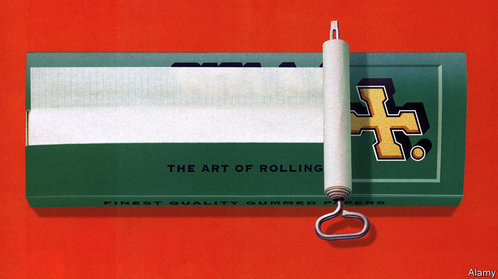

###### Rolling in it

# Branding lessons from Rizla 

##### How to become a household name 

 

> Jan 16th 2021 


IT IS HARD to imagine a simpler product than a cigarette paper: small, rectangular, with no moving parts. So cheap it is often given away. And replaceable; desperate smokers have been known to tear out Bible pages as substitutes. It has none of cigarettes’ glamour (though, these days, some of their stigma). No wonder Rizla, which produces 45bn rolling-papers a year and dominates the industry, attracts little attention as a marketing phenomenon. Yet it is one of a few brands, like Coca-Cola, Google, Jacuzzi or Tupperware, whose name (“Got a Rizla?”) defines the product.


That is because a simple packet of Rizlas exhibits many of the qualities—history, design, consistent quality and values—that marketing gurus consider hallmarks of enduring brands. Flip open the cover and you find a lesson in how to remain relevant. Aptly for a business long associated with the counterculture, the tutorial is a wry summary of the dark arts of marketing. 


Start with history. Long ago Rizla may have realised that if you lack an illustrious heritage, you could invent one. “The Original...since 1796”, as the underside of its packets’ lids still boasts, refers to a time when Napoleon Bonaparte supposedly granted the Lacroix family of south-western France a licence to supply rolling papers to French troops, according to Rizla’s website. This may well be nonsense. A museum in Angoulème, the Lacroix ancestral seat, calls this historical “fantasy” and says that until 1860 the family manufactured paper but not for cigarettes. Its history of the clan says it was not until 1867 that Léonide Lacroix created the brand. A spokesman for Imperial Brands, which owns Rizla, says the story is widely recognised to have been told through the generations. “It’s a heritage we inherited when we acquired the Rizla brand in the 1990s,” he says. The discrepancy notwithstanding, Napoleon is now part of Rizla folklore.


Or take design. Rizla’s name and its cross logo are cryptic clues, which also date back to the 19th century. Riz is French for rice, as in the paper. La is the first syllable of Lacroix. The second, croix, is French for cross—and symbolised by a gold one appended to the name. For Rizla fans the logo is iconic. A former marketing executive recalls emblazoning it on the heel of wellies that the company distributed at music festivals, so that the imprint would stand out in the mud. Rizla does not advertise to its customers that they can use its papers to smoke marijuana as well as tobacco; that would break the law in many countries. But it doesn’t have to: pot-heads do it themselves, by plumping for its king-size papers (which the company insists are only produced to emulate ultra-long cigarettes).


Consistent quality is another trait, and a must to ensure that the claim on the packet—“Keep Rolling with the World’s No. 1”—remains true. Being owned by Imperial, a global tobacco giant valued at £15.5bn ($21bn), helps. Rizla is a sleek industrial machine, producing almost all of its papers at a big factory in Wilrijk, a suburb of Antwerp in Belgium. Reels of paper, now made of wood pulp rather than rice, are layered with gum, cut into strips, packaged and shipped to about 100 countries. It is highly automated. Ties to Imperial, owner of Golden Virginia tobacco used for rolling, offer a structural advantage that rivals lack.


The trick is to tap its parent’s deep pockets while promoting values that appeal to roll-your-own smokers who like to think of themselves as individualistic iconoclasts. One is attention to detail, which users obsess over. The papers come in six thicknesses, from 12.5 grams per square metre (in silver packets) to 26.5g/m (liquorice).


The second value, irreverence, is more ephemeral. Brice Barberon, who took over as Rizla’s boss in March, speaks of the “tribal element” to rolling your own cigarette. “The kind of blend you will choose, the kind of paper, the way you roll it, how much tobacco you put in, there is a kind of ritual in it that our consumers like...that brings people together.” Brits favour green packets (17.5g/m). The Dutch, orange (20g/m). The French, Micron (12.5g/m).


Tribes share a lingo, musical tastes, pastimes, memes, clothing and a sense of humour. That is a great way to reach them. A former executive says that Rizla once used models dressed as border guards with high heels and handcuffs as part of a “show me your papers” campaign. With that comes the most effective, and cheapest, form of marketing—word of mouth.

Going from paper to digital


For all its guile, Rizla faces challenges ahead, notably the rise of upstarts that use less subtle social-media campaigns to build a new kind of cult following, especially among pot-smokers. They include Raw, started by Josh Kesselman, a shaggy-haired American entrepreneur who instructs his 1.7m followers on Instagram how to roll the perfect joint (“if you pack it too tight, it can’t run right”).


Vaping presents another problem. Though smokers are trading down to roll-your-own cigarettes during the pandemic, sales growth in the longer term is expected to weaken. Rizla is diversifying. Coinciding with the European Union’s ban on menthol cigarettes, it now sells “flavour cards” that infuse a packet of cigarettes with the taste of menthol within 60 minutes. 


The biggest risk, though, may be thinking it must change too much. It has a market position to protect, but also a heritage. This may not quite date back to 1796 but is, these days, real enough. Rizla’s competitors can, at best, hope to fake it. ■

