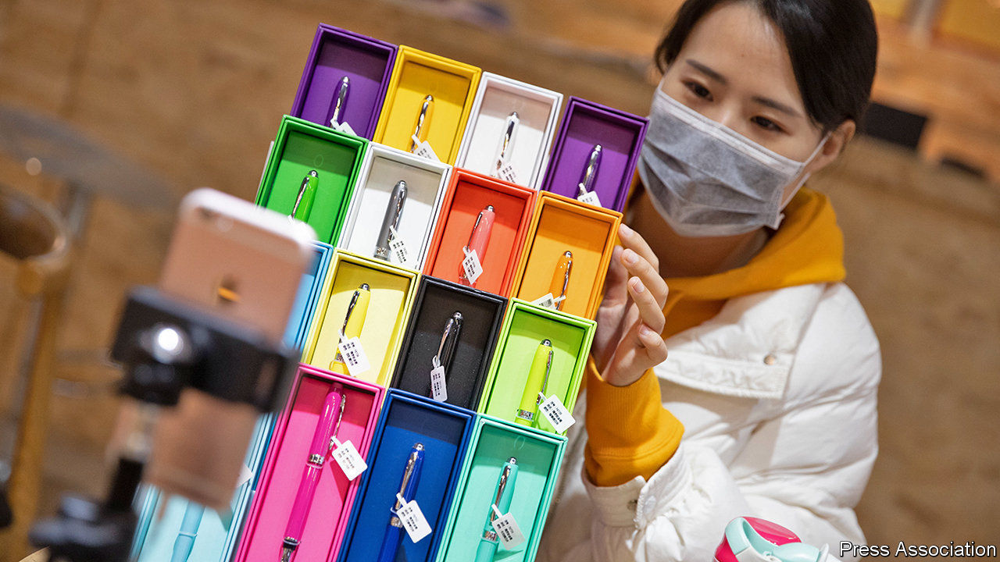

###### Video games

# Kuaishou takes on TikTok and its Chinese sibling 

##### China’s short-video wars are heating up 

 

> Jan 14th 2021 


“WE AIM TO be the most customer-obsessed company in the world,” declares the opening line in the 700-page prospectus from Kuaishou, a Chinese video app. The firm, launched a decade ago by a former software engineer at Google and another at Hewlett-Packard, boasts more than 250m daily active users, up from an average of just 67m in 2017. Kuaishou is expected to hit a valuation of around $50bn when it goes public next month in Hong Kong. That would lift it above better-known social-media titans like Twitter (worth $37bn).


Kuaishou’s revenues have soared in recent years, reaching 25bn yuan ($3.6bn) in the first six months of 2020, up by nearly half on the previous year. Just over two-thirds of this came from what the firm calls “live-stream gifting”. It hosted nearly 1bn live-streaming sessions in that period, taking a cut on “tips” that viewers shower on their favourite live-streamers. A tip can be as small as 10 fen (1.5 cents) or as generous as 2,000 yuan. Performers film themselves singing, dancing, otherwise prancing or just sunbathing. (Pornography is strictly prohibited.) New stars can expect to fork half of their tips over to the platform.


Amid this exuberance two threats loom. The first comes from China’s increasingly hands-on regulators (see ). In November they mandated that video apps like Kuaishou impose daily and monthly limits on the amount that users can tip live-streamers. Moreover, to prevent impressionable minors from being coaxed into sponsoring cunning broadcasters, platforms have been instructed to perform tougher background checks on users with such tools as facial-recognition technology. Bureaucrats in Beijing have yet to work out precisely what Kuaishou’s daily and monthly ceilings ought to be. But growth will probably slow down once the details are hashed out.


Douyin, TikTok’s Chinese sister app and Kuaishou’s arch-rival, is better insulated from the regulatory crackdown. Like Kuaishou, it operates a live-streaming business. But unlike its competitor, it earns most of its revenues from online ads, which the new rules do not affect. For comparison, adverts accounted for just 28% of Kuaishou’s revenue mix in the first half of 2020. The company may now try to raise that share. To do so Kuaishou will have to overcome the somewhat outdated perception that its users are disproportionately folk living in small cities and rural areas with less money to buy advertised wares.


The second threat is the potential for a price war between Kuaishou and Douyin. For both platforms, user growth is largely a function of the appeal of their video content, which in turn depends on the calibre of the producers behind it. A race to the bottom, whereby each firm lowers its “take rate” on tips and ad sales to lure popular broadcasters from the other app, would depress margins.


At the moment neither company has a particular incentive to shatter the cosy duopoly, points out Jeffrey Young of Grandly Asset Management, a broker. But the possible arrival of a big competitor—not inconceivable in China’s effervescent e-economy—could disrupt this equilibrium, Mr Young suggests.


Despite its domestic challenges (or maybe because of them), Kuaishou is proceeding apace with its global ambitions. The international version of its app, Kwai, claims “tens of millions” of users in markets from Brazil and Colombia to Malaysia and Vietnam. It still lacks the name-recognition of TikTok, though that may prove to be a blessing in disguise. Kwai has thus far avoided the sort of political scrutiny that its better-known rival has attracted in many foreign markets. ■

