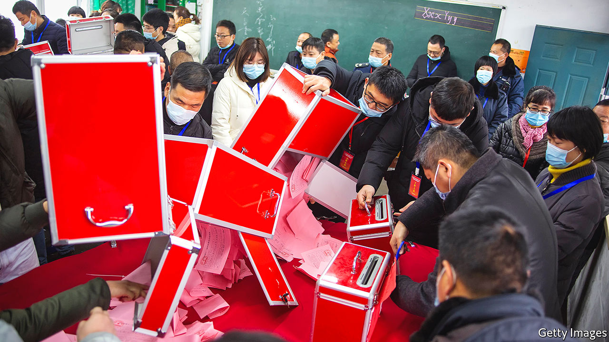

###### Why bother counting?

# The West once dreamed of democracy taking root in rural China 

##### The Communist Party is redoubling its efforts to make sure it does not 

 

> Jan 16th 2021 


“I LIKE WINNING better than losing,” America’s then president, Bill Clinton, told villagers in China in 1998 as they prepared to elect their community’s leader. In a gentle prod to his hosts, he added: “But whenever there is an election and the people decide, everyone wins.”


At that time, Western leaders were excited by China’s new and much-vaunted experiment with rural democracy. It would, they hoped, lead to broader political change. Today it is election season once again in the countryside. But the Communist Party is making it clear that the days of dalliance with modest political freedom in villages are over. The biggest effort in decades is under way to make sure the party’s candidates win, unopposed.


Seeding democracy was not the party’s plan when it introduced elections in the countryside in 1988. Corruption was rampant among rural party bosses. Many were incompetent. The party feared that farmers’ anger would foment unrest. Making village leaders more accountable could help keep the lid on, officials thought. But, to the party’s chagrin, its stooges did not always win. In the 2000s Chinese leaders re-emphasised that (appointed) party secretaries, not elected committees, still had the final say in villages. In the West, dreams gradually faded of democracy spreading upwards through the system. But every three years, as the law decreed, villages still held elections, and, occasionally, snubbed the party’s preferred candidates.


Late in 2020 rural residents began voting for their leaders once again. It is a process that will take months to complete, with different places conducting polls at different times. In this cycle the party is pulling out all the stops to get its way.


To the 550m people who live in rural China, the results can matter. Decisions made by village bosses can have an enormous impact on people’s livelihoods. In particular, they wield power over the use of land, which is officially under “collective” control—none of it is privately owned. In some villages it is pooled for large-scale farming or industrial purposes.


In 2018 the party began calling for all-out efforts to implement a system it describes as yijiantiao, or “carrying across one shoulder”. This refers to the way that farmers suspend two loads on either end of a pole across their backs. In this case the loads are the two parallel structures that run China’s villages: the elected village committees and the party committees. The party wants memberships of both committees to be the same, and to be led by a single person: the village party secretary.


In some places, local officials—with the party’s blessing—have long been practising the yijiantiao model. A five-year plan for “rural revival”, published in 2018, said it was being implemented in around one-third of China’s more than 500,000 “administrative villages” where the committees reside (there are 2.6m other “natural villages” that fall under their aegis). That year the party issued regulations saying that the system should become the norm. After the elections now under way the party wants at least half of village leaderships to be of the yijiantiao variety. Doubtless eager to impress, some places are aiming much higher. Township officials are being told their performance evaluations will depend on how well they do at ensuring targets are met. Red banners have been put up in streets saying yijiantiao will “strengthen the party’s overall leadership”.


This requires some sleight of hand. The election law says that “no organisation or individual may designate, appoint or replace any member” of elected committees. But localities have introduced rules that all but ensure the village party secretary gets the concurrent job of village chief. Commonly, the village’s party members (usually just a small fraction of the population) choose a party secretary and other members of the party committee—ie, endorse the choice made by higher-ups. Next, a member of this committee organises the election for the post of village chief. Finally an election is held in which every adult villager may vote. The party secretary wins.


A tighter vetting system typically ensures that no one stands against him (village leaders are rarely female). It involves consulting official organs in the local township, including the police. These can block the candidacy of a wide range of people. The south-western city of Kunming, for example, has a list of ineligible types called the “seven forbiddens and 15 unsuitables”. Among the forbiddens are “politically two-faced” people. A propaganda video explains this with an illustration of a man dreaming of a protest for freedom and democracy. The unsuitables include those with “strong religious feelings”: a cartoon shows people bowing to a Jesus-like figure.


Local regulations also commonly bar those who have been involved in “illegal” petition campaigns for the redress of a local injustice; petitioning is routinely treated as criminal. In Guangxi province there are bans on candidates who have received training in grassroots politics from any organisation abroad. A few years ago the government allowed some Western groups to provide such help.


Also banned are those with links to “black and evil forces”. This is a sweeping term used to describe everything from criminal gangs to unauthorised religious sects and clan networks. In 2018 the party launched a three-year campaign to sever such forces’ connections with grassroots political structures. It declared victory late last year, claiming it had “severely punished” 3,700 “village overlords” (as powerful leaders operating without heed to the law are known), and sacked 41,000 offenders from village committees.


Democracy is not entirely dead. Some local regulations say ordinary villagers’ views should be solicited when choosing the party secretary. The law still says that the winner of an election for village chief needs at least 50% of the vote, and that 50% of registered voters have to cast their ballots for an election to be valid. But that is a low bar, especially when many do not register. Since the 1990s, many working-age villagers have moved to cities. Migrants can return to vote or appoint a proxy, but why bother when it looks stitched up? The same turnout is required to force a village chief to step down. But when the chief is also the party secretary, a recall requires daring. In Guangdong province, residents of Wukan village grabbed world headlines when they rose up against their party boss in 2011 and held free elections. The party eventually clamped down there, harshly.


The party clearly expects the current elections to produce the results it wants: it has changed the rules this time to allow village chiefs to serve for five years instead of three. Officials argue that, for one person carrying two loads, a five-year term will make it easier to implement plans without being fettered by frequent polls. Some state-owned media have aired concerns that concentrating so much power in the hands of one person may result in rash decisions going unchecked. But that is a problem for later. The party is out to win. ■

