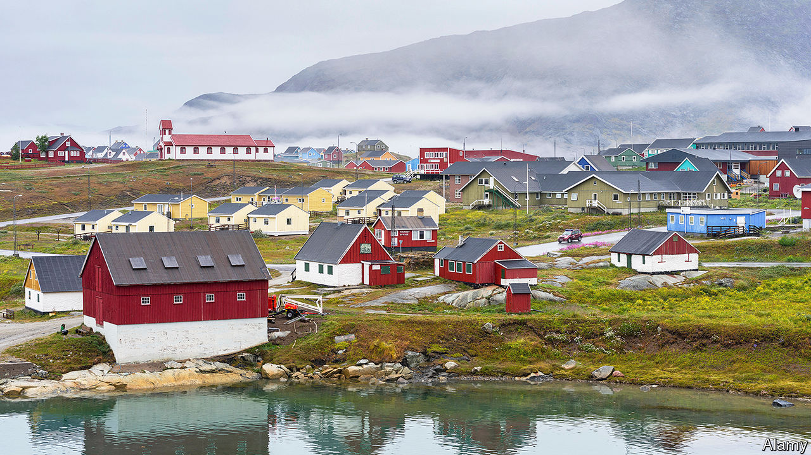

###### Cloud mining

# In search of Greenland’s rare earths 

##### Heavy metals, heavy politics 

 

> Jan 14th 2021 


MOST PEOPLE sniggered when Donald Trump proposed buying Greenland in 2019, but he had a point. The world’s biggest island has a rich helping of rare-earth minerals, and the superpowers want them.


These 17 elements, ranging from scandium to lutetium, lurk in the depths of the periodic table and turn up in all things electronic. The renewable-energy revolution will also rely on them for power storage and transmission. On the darker side, weapons—including nuclear ones—need them too.


A new open-pit mine at the top of Kuannersuit, a cloud-rimmed mountain near the settlement of Narsaq in the south of the island, may provide a goodly chunk of the rare earths needed to ditch fossil fuels. So believes Greenland Minerals, actually an Australia-based company, which has been angling for the excavation rights for the past decade.


Greenland’s environment ministry has given a tentative go-ahead. A majority of parliamentarians have already declared themselves in favour of digging. In early February the townsfolk of Narsaq will hear representations from the island’s government; though a dependency of Denmark, Greenland enjoys self-government in most areas except defence and foreign relations. A consultation phase is to last, provisionally, until mid-March.


Residents of Narsaq welcome the opportunity to learn more and to have their say. Urani Naamik (“No to Uranium”), a community lobby, has strong support. Nobody wants (mildly) radioactive dust, an inevitable by-product, drifting down to settle on their town and pastures. Many worry about the lake of waste—a sludge of chemicals and discarded rock fragments—that mining would leave on top of the mountain.


But Greenland’s politicians are in a quandary. The country’s two largest parties both want full independence from Denmark, which currently provides half the territory’s annual budget. But they would then need to be self-sustaining. Greenland would depend on fish, tourism, fresh-water sales and minerals. The last is by far the most valuable.


Christian Schultz-Lorentzen, editor of Greenland’s Sermitsiaq newspaper, says a bigger long-term issue is who gets the mine’s spoils. Shenghe, a Chinese conglomerate, is the largest shareholder in Greenland Minerals. The Danish government, in a frenzy of Atlanticism, earlier managed to stop Chinese companies from investing in the expansion of two airports on the island. Will it preserve Greenland’s rare earths for NATO?


For more coverage of climate change, register for The Climate Issue, our fortnightly , or visit our 

