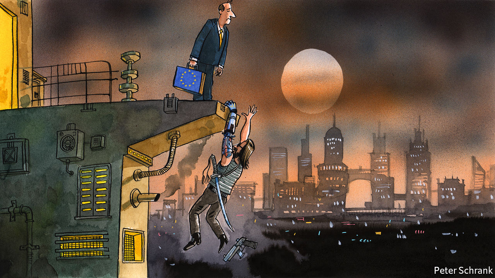

###### Charlemagne

# The botched launch of “Cyberpunk 2077” 

##### The continent’s video-game sector is a mixture of triumph and failure 

 

> Jan 16th 2021 


IT IS EASY to be optimistic about the future of Europe when running through a dystopian hellscape, machinegunning police and decapitating pedestrians with a samurai sword. Such opportunities come thanks to “Cyberpunk 2077”, a Polish video game, launched before Christmas after a decade of development. It sold 13m copies at up to $60 each in its first ten days, with buyers tempted by its mix of hyper-violence, women wearing inexplicably few clothes and a one-armed terrorist played by Keanu Reeves. Pre-launch hype turned its Warsaw-based creator, CD Projekt, into the country’s most valuable listed company and a rare example of European business succeeding at the frontier of a 21st-century industry, rather than coasting on a reputation built up in the century before. Even the in-game currency provides something for Europhiles to cheer: in Cyberpunk lore, the main currency, “eddies”, is based on the euro. Society may have collapsed into a living nightmare, but at least the EU’s single currency lived on.


What should have been a rare technology victory for European business soon turned into a farce, however. The game was launched while still littered with bugs, much like the actual euro. Performance was so poor on older consoles that Sony, the world’s biggest console manufacturer, took the rare step of pulling the game from its stores. One scene gave an unfortunate reviewer an epileptic seizure. CD Projekt issued grovelling apologies. Its share price halved as complaints and refund demands poured in. The paper billionaires created among the Polish company’s management became paper millionaires once more. The peculiar cocktail of success and embarrassing failure of “Cyberpunk 2077” is an allegory for Europe’s video-game industry at large. It also says something about Europe’s economic place in the world.


Start with the positives. Had a Polish film studio put out a film that grossed the best part of $1bn in just a few weeks, as “Cyberpunk 2077” managed to do, it would be churlish to complain if some of the acting was clunky and the plot had holes. CD Projekt is far from alone. Ubisoft, its French peer, is behind popular series such as “Assassin’s Creed”, which allows players to vent their bloodlust across the rooftops of historic Europe. A host of other smaller developers are scattered across the bloc, from Bucharest to Helsinki via Berlin. Game-designers in Poland and France find their efforts on bestseller lists for the same reason Swedish pop stars do: they have a knack for knowing what people like. In an industry worth $140bn annually, roughly three times global box office for films, this is a useful skill to have.


Yet Europe’s success in the sector has its limits. European companies are dwarfed by American and Chinese rivals. The two biggest American competitors, Electronic Arts and Activision Blizzard, are roughly three and six times bigger respectively than their largest European peer. Any company showing signs of growing to a serious size is swiftly gobbled by an American or Chinese rival. Microsoft bought Mojang, the maker of “Minecraft”, for $2.5bn in 2014. Tencent took control of the Finnish mobile-gaming company Supercell in 2016 in a deal valuing the group at $10bn. Capital is always relatively scarce in Europe compared with America, but especially when it comes to video games, points out Matti Littunen at Bernstein, a broker. Often continental investors have no interest in the genre.


Just as Europe failed to produce its own Amazon or Facebook, so too has it failed to control the platforms that dominate video games. These are controlled either by hardware sellers, such as Microsoft and Sony, or American distributors such as Valve, which owns the world’s biggest PC-game store, Steam. The companies that did succeed in these previous land grabs, such as Microsoft, Google and Amazon, can be ambitious in a way that European rivals are simply unable to match. It is these giants that are set to dominate new markets, such as the rise of cloud gaming, with games streamed—à la Spotify, a rare European tech success—rather than bought individually, as they are now. People’s attention is a lucrative, finite resource and one that European companies are ill-placed to mine, because of previous failings. Europe’s younger technology companies will pay for the sins of their fathers.

Steady eddies


Perhaps Europe should be happy for its businesses to be niche players in a world dominated by American and Chinese firms. Being owned by others is not the end of the world. Asset-stripping in the creative industry is a dumb idea: there is little point buying a creative company, then firing everyone. True, the quality of jobs in gaming can be overstated. (At its worst, it can be well-paid grunt work, ensuring that a horse’s digital testicles shrivel in the correct manner on a chilly day.) But video games are a growing industry and, crucially for a bloc with increasingly divergent economic prospects, relatively well spread across the continent. As long as some jobs and investment stay, why should anyone care?


Yet this attitude jars with the goals of Europe’s leaders, who are desperate to make the union a proper superpower. The EU has proved capable of regulating businesses, but incapable of helping to build them. It should start by paying future-proof industries more attention. Instead of being cherished, sectors like video games are forgotten: eclipsed by traditional industries, which have the ear of national politicians; dismissed as too nerdy by the luvvies who give the creative sector its clout. If a more dirigiste Europe is inevitable, then the EU should at least focus its efforts on industries with a bright future, rather than helping older ones cling on. Much like the haphazard launch of “Cyberpunk 2077”, Europe’s video-game sector is still a success, but it has the potential to be a lot better. Unfortunately, in the minds of Europe’s lawmakers, 20th-century industries on which the continent built its wealth—cars, chemicals, banks—are still king. Unless that changes, come 2077, there may be no eddies to go around. ■

