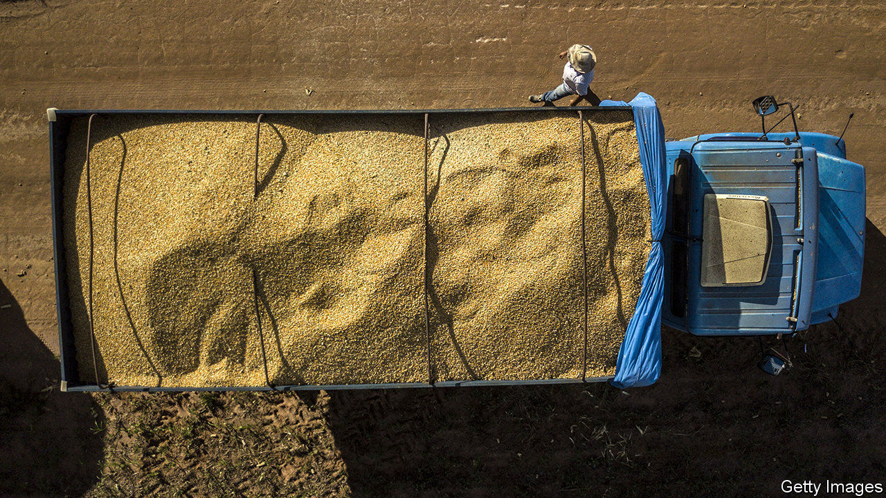
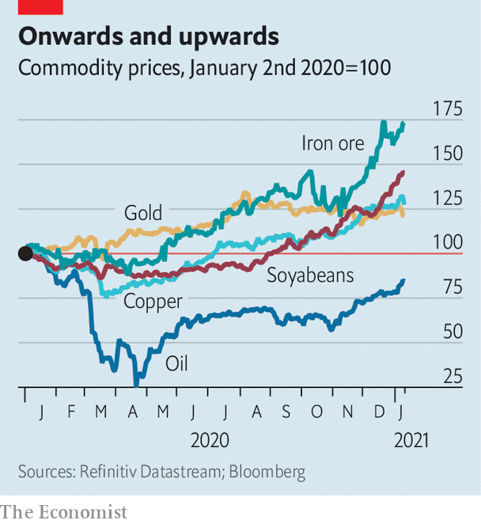

###### The mountaineers

# Commodity prices are surging 

##### Is a new supercycle beginning? 

 

> Jan 12th 2021 


THE BIGGEST commodity story of 2020 was one of decline. As the coronavirus pandemic halted travel, oil prices fell off a cliff, then briefly went subterranean: in April a futures contract for West Texas Intermediate was worth less than nothing. Oil began clawing its way above $45 a barrel in November, supported by optimism about vaccines. For other commodities, however, 2020 was not all bad. Indeed the year may have marked the start of an extraordinary ascent.


In August gold passed $2,000 an ounce for the first time ever, as low interest rates made the precious metal more attractive. The value of other commodities rose, too, not just from the depths of virus-induced lockdowns in April but from the start of 2020, before the pandemic began (see chart). Commodity assets under management reached a record $640bn in December, estimates Citigroup, a bank, representing an annual gain of nearly a quarter. By January 11th even the oil-heavy S&amp;P GSCI commodity index had reached the level of a year ago. The debate now is how quickly oil prices will recover, and how high other commodities may soar.


That in turn depends on whether the forces that pushed up certain commodities in 2020 will continue in 2021, or indeed be supplanted by even more powerful engines of growth. Last year China proved a voracious importer as it increased investment and filled strategic stockpiles. Beneficiaries included iron ore and copper, used in steel and electricity projects, as well as soft commodities such as wheat, soyabeans and pork. This coincided with restrained supply. Outbreaks of covid-19 prompted the closure of some iron-ore mines in Brazil. Scant rain in South America, caused by La Niña, a large-scale cooling of Pacific Ocean temperatures, raised grain prices.

 


This year has already presented signs of limited supply. On January 11th Argentina lifted a ban on corn exports, but imposed a cap. Russia plans to tax wheat exports from mid-February. Low supply and cold weather have powered Asian prices of liquefied natural gas to a record high of well over $20 per million British thermal units. Big mines still face risks of restrictions. Protests at Las Bambas copper mine in Peru, for instance, have stoked fears of disruptions.


Meanwhile oil has continued its tentative recovery, alternately inflated by hopes for vaccines and depressed by news of lockdowns. To boost prices, Saudi Arabia has said it will limit output by a further 1m barrels a day in February and March.


Two important developments may provide further support. The roll-out of vaccines across the world’s largest economies will eventually inspire higher levels of travel and trade. And a big spending bill by a Democratic American government, together with continued loose monetary policy from the Federal Reserve, would stimulate economic activity and therefore commodity consumption. That might also weaken the dollar, which would make oil and other commodities denominated in dollars cheaper for buyers in emerging markets, lifting demand and pushing commodity prices even higher.


Commodity bulls, led by Jeff Currie of Goldman Sachs, a bank, argue that longer-term trends will support prices through the coming decade. “The pandemic itself is a structural catalyst for a commodity supercycle,” Mr Currie contends. In addition to a weaker dollar and the accompanying boost for commodities, the pandemic may help synchronise activity across some of the world’s biggest economies.


Governments in America, China and Europe profess to champion green investment and efforts to narrow gaps in income. Assistance for poor households has an outsize effect on consumption, Mr Currie points out, which in turn supports commodity prices. And green investment—in electric-charging stations, for instance, and wind farms—is commodity-intensive. The early years of green spending may even lift oil demand, by boosting employment and economic activity. Goldman estimates that a $2trn stimulus over the next two years would raise American oil demand by about 200,000 barrels a day, or 1%.


Sceptics expect more muted growth. In the short term, Ed Morse of Citigroup points out, investors’ bets on copper are not supported by trends in supply and consumption. The Democrats’ slim majority in the Senate hardly guarantees that president-elect Joe Biden’s climate plan will be passed. “There is nothing on the demand side that is nearly as commodity-intensive as the first decade of the 21st century,” says Mr Morse.


That earlier supercycle was driven by urbanisation, investment and an ascendant middle class in emerging markets—and China, in particular. Governments from Berlin to Beijing now declare that they intend to bring a new type of transformation. The price of commodities in the coming decade depends in large part on whether they do what they say. ■


Editor’s note: Some of our covid-19 coverage is free for readers of The Economist Today, our daily . For more stories and our pandemic tracker, see our 


 This article has been updated.

