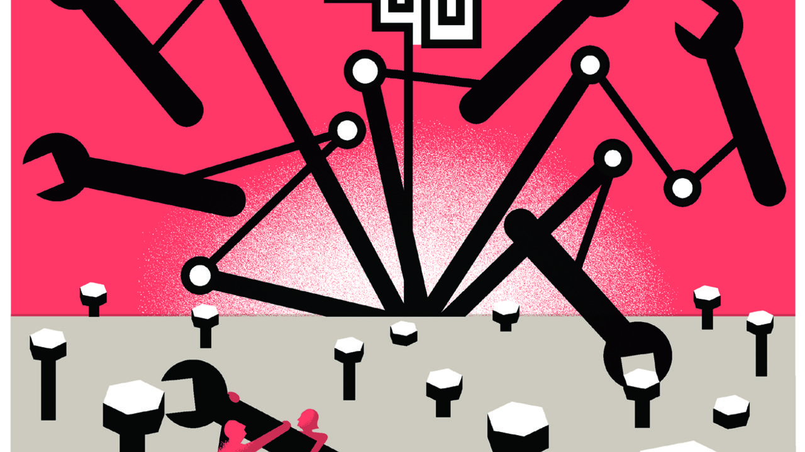

###### Free exchange

# New research shows the robots are coming for jobs—but stealthily 

##### Look beneath the aggregate economic numbers, and change is afoot 

 

> Jan 14th 2021 


THE YEAR is 2021, and honestly there ought to be more robots. It was a decade ago that two scholars of technology, Erik Brynjolfsson and Andrew McAfee, published “Race Against the Machine”, an influential book that marked the start of a fierce debate between optimists and pessimists about technological change. The authors argued that exponential progress in computing was on the verge of delivering explosive advances in machine capabilities. Headline-grabbing breakthroughs in artificial intelligence (AI) seemed to support the idea that the robots would soon upend every workplace. Given that, on the eve of the pandemic, jobs were as plentiful as ever, you might now conclude that the warnings were overdone. But a number of new economics papers caution against complacency. The robots are indeed coming, they reckon—just a bit more slowly and stealthily than you might have expected.


Economists have, on the whole, been fairly sanguine about the impact of robots and AI on workers. History is strewn with incorrect predictions of the looming irrelevance of human labour. The economic statistics have yet to signal the arrival of a robot-powered job apocalypse. Outside of slumps, firms remain keen to hire humans, for example. Growth in productivity—which ought to be surging if machines are helping fewer workers produce more output—has been unimpressive. A look beneath the aggregate numbers, though, reveals that change is indeed afoot.


Take work by Daron Acemoglu and David Autor of the Massachusetts Institute of Technology, Jonathon Hazell of Princeton University and Pascual Restrepo of Boston University, which was presented at the recent meeting of the American Economic Association (AEA). The authors use rich data provided by Burning Glass Technologies, a software company that maintains and analyses fine-grained job information gleaned from 40,000 firms. They identify tasks and jobs in the dataset that could be done by AI today (and are therefore vulnerable to displacement). Unsurprisingly, the researchers find that businesses that are well-suited to the adoption of AI are indeed hiring people with AI expertise. Since 2010 there has been substantial growth in the number of AI-related job vacancies advertised by firms with lots of AI-vulnerable jobs. At the same time, there has been a sharp decline in these firms’ demand for capabilities that compete with those of existing AI.


An AI-induced change in the mix of jobs need not translate into less hiring overall. If new technologies largely assist current workers or boost productivity by enough to spark expansion, then more AI might well go hand-in-hand with more employment. This does not appear to be happening. Instead the authors find that firms with more AI-vulnerable jobs have done much less hiring on net; that was especially the case in 2014-18, when AI-related vacancies in the database surged. But the relationship between greater use of AI and reduced hiring that is present at the firm level does not show up in aggregate data, the authors note. Machines are not yet depressing labour demand across the economy as a whole. As machines become cleverer, however, that could change.


Evidence that AI affects labour markets primarily by taking over human tasks is at odds with some earlier studies of how firms use the technology. A paper from 2019 by Timothy Bresnahan of Stanford University argues that the most valuable applications of AI have nothing to do with displacing humans. Rather, they are examples of “capital deepening”, or the accumulation of more and better capital per worker, in very specific contexts, such as the matching algorithms used by Amazon and Google to offer better product recommendations and ads to users. To the extent that AI leads to disruption, it is at a “system level”, says Mr Bresnahan—as Amazon’s sales displace those of other firms, say.


New work by Ajay Agrawal, Joshua Gans and Avi Goldfarb of the University of Toronto suggests that this state of affairs may not persist for long, though. As the quality of AI predictions improves, they write, it becomes increasingly attractive for AI-using firms to restructure in more radical ways. At some level of accuracy, for example, Amazon’s ability to predict consumers’ desires could encourage the firm to adjust its business model—by pre-emptively shipping goods to consumers before they ever go searching at Amazon in the first place—in ways that are likely to change how many workers and of what sort the firm requires. In that event, the influence of AI on the economy could change dramatically.

OK computer


Does more automation mean a surge in productivity is just over the horizon? Not necessarily. Speaking at the (virtual) AEA meeting, Mr Acemoglu mused that automation comes in different sorts, with different economic consequences. “Good” automation generates large productivity increases, and its transformative nature leads to the creation of many new tasks (and therefore jobs) for humans. Advanced robotics, for example, eliminates production jobs while creating work for robot technicians and programmers. “So-so” automation, by contrast, displaces workers but generates only meagre benefits. Mr Acemoglu cites automated check-out kiosks as an example; though they save some time and money, their deployment is hardly revolutionary. From 1947 to 1987, the displacement effect of new technologies was generally offset by a “reinstatement” effect, he reckons, through which new tasks occupied displaced workers. The rate of reinstatement has since fallen, though, while displacement has not, suggesting an increase in so-so automation relative to the good kind.


Mr Acemoglu suggests that policy interventions that lean against employers’ inclination to deploy so-so automation, such as higher taxes on capital, might be desirable. Perhaps. Yet it is also possible that continued improvement in machine capabilities will solve this problem on its own, either by creating vast new categories of work for humans, or by making us so much better off that we do not especially mind our approaching obsolescence. ■

