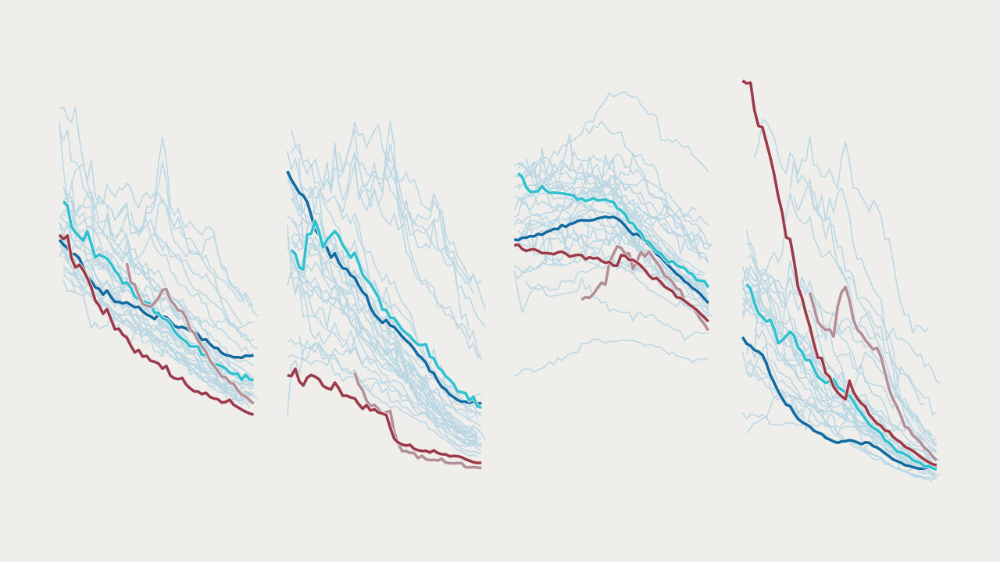

###### The meat spot

# Japanese people may have gained longevity by balancing their diets 

##### Japan’s rate of strokes fell during a period when it began eating a bit of meat 

 

> Jan 16th 2021 


TANAKA KANE is one of humanity’s great outliers. On January 2nd she became the third person ever to turn 118, according to the Gerontology Research Group, a team of academics. She is also the first citizen of Japan to reach 118—but is unlikely to be the last. The country has the world’s longest life expectancy, and 80,000 centenarians.


Mrs Tanaka is an outlier for another reason, too. She claims to love chocolate and fizzy drinks, setting her apart from most of her compatriots. Japan has long had one of the lowest sugar-consumption rates in the OECD, a club of mainly wealthy countries.


The unusual longevity enjoyed in Japan is often credited to diet. Yet the idea that the country has extended lifespans by entirely avoiding the West’s sinful culinary delights may be too simple. In fact, recent studies imply that one key to its success may be that its people’s diets have shifted over time towards Western eating patterns.


Japan was not always a longevity champion. In 1970 its age-adjusted mortality rates were average for the OECD. Although its levels of cancer and heart disease were relatively low, it also had the OECD’s highest frequency of cerebrovascular deaths, caused by blood failing to reach the brain.


In 1970-90, however, Japan’s cerebrovascular mortality rate fell towards the OECD average. With world-beating numbers on heart disease and fewer strokes, Japan soared up the longevity league table.


How did Japan overcome its cerebrovascular woes? Some of its gains simply mirror better treatments and reductions in blood pressure around the world, notes Thomas Truelsen of the University of Copenhagen.


However, another cause may be diets. Japan largely banned meat for 1,200 years, and still consumes relatively little meat and dairy. Too much of these can be damaging, since they contain saturated fatty acids, which correlate to heart disease. Studies have also tied eating lots of processed red meat to a greater risk of stroke. But too little may be unwise as well, because they provide cholesterol that may be needed for blood-vessel walls. In a study of 48,000 Britons, vegetarians were unusually resistant to heart disease, but prone to strokes.


In theory, a dearth of animal-based food could have contributed to Japan’s historical cerebrovascular mortality. In 1960-2013, as the country’s deaths from strokes tumbled, its annual meat intake rose from near zero to 52kg per person (45% of America’s level). Tsugane Shoichiro of the National Cancer Centre in Tokyo says that his compatriots may need meat and dairy to keep their blood vessels robust—though not so much that those vessels get clogged.


Some empirical evidence supports this view. One paper from the 1990s found that the parts of Japan where diets had changed most also had the biggest drops in cerebrovascular mortality. Another study, which tracked 80,000 Japanese people in 1995-2009, showed that strokes were most common among those who ate the least chops and cream. Although Japan’s decline in cerebrovascular deaths could stem entirely from other causes, these data suggest that nutritional shifts may have helped.


The unhappy irony is that Japan’s health gains, paired with a low birth rate, threaten its economy. By 2060, 40% of Japanese could be 60 or older. That would yield more birthday cakes with 118 candles—and fewer great-grandchildren to blow them out. ■


Sources: WHO; FAOSTAT; OECD; UN 


