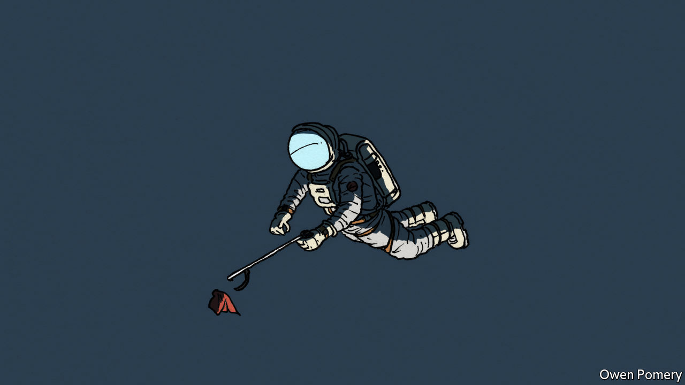

###### Decluttering low-Earth orbit

# It’s time to tidy up space 

##### And also to create rules to stop it getting messy again 

 

> Jan 14th 2021 


EVERYBODY’S BUSINESS, an old saw has it, is nobody’s business. And that is a good description of the business of keeping outer space clean and tidy. Yet the part of space nearest Earth, known technically as low-Earth orbit, is getting cluttered. Some of the objects up there are working satellites. Some are satellites that have stopped working. Some are stages of the rockets which put those satellites into orbit. And a lot are debris left over from explosions and collisions between larger objects.


The risk of such collisions is increasing, for two reasons. First, the number of satellites being launched is rising. Second, collisions themselves beget collisions. The fragments they create add to the number of orbiting objects. At the moment, more than 20,000 such objects are being tracked, but there may be as many as 1m bigger than 1cm across.


In the long term, this accumulation of junk may lead to a chain reaction, known as Kessler syndrome, that would make some low-Earth orbits unusable. Even in the short term it puts lots of expensive hardware at risk. So plans are being laid to send up special craft to “deorbit” redundant satellites and rocket stages (see ). Given the current situation, this is a good, if expensive, idea. But a better one for the future would be to build deorbiting into the life-cycles of satellites and rocket stages from the beginning.


There are several ways of doing this. One is a “launch tax”. But that would load costs onto the satellite industry with no benefit unless the proceeds were actually spent on orbital clean ups—and the record of tax-hypothecation of this sort is not good. A launch tax would also fail to attack the nub of the problem, which is that rocket stages and satellites need to be able to deorbit themselves unaided, even though building in such capability increases weight, and therefore launch costs.


A second idea is a space-going “bottle deposit” scheme. Satellite owners would pay an agreed sum into an escrow account that was redeemable when they deorbited their property. If they did not do so, enterprising salvagers could try to do it for them, and claim the deposit if successful. This has the virtue of encouraging built-in deorbiting capability, though claiming the bounty would require a separate launch.


The best idea, though, is to attack the problem at its roots. The littering of space is an example of the “tragedy of the commons”, in which no charge is made for the use of a resource that is owned collectively. So why not charge the beneficiaries for the right to put something into orbit and keep it there? The longer an object stays up, the more the satellite owner pays. The more popular (and hence crowded) the orbit chosen, the more expensive it would be to add a satellite to it.


That raises the question of who would do the charging. The Outer Space Treaty, signed in 1967, assigns responsibility and liability for objects in orbit to the country which launches them, and entreats signatories to avoid harmful contamination of space and celestial bodies. As far as low-Earth orbit is concerned, this has not really worked. France requires rocket boosters to be dumped in the sea, but that’s about it. It would make sense for countries with space-launch capability, and thus an interest in keeping space clean, to hammer out a new and specific agreement. A well-crafted treaty would clean up space, cause it to be used more efficiently, and raise some useful revenue from a resource currently exploited for nothing.


To deal with non-participants acting as free-riders, participants might agree to make pariahs of firms that tried to take advantage in this way, while perhaps offering a share of orbital-use fees to countries without launch capacity of their own. Other natural commons, notably the oceans and the atmosphere, have suffered, and still suffer, from a lack of sensible arrangements for their joint exploitation. It is not too late to stop outer space being added to that list.■

