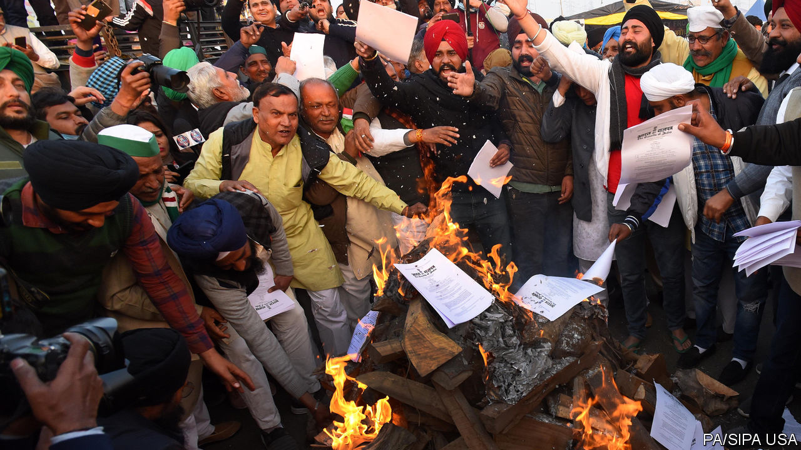

###### Reaping what you sow

# The failure of India’s farm reforms is a parable of mismanagement 

##### The high-handedness of Narendra Modi’s government is undermining sensible changes 

 

> Jan 16th 2021 


WHEN MOST of India’s laws on farming were adopted, in the 1950s and 1960s, the country was often on the brink of famine. In 1966 mass starvation was averted only by the arrival of 10m tonnes of American food aid. Small wonder that a Himalayan range of regulations rose up, to boost output and stop hoarding.


Happily, much has changed since then. In 2020 India exported 14m tonnes of rice alone. The government has amassed grain stores of around 50m tonnes. Yet even as the food has piled up, the rules have remained the same. The bill for the subsidies has risen dramatically. So have the environmental costs, in the form of sinking water tables, for example, and choking smoke from the burning of stubble. The prime minister, Narendra Modi is trying to enact reforms. His failure to make them stick illustrates much of what is wrong with Indian politics.


The first problem is inertia. Reform has been an absurdly long time coming. A judge this week asked the attorney-general whether farmers had been consulted about the changes. He replied that consultations had been under way for 11 years. Such dithering is all too common. The overhaul of sales taxes pushed through in 2017 had been under discussion even longer.


In both cases, the ruling Bharatiya Janata Party (BJP) deserves credit for adopting long-overdue reforms that its predecessor in government, Congress, had simply debated ad nauseam. But the BJP takes things to the opposite extreme. It whisked three farm bills through parliament in September with minimal scrutiny. It refused even to put them to a proper vote in the upper house, insisting, questionably, that they had been passed by acclaim. This is standard procedure for the BJP: no parliamentary committee got a chance to debate changes to the laws on citizenship that sparked protests in 2019. The government first made public a constitutional amendment revoking the autonomy of the state of Jammu &amp; Kashmir only a day before parliament approved it.


It is not just parliament that does not get a look-in. Two of the BJP’s coalition partners left the government in protest at the farm reforms. No one seems to have tried to bring the farmers’ unions around until after the bills were passed. Rather than cultivating broad support for its agenda, the BJP tends to ram it through.


The result has been big and intractable protests from suspicious farmers. That is where a third scourge of Indian democracy entered the picture: the judiciary. Farmers’ groups and opposition parties have petitioned the courts to throw out the new laws. On January 12th the Supreme Court came close, suspending them indefinitely (see ). There is a genuine debate about whether the government might have exceeded its powers by regulating matters that should be left to the states. But the justices did not seem very interested in that. Instead, they expressed concern about the health of the women and children among the protesters, and anxiety that the long stand-off might end in damage to property. The solution, they said, was to form a committee (which no one had asked for) to determine whether the laws were in the national interest—a reprieve for dither.


India is not an easy place to govern. It is so vast, with so many competing interests, that securing a consensus about anything is a challenge. The BJP’s proposed farm reforms are sensible enough. But they will never be implemented without a concerted effort to win farmers over. As for the courts, their job is to uphold the laws, not prevent them from being implemented. The alternative, yet more drift, yields meagre harvests. ■

