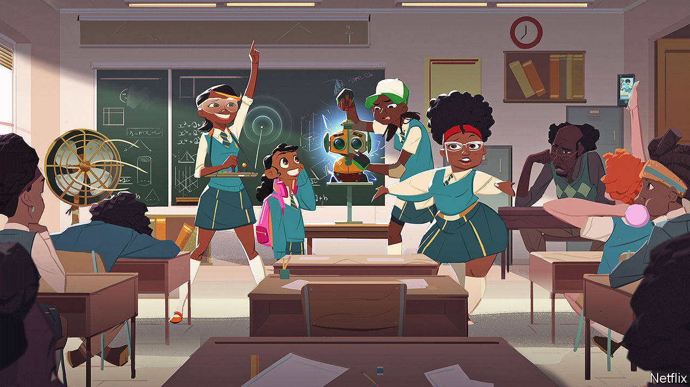

###### Move over, Superman

# New platforms are bringing African comics to a broader audience 

##### Who needs Superman when you have Razor-Man? 

 

> Jan 14th 2021 


FOR ZIKI NELSON it began with TV cartoons: “X-Men” and “Spider-Man”. These led to “Archie” and “Asterix” comics, then Japanese anime and manga. But as he devoured animated work from elsewhere, something was missing. “We had this African heritage and no one was telling stories about where we’re from.”


That is changing. New platforms are bringing African animators to a global audience. One is Kugali, co-founded in 2017 by Mr Nelson with a fellow Nigerian, Tolu Foyeh, and Hamid Ibrahim, a Ugandan. It sells comics from across the continent and creates its own animations. In December Kugali announced a landmark deal with Disney to make “Iwájú” (The Future), a sci-fi series imbued with Yoruba culture.


Kugali is part of a small but vibrant industry. As in many areas of African popular culture, Nigerian brands are prominent; others include Comic Republic and Vortex Corp. But animators are thriving elsewhere, too. Afrocomix, an app for reading comics, was made by Leti Arts, a video-game developer based in Ghana and Kenya. In 2019 “Mama K’s Team 4”, written by Malenga Mulendema, a Zambian artist, and co-produced by a South African studio, became Netflix’s first African-made animated series. Etan Comics is the publisher of the first Ethiopian superhero comic books, “Jember” and “Hawi’’.


These superheroes do not just look different. Whereas many American superheroes derive their powers from galactic or scientific sources, the faculties of African ones often have spiritual provenance. “Strike Guard”, by Ayodele Elegba, a Nigerian artist, is the story of a murdered student whose body is thrown into the grave of Ajagbeja, a Yoruba deity, from whom the reincarnated hero gets his strength. Juni Ba’s comics are rooted in Senegalese myths and legends.


Others draw on the hustle of urban life. “Kwezi”, a South African comic, features a self-absorbed social-media influencer who reluctantly uses his powers for good. In “Razor-Man” a mechanic-turned-superhero tries to avenge his father’s death amid corruption and repression in Zimbabwe.


Comics also confront difficult subjects. “Lake of Tears”, set among the treacherous fishing industry on Lake Volta in Ghana, depicts child trafficking. “Un Voyage Sans Retour” (A Journey Of No Return) by Gaspard Njock, a Cameroonian artist, charts the dreams and dangers of migration to Europe. “Zana”, set in a future in which apartheid never ended, raises questions about race relations in South Africa today.


African comic artists have been sketching for decades. But digital platforms and cheaper software are making it easier for them to make a living. The pandemic has nudged comic-buyers towards digital versions with fatter margins. A new generation of readers want characters they can relate to. Mr Nelson says that conversations “about race and identity are inspiring people to seek out new stories.” When it comes to comic sales, curiosity is a superpower.

