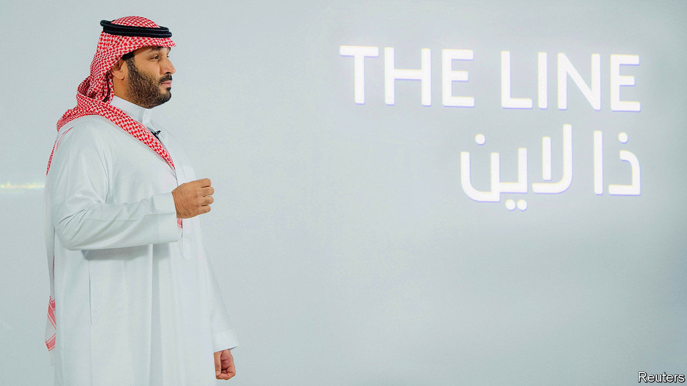
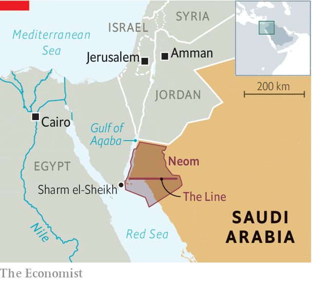

###### No cars, no roads, no emissions

# The Line in Saudi Arabia is an urbanist’s dream 

##### Will the planned development remain just that? 

 

> Jan 14th 2021 


IT IS PERHAPS the mother of all off-plan sales. The prospectus makes a seductive pitch to weary city-dwellers trapped in polluted concrete jungles. Why spend years of your life stuck in traffic or crammed into public transport? Urban planners would no doubt make different choices if they were free to start from scratch. That, at least, is the thinking behind The Line.


The proposed city within Neom, a high-tech development planned for Saudi Arabia’s north-west coast, would carve a 170km-long (106-mile) ribbon across the desert (see map). There would be no fights over congestion charges or parking regulations because there would be no cars, nor even streets for cars to drive on.


Instead it would be an urbanist’s dream, with residents able to reach whatever they need within a five-minute walk. For the average person that is a distance of around 400 metres, shorter than two blocks in Manhattan but apparently long enough for everything from schools to clinics and parks. The brochure is silent on the weather: summer temperatures in the region hover around a not-so-walkable 40°C.

 


Perhaps heat is a surmountable obstacle, since the laws of physics seem to be. Should any of its 1m potential residents wish to venture farther afield, longer journeys will be a pleasure: “ultra-high-speed transit” should limit even the longest trip to a mere 20 minutes. If passengers are willing to pull a few G’s while accelerating, that would require speeds of up to 510kph, about 25% faster than Japan’s fastest bullet train, which is still being tested. All this would be powered, in the world’s biggest petro-state, by renewable energy with zero carbon emissions.


First announced in 2017, Neom—a portmanteau of “neo” and mustaqbal, Arabic for “future”—remains something of a blank canvas. There is talk of robot workers, flying cars and glow-in-the-dark sand on the beach. Foreign consultants eagerly lap up contracts to draft fanciful schemes.


In the real world, though, little of this has advanced beyond PowerPoint slides. There is an airport, and palaces where Saudi royals can summer: King Salman has holidayed in Neom for the past few years. The project is still many years away from attracting millions of residents and contributing significant sums to the Saudi GDP.


Supporters praise the kingdom for thinking big. Critics call it a white elephant, of which the Gulf states already have plenty. Some locals who live in the area are excited about development. Others have clashed violently with police sent to evict them. And, at least for now, those police are humans who arrive the old-fashioned way: in cars.


For more coverage of climate change, register for The Climate Issue, our fortnightly , or visit our 

