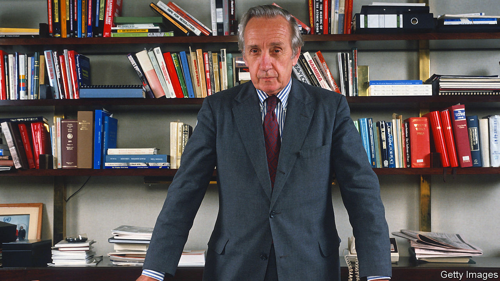

###### The thin blue line

# Sir Brian Urquhart died on January 2nd 

##### The initiator and overseer of the UN’s peacekeeping operations was 101 

 

> Jan 16th 2021 


WHEN HE CAME to, Brian Urquhart found himself lying on the floor of a truck full of drug-high commandos. His nose was broken and streaming blood, and he was bruised from a thorough pummelling with rifle butts. Much of his clothing seemed to be missing. Every so often, one of the boots around him would administer a kick. He seized the nearest; it happened to belong to the squad commander, and they fell to arguing. In the state he was, he was not as impressive a disputant as he would have wished.


He was sorry to be a disputant at all. That was not why he was in Katanga, a breakaway province of newly independent Congo, in 1961. As the UN representative there (a job no one in his right mind would have wanted), he and his force of Moroccans were meant to be keeping the peace between Moise Tshombe’s Katangans, the mutinous Congolese army and the fleeing Belgians. Now that he had been kidnapped and beaten up, the UN was in the fight too. Soon enough his force was battling rebels all over Elisabethville.


This was not what peacekeeping was all about. Few knew that better than he did, for he had been in at the inception, when in 1956 the first UN Emergency Force had been sent to Suez to stand in their freshly blue-sprayed helmets, ex-American GI issue, between the armies of the French, the British and the Egyptians. Together he and Ralph Bunche—his most valued colleague at the UN, who had won the Nobel peace prize in 1950 for mediating between Egypt and Israel—had devised the peacekeeping rules. The force was to be a buffer between combatants, to express a world consensus that peace was preferable to war. It could advise, but not order; help with humanitarian tasks, but not with anything political. And it could not favour one side, even secretly, for first and foremost—whether on the Green Line in Cyprus, or the Line of Control in Kashmir, or the Golan Heights between Syria and Israel—it was not there to join in the fight.


This was difficult, and over his next three decades of organising peacekeeping it became no easier. He had been a soldier himself in the war, second lieutenant in the Dorset Regiment and then an intelligence officer with the 1st Airborne Division. Soldiers were trained to fight, and wanted to be armed. As he had found out, after his service pistol went down with the ship when he was blown up by a mine off the Kent coast, to lose one’s weapon was a disgrace. Besides, it was no joke to be sitting-ducks between enraged parties. But his rule was firm: their strength lay in having light arms only, or none at all. He might limp like an ex-soldier (parachute failure during training), and enjoy the logistics of operations; but he was an impartial desk man now, an international civil servant.


His view of the UN and its role had begun with high romantic enthusiasm in 1945, when he was only the second staffer hired. He had wanted to work for the League of Nations, and here was a stronger chance to build co-operation and prevent future disasters. Experience had left him deeply sceptical of leaders and revolted by war’s waste and violence. Two events seared him: the disastrous Market Garden operation in 1944 to seize German-held bridges over the Rhine, where commanders bent on a dashingstroke ignored the intelligence he gave them; and his consuming rage at stumbling on Bergen-Belsen, where the corpses piled up like logs at the perimeter fence did not smell, because they had been reduced to skin and bone while they were living.


Peacekeeping was not mentioned in the UN charter. But it seemed fundamental to create safe zones while reason was brought to bear on conflicts. Among the five secretaries-general he worked for, his deepest admiration was for Dag Hammarskjold: a loner, almost a mystic, with an evangelistic passion for his work and for preserving peace. Hammarskjold’s death in a plane crash just before his own posting to Katanga left a void in which, for years afterwards, he still saw his face and heard his directions.


Leadership at the UN was seldom so good. He judged Trygve Lie, the first, to be out of his depth, and Kurt Waldheim a status-hungry mediocrity as well as a liar. His work could be trying, too often arguing the toss over deployment or sitting, numb with annoyance, in some conference hall while antagonistic delegates sulked over seating plans. In New York, sclerosis and elephantiasis had set in. The Security Council (that “Awesome Organ” as he mockingly called it) had split at once along cold-war lines, which made arranging peacekeeping all the harder. Decolonisation brought in dozens of Third World countries with new agendas and views that tilted against Israel and, therefore, annoyed the United States. All through the 1980s America’s neocons, especially fierce Jeane Kirkpatrick, railed at the UN as if it was a troublesome sideshow, though one they were happy to use when in a bind. He began to wonder whether it would actually survive into the 21st century.


Something of that original romance still glowed, however. Even as he witnessed, after his retirement in 1986, terrible peacekeeping failures in Rwanda, Somalia and Bosnia, and even as he saw missions he had set up still stuck after decades in Cyprus and in Lebanon, he stayed committed to the idea that there had to be one place and one international civil service dedicated to problem-solving on a global scale. As the perils facing the planet mounted, so did his appeals in the press and at the Ford Foundation for the UN, the world’s best hope, to be streamlined and reformed.


His peacekeeping days made him realise what a reasonable, co-operative world community might be like. He was always moved to see soldiers from every corner working as friends in a common enterprise—as he also was to see, in some disputed zone, memorials to UN soldiers killed “in the service of peace”. He might have been killed in its service himself, that night in Katanga, but at the time he was fairly sure some UN Gurkhas would haul him out. As it happened, the only real damage he sustained was his broken nose. Non-religious though he was, he liked to recall St Ignatius’s advice “not to heed the wounds”. As he was rescued he noticed with satisfaction that his nose was bleeding again, all over the luxurious white upholstery of Moise Tshombe’s car. ■

