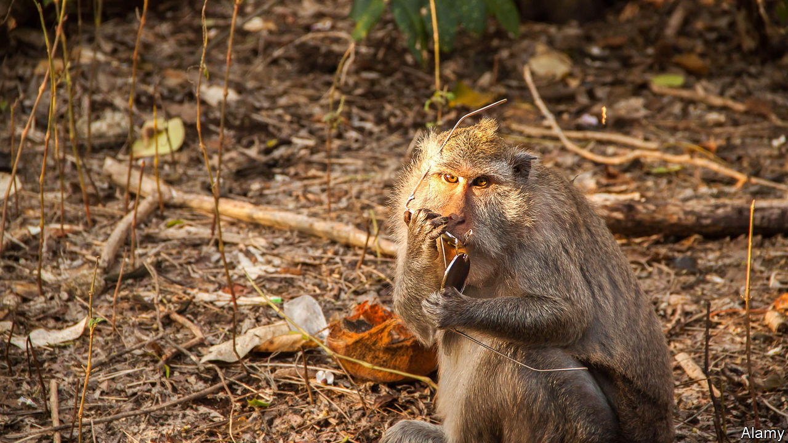

###### Animal economics

# Balinese temple monkeys are sophisticated thieves 

##### They prove that human beings are not the only species able to negotiate a deal 

 

> Jan 14th 2021 


IF YOU VISIT Uluwatu temple in Bali, beware. The long-tailed macaques there are well-known thieves. Since time out of mind they have made a living by robbing visitors of their possessions and then holding those objects hostage until a ransom in the form of food is paid. That is quite clever. But Jean-Baptiste Leca of the University of Lethbridge, in Canada, wondered whether these monkeys are cleverer still. Sometimes, they do not accept the first offer and hold out for more. He therefore asked himself whether they are able to assess how valuable an object is to its owner, and factor that into their negotiations.


Laboratory experiments conducted in the past with various species of monkey and ape suggest such primates can indeed attach a value to something intrinsically worthless to them, like a coloured plastic counter, by learning that tokens of this sort may be exchanged for food, and that different types of token bring different rewards, not all of them equally valued by the animal (a desirable grape versus an undesirable piece of cucumber, for example). That, though, is an artificial protocol in an artificial setting. The macaques of Uluwatu are true wild animals, albeit ones that are familiar with, and comfortable in the presence of, human beings.


As they describe in the Philosophical Transactions of the Royal Society, Dr Leca and his colleagues conducted their experiment by wandering around the temple with video cameras, recording the activities of the larcenous monkeys. Every time they saw a monkey show interest in a particular tourist, they recorded the interaction. Not all attempts at robbery were successful. But of those that were, they analysed the details of almost 2,200.


To work out what was going on, they had first to establish the relative values of food rewards to monkeys, and of stealable objects to people. The temple staff keep three sorts of reward available for use in negotiations by, or on behalf of, tourists who want to get their property back: raw eggs, crackers and small bags of fruit. Different monkeys have different preferences, but Dr Leca and his colleagues established these for individual animals by offering them choices between pairs of goodies in a preliminary experiment.


To confirm which stealable objects are most valued by people, they divided them into six classes: empty containers, such as phone cases, camera bags and plastic bottles; accessories such as hairpins and key rings; hats and headgear; shoes; spectacles and sunglasses; and electronics and wallets (phones, cameras, tablets, purses and so on). They then observed, from their video recordings, how often victims bothered to bargain with the thief for the return of property belonging to different classes, and thus classified objects into low value (the first two classes on the list), medium value (the second two) and high value (the third two).


They found that monkeys do, indeed, have a sophisticated sense of what they are doing—at least, adults and sub-adults do. These animals have a preference for stealing high-value items, and will often hold out either for more rewards, or for better ones, if they are in possession of such items. But this is something that they have to learn how to do as they grow up. Juveniles make no such distinctions, and sub-adults are less good at doing so than adults. In monkeys, as in people, guile is not a trick that is innate. It has to be acquired.■

