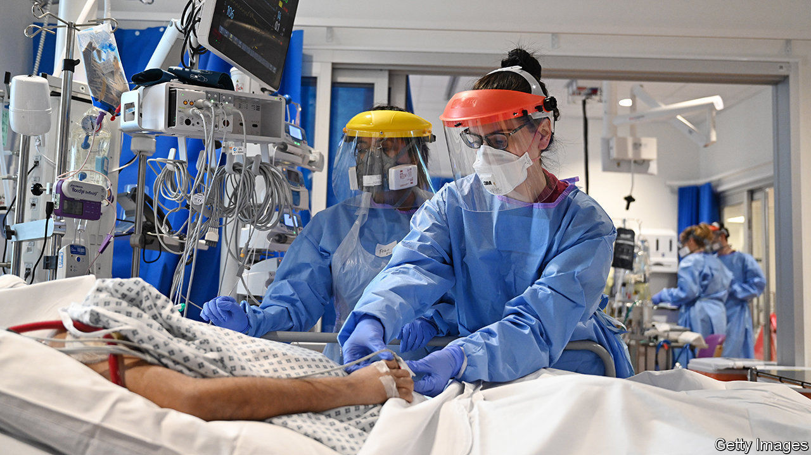

###### Repurposing drugs

# Two arthritis medicines prove effective for covid-19 

##### A pair of aces 

 

> Jan 14th 2021 


GOOD NEWS from covid-19 wards is hard to come by. A relentless surge in infections is overwhelming hospitals around the world. But the results from a clinical trial of two drugs, announced on January 7th, have improved the prognosis for both patients and hospitals.


The drugs in question, tocilizumab and sarilumab, are currently used to reduce inflammation in patients with arthritis. Hyper-inflammation, whereby the immune system goes into overdrive and destroys a patient’s organs, is how covid-19 tends to kill. The search for suitable anti-inflammatory drugs to treat it has already turned up one, dexamethasone. This is a cheap steroid that dampens the immune system across the board. Tocilizumab and sarilumab, by contrast, are more focused. They are both antibodies that block the effect of interleukin-6, a protein that stokes the immune response and has been prominent in patients with covid-19.


The trial of tocilizumab and sarilumab enrolled 800 patients admitted to hospital with covid-19 who were ill enough to require transfer to intensive-care units (ICUs). It was conducted in six countries by REMAP-CAP, an international collaboration dedicated to improving treatments for pneumonia, with most of the participants being in Britain. (Britain has an efficient programme of covid-19 drug trials, in which a quarter of patients in hospital with the illness are enrolled.) Half of the volunteers received one of the two drugs on top of the standard treatment, which includes dexamethasone. The other half received only the standard treatment


Both drugs appear to work equally well, though the results are more certain for tocilizumab, an older, more widely available medicine which was, therefore, given to a majority of participants in the new-treatment arm of the trial. Nearly 36% of patients in the standard-treatment group died, compared with 27% of those in the group that also received either tocilizumab or sarilumab—a reduction in the death rate of about a quarter. Moreover, those treated with these drugs recovered faster and were discharged from hospital seven to ten days earlier than would otherwise have been expected. Reductions in hospital stay of this magnitude would free up lots of ICU beds—welcome news in places like Britain and America, where many hospitals are running out of such beds.


Neither drug is cheap, however, so they may be beyond the means of poorer countries. In Britain, a course of treatment costs £750-1,000 (about $1,000-1,400). But the shorter stays in ICUs which that treatment permits more than offset this, for it costs the country’s National Health Service (NHS) £2,000 a day to keep a patient in such a unit. Also, in general, those who spend fewer days in intensive care recover faster afterwards and need less rehabilitation.


The NHS will start using tocilizumab immediately for covid-19 patients in ICUs. Hospitals already have stocks and the government is working with Roche, the maker, to increase supplies. For now, Britain has banned exports of both tocilizumab and sarilumab. Whether other countries will follow suit remains to be seen.■


Editor’s note: Some of our covid-19 coverage is free for readers of The Economist Today, our daily . For more stories and our pandemic tracker, see our 

