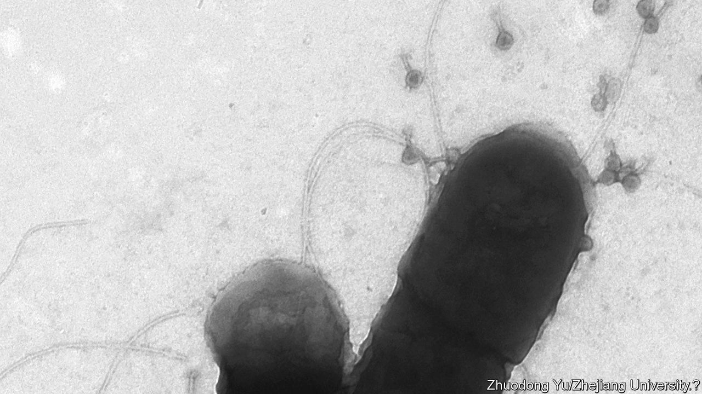

###### Microbiology

# Viruses hitch lifts on some bacteria, the better to kill others 

##### A hitchhiker’s guide to the microverse 

 

> Jan 16th 2021 


NOWADAYS, PATHOGENIC bacteria are generally dealt with using antibiotics. But some researchers argue that bactericidal viruses called bacteriophages should be added to the armory. One reason they have not found favour so far is that they are hard to deliver to their targets. However, Yu Pingfeng at Rice University in Texas and Zhu Liang at Zhejiang University in China may have found a way around that. As they report in Environmental Science and Technology, they have discovered that some phages can hitch lifts with certain bacterial species that they do not attack, to bring them to places rich in those that they do.


As is often the way with intriguing findings, Dr Yu and Dr Zhu made this discovery by chance. They were studying microbe communities in treatment plants for waste water, and noticed that phages in these miniature ecosystems sometimes attached themselves to species of bacteria equipped with flagella. These are rotating, helical appendages which act as propellers, so flagellate bacteria are more mobile than those lacking such equipment. To the two researchers, the behaviour of the phages looked a lot like hitchhiking, so they conducted some experiments to find out what was happening.


They and their colleagues grew “lawns” of an antibiotic-resistant strain of Escherichia coli, a common gut bacterium that is a laboratory workhorse. To some of these lawns they added a suspension of phages; to others, a suspension of a flagella-bearing bacterium called Bacillus cereus; and to others still, a mixture of the two. They then observed the consequences.


Phages alone inflicted little damage to the lawns. Neither did B. cereus alone. In combination, however, they were able to tear holes in the lawns, and both the viruses and the bacterial interlopers consequentially prospered at the expense of the original E. coli. Whether such partnerships between viruses and bacteria might be used for medical purposes would require considerable further investigation. But this study does offer a novel lead in the search for a way to deploy phages effectively in the service of human beings.■

