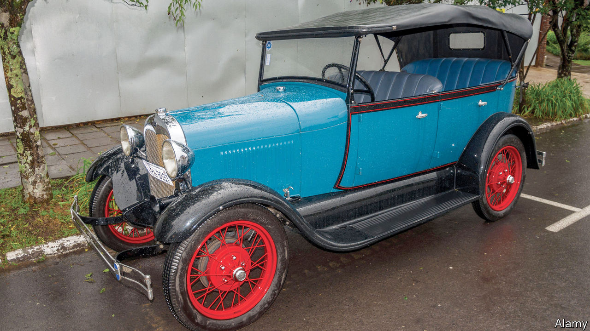

###### Driven away

# Why Ford is leaving Brazil 

##### Carmakers get tax breaks, but have to cope with high costs and low productivity 

 

> Jan 16th 2021 


IN 1928 HENRY FORD built a factory in the Amazon rainforest. He planned to grow rubber trees, make tyres and teach Brazilians Utopian ideals at a Midwest-style company town called Fordlândia. It lasted 17 years. Pests killed the trees and vice doomed the town. But car culture thrived in Brazil. Ford stayed, its profits fattened by industry-promoting subsidies from the government.


On January 11th Ford Brasil said that it will close its factories, laying off 5,000 workers. Although the decision is partly a result of Ford’s global woes, it also shows the weakness of Brazilian manufacturing. “It’s a blow to Brazil’s notion of being a modern nation,” says Joel Wolfe, the author of “Autos and Progress: The Brazilian Search for Modernity”.


In the 1950s Juscelino Kubitschek, a statist president, built thousands of miles of motorway. Military dictators in the 1970s built roads in the Amazon, filling the jungle with settlers to fend off foreign influence. Luiz Inácio Lula da Silva, who as a child left the poor north-east in the bed of a pickup and later worked in a car factory in São Paulo and led a trade union, became president in 2003. Tax breaks worth billions of dollars in the 2000s brought more carmakers, which supplied a growing middle class. Its members included autoworkers who “put their kids in private school”, says an ex-director of Mercedes in Brazil.


But the industrial engine is faulty. Bureaucracy is oppressive and workers’ productivity is relatively low. Brazilians sum up the burden as “Brazil cost”. It is one reason why China and Mexico out-export Brazil. Internal demand crashed in a recession in 2014-16. With a manufacturing capacity of 5m cars a year, Brazil put plates on 1.9m in 2020, when both supply and demand were hurt by the pandemic. 


Ford would probably have exited anyway. It has been losing money in Brazil since 2013. In 2018 it announced a global plan to focus on pickups, which are made for the South American market in Argentina, and electric cars. “There’s no debate about sustainable mobility” in Brazil, says Cassio Pagliarini, a consultant who spent 25 years at Ford. He predicts that other carmakers will shutter plants, too.


Miguel Torres, the head of a car-workers’ union in São Paulo, lambasted Ford for “deepening the social tragedy” caused by the pandemic. He called on politicians to press the carmaker to change its mind. They would do better to reduce Brazil cost. That could truly modernise the country.

