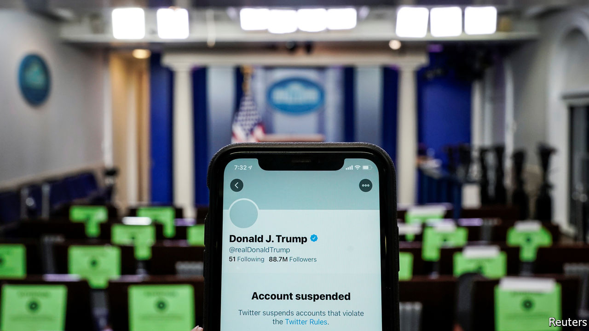
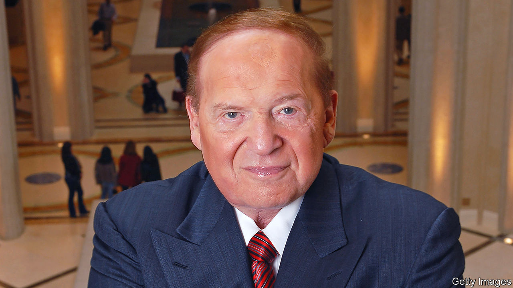

###### 

# Business this week 

#####  

 

> Jan 16th 2021 


Social-media companies, including Facebook, Twitter and YouTube, kicked Donald Trump off their platforms for inciting the mob that stormed Congress. Twitter’s ban is permanent, a blow for a man who last year tweeted 6,280 times (over 17 a day on average) and retweeted 5,956 items. Questions were raised about the implications for free speech. Parler, a social network favoured by right-wingers who are banned from other forums, was also muzzled. Its app was dropped by Apple and Google, and Amazon stopped hosting it in the cloud. See .

Flight test


The American government issued an edict that all air passengers travelling to the United States must test negative for covid-19 a minimum of three days before their departure. Airlines will be required to deny boarding to anyone who cannot produce evidence of the test. The International Air Transport Association has criticised such moves, its director-general this week lamenting that “governments are not interested in managing a balanced approach to the risks” of the disease, making it impossible for the travel and tourism industries to recover.


Moderna is working with Uber to disseminate information about the safety of its vaccine through the ride-hailing app. Uber also hopes people will be able to book a car when scheduling a vaccination appointment. It recently made 10m rides available free or at a discount to get people to vaccination centres, in a project targeted at black communities. 


Airbus delivered 566 commercial aircraft to customers last year, a sharp drop from 2019 but in line with its revamped production schedule. Beset by problems with the 737 MAX, Boeing delivered just 157 passenger planes. Boeing has reached a deferred prosecution agreement with the Department of Justice, in which it admits that two former employees misled regulators about changes to the 737 MAX. It is to pay $2.5bn in penalties.


American employers shed 140,000 workers in December, the first job losses since April, when millions were being thrown out of work because of the pandemic.


Intel announced that Pat Gelsinger, who worked at the company for several decades and is presently in charge of VMware, would return as its chief executive, after it abruptly ditched Bob Swan. Mr Gelsinger’s task will be to reverse a steady decline. Intel’s chip factories are no longer cutting-edge, and it is losing market share to AMD, a much smaller rival.


According to reports, Americans will still be allowed to invest in Alibaba, Baidu and Tencent, after the Treasury intervened to have them removed from a blacklist of Chinese tech firms that are alleged to have ties with China’s armed forces. Rumours that the three companies were to be put on the list had caused their share prices to swoon.


Joe Biden was expected to choose Gary Gensler to head the Securities and Exchange Commission. Mr Gensler earned a reputation as a tough overseer of Wall Street when he led the Commodity Futures Trading Commission in the aftermath of the financial crisis, overhauling derivatives markets.


The EU’s competition regulator approved the $27bn takeover of Refinitiv, a data and trading company, by the London Stock Exchange. It was the last big hurdle for the deal, which was announced in August 2019.

Plugged in


Volkswagen’s worldwide vehicle sales fell by 15% last year, to 9.3m, and by more in Europe and South America. Sales of electric cars, however, more than tripled, to 231,600. That is close to half the number that Tesla sold in 2020, evidence that competition in the electric-car market is at last revving up. Separately, Baidu, China’s leading internet-search platform, which has a big interest in artificial intelligence, announced that it was teaming up with Geely, a Chinese carmaker, to build smart electric cars.


Ford is to close its factories in Brazil. The carmaker opened its first assembly plant in the country in 1919, its vehicles helping to shape Brazil’s modern layout, which still relies on road over rail. Henry Ford even established Fordlândia, in the Amazon, to secure a source of rubber, but his company town eventually failed. See .

Flight test

 


Sheldon Adelson died at the age of 87. The casino tycoon started out selling newspapers on Boston’s street corners and took various other jobs before making his fortune in Las Vegas and, eventually, by transforming Macau into a gambling mecca. In 1989 he bought the famed Sands hotel, only to demolish it in 1996 to make way for the Venetian. Like the punters who flocked to his casinos, Mr Adelson’s riches could fluctuate at astonishing speed. As one of America’s wealthiest men, his deep pockets funded political campaigns, backing Binyamin Netanyahu in Israel and Donald Trump in America.

