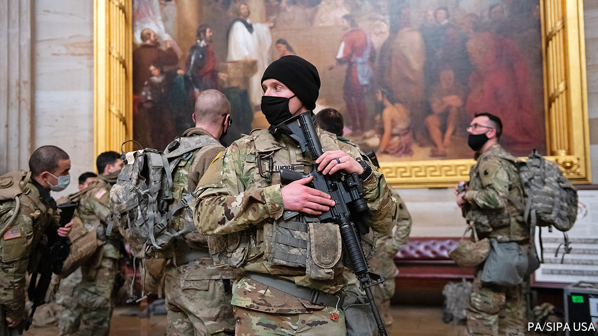
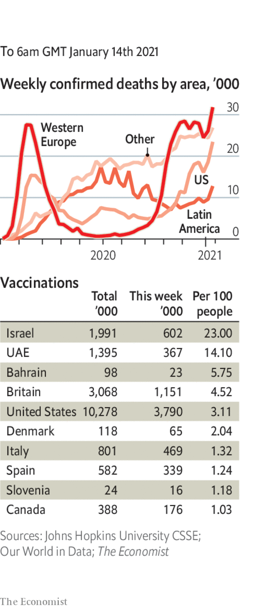

###### 

# Politics this week 

#####  

 

> Jan 14th 2021 


Protected by National Guard troops, the House of Representatives voted to impeach Donald Trump for inciting the recent mob attack on Congress, the first time that an American president has been impeached twice. It is uncertain if and when the Senate will hold an impeachment trial. Meanwhile, the FBI has reportedly warned officials of further armed protests ahead of Joe Biden’s inauguration on January 20th. Pro-Trump demonstrations are apparently being planned for all 50 state capitals as well as Washington, DC. See .


Mr Biden nominated William Burns to head the CIA. Mr Burns is a career diplomat who has been an ambassador to Russia and was instrumental in forging the nuclear deal with Iran in 2015, which Mr Trump pulled America out of.


The Trump administration announced that it was banning the import of all cotton and tomato goods from Xinjiang, and products from other countries that contain those items,because they are produced using the forced labour of Uyghurs, a predominantly Muslim group who have been subjected to mass internment by China. It is the most sweeping trade order yet issued regarding Xinjiang.


The north-eastern Chinese province of Heilongjiang declared a state of emergency following the discovery of a handful of locally transmitted cases of covid-19. This followed the imposition of tight curbs on travel in parts of Hebei after a new outbreak in the province, which borders on Beijing. A team of experts sent by the World Health Organisation at last arrived in China to investigate the origins of the pandemic, after China delayed their entry because of a “misunderstanding” about visas. The team’s first two weeks will be spent in quarantine.


A South Korean court ruled that the government of Japan should pay compensation to 12 women forced to work as sex slaves for Japanese soldiers during the second world war. Japan maintains that several agreements have already settled all such claims.


Abu Bakar Basyir, the spiritual leader of Jemaah Islamiyah, a jihadist group that carried out deadly bombings in Indonesia, was released from prison after serving ten years of a 15-year sentence for setting up a training camp for terrorists.


Sadyr Japarov, a convict freed from prison by supporters in October, was elected president of Kyrgyzstan. See .


American prosecutors claimed that Honduras’s president, Juan Orlando Hernández, directed his armed forces to protect deliveries of cocaine to the United States. They allege that Mr Hernández took bribes from traffickers and wanted to “shove the drugs right up the noses of the gringos”. He denies wrongdoing.


The Trump administration put Cuba back onto America’s list of state sponsors of terrorism. The measure, which restricts business between America and Cuba, will make it more difficult for Joe Biden to normalise relations when he takes over as president. The administration is also to designate the Houthi rebel movement of Yemen as a terrorist group, a move aid organisations warn will make it harder to help the millions of Yemenis who need assistance.


America’s secretary of state, Mike Pompeo, claimed that al-Qaeda had established a new “home base” in Iran, though he did not provide hard evidence. Terrorism experts, as well as Iran, disputed the claim, which some saw as an effort to sabotage Mr Biden’s outreach to Iran. Meanwhile, Israel bombed Iranian-backed militia bases in Syria.


Kuwait’s cabinet, less than a month old, resigned amid a stand-off with parliament. MPs claimed the ministers were “not reflective” of recent election results. The feud has hindered efforts to tackle a fiscal crisis caused by low oil prices and covid-19. It is the first big test for Emir Sheikh Nawaf al-Ahmed al-Sabah, who took over in September.


Uganda cut off access to social media ahead of an election scheduled for January 14th. Opposition candidates have been shot at, arrested and intimidated by the government of Yoweri Museveni, who has been president for 35 years. See .


Ethiopian government forces claimed to have killed several leading members of the Tigrayan People’s Liberation Front, the ousted ruling party of the northern region of Tigray. Seyoum Mesfin, a former foreign minister of Ethiopia, was among the dead.


The trial began of more than 300 alleged members of Italy’s most powerful Mafia group, the ’Ndrangheta. It is the largest Mafia trial for more than three decades, and is expected to last for at least two years.


The Italian government was meanwhile plunged into crisis when Matteo Renzi, a former prime minister who leads a small splinter party, withdrew his support for the ruling coalition. See .


Madrid was paralysed by the heaviest snowstorm for 50 years. Temperatures fell to -16C in the Spanish capital.

Coronavirus briefs

 


New variants of the disease that are more infectious than the original strain were reported in Brazil and Ohio.


Two cabinet ministers in Malawi died after contracting covid-19 as a second wave of the pandemic sweeps across sub-Saharan Africa. Hospitals in South Africa’s major cities have been overwhelmed, leading the government to close 20 border crossings.


London’s mayor, Sadiq Khan, declared a “major incident”. The death toll from covid in the city passed 10,000; 7,600 are being treated in hospital. British police toughened the use of new powers targeting a “stubborn number of people” wilfully flouting the rules.


Andrew Cuomo, the governor of New York, promised to increase vaccination rates in his state, but also warned that “We simply cannot stay closed until the vaccine hits critical mass…We will have nothing left to open.”

