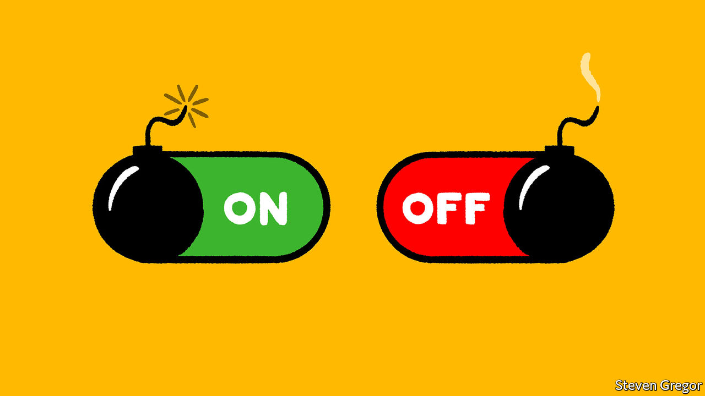

###### Said the spider to the fly

# Donald Trump’s ban from online platforms underlines their power 

##### The debate about free speech online grows beyond just Facebook and Twitter 

 

> Jan 14th 2021 


PARLER, A SMALL but rapidly growing social network, is an unlikely candidate for liberal sympathy. Pronounced “parlour”, it gained popularity mainly with right-wing Americans fleeing what they saw as the lefty tendencies of Twitter and Facebook. Yet alarm at the company’s fate has crossed America’s political divide in a way that suspending the president from Twitter and Facebook has not.


On January 8th, after the two better-known sites banned President Donald Trump, Parler jumped to the top of Apple’s app store in America, nearly quadrupling downloads in a day. The same day Google removed the app from its store for Android phones, citing its weak moderation policy, followed the next day by Apple. So did other providers of important back-end services, with names like Twilio and ZenDesk, that few outside the tech industry have heard of. The end came when AWS, Amazon’s cloud-computing arm, which provides the infrastructure used by millions of services and websites, also pulled the plug. Inaccessible as an app on either Android or iOS devices, Parler and its roughly 12m accounts disappeared from the web too.


The firms have a legal right to cut ties with Parler. And Section 230 of the Communications Decency Act allows them to remove any “objectionable” content if it is done in good faith. But their actions give the lie to the argument that if users do not like one social network’s policies, they can just go somewhere else. It is unlikely that the two other big cloud services, run by Microsoft and Google, will want Parler anywhere near their servers. Even though in wiping Parler from their infrastructure they may well be removing illegal incitements to violence, potentially shielding themselves from liability, these companies are “wielding unchecked power over key arteries of the internet,” says Lina Khan, an antitrust scholar at Columbia Law School.


The debate surrounding the awesome power of tech companies to shape what people see online has long focused on consumer-facing platforms such as Facebook and Twitter. Yet, in recent days, many previously obscure firms have found their names included in these discussions. These include Stripe, a payment-processor that said it would stop working with the Trump campaign; Salesforce, which blocked emails sent by the Republican National Committee; and Shopify, a Canadian firm that provides online shopfronts and removed two stores connected with Mr Trump. That is in addition to bans from Reddit, Instagram, Snapchat, TikTok, Twitch, YouTube, Pinterest and Discord, social-networking firms which have all taken action against Mr Trump’s accounts or hashtags such as #stopthesteal. Even Peloton, which makes pricey internet-connected exercise bikes, issued bans.


The role of social networks, payment-processors and infrastructure providers as the police force of the internet is not new. Gab, a far-right social network, was dropped by GoDaddy, which registers domain names, after it became clear that an anti-Semitic mass-shooter had used the service to broadcast hateful content (it had long before been barred from app stores). Cloudflare, a famously neutral infrastructure firm that helps protect websites from cyber-attacks, last year booted out 8chan, an online forum, for its role in other mass shootings. In 2017 it pulled the plug on the “Daily Stormer”, a neo-Nazi website. “I woke up in a bad mood and decided someone shouldn’t be allowed on the internet. No one should have that power,” Matthew Prince, the company’s boss, wrote at the time. It is difficult to exist on the internet without the support of these companies.


Few tears were shed over sites known to host extreme far-right actors. But the banning of Mr Trump and of Parler make even their detractors uncomfortable. It puts some on the left in the unfamiliar position of celebrating corporate power to determine what people can say and much of the right in the unfamiliar position of lamenting it. The fallout will be louder calls to regulate internet companies—not just from American politicians but from leaders around the world. Politicians from Germany’s Angela Merkel to Russia’s Alexei Navalny have expressed dismay at the way Mr Trump was banned by networks. Facebook itself has long called for more regulation. That is likely to come in this Congress. Even before the events of the past weeks, both parties agreed on the need to reform Section 230, which became law 25 years ago, when the web was in its infancy. A clearer set of rules, set by legislatures rather than Silicon Valley executives, would be enthusiastically welcomed—not just in America but everywhere else, too. ■

