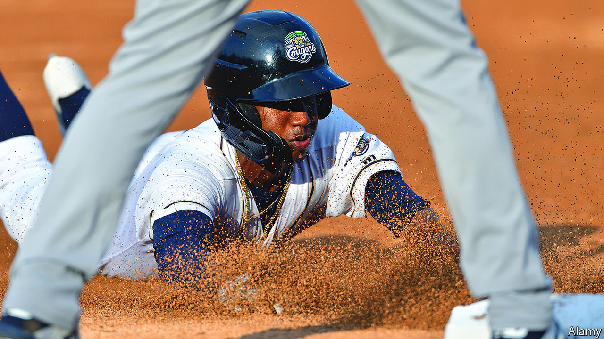

###### Trouble on the farm

# Minor-league baseball is getting squeezed 

##### The shifting relationship between baseball’s major and minor leagues is American society in miniature 

 

> Jan 16th 2021 


MINOR-LEAGUE baseball clubs, the more than a hundred small, independent teams—some, like the Albuquerque Isotopes, with wonderful names–have long had a symbiotic relationship with their major-league counterparts. Since the 1960s most have been affiliated with a major-league club in what is called the farm system. Major-league clubs loan their prized young talents to a minor-league club, pay their salaries (a relative pittance, given that Congress has exempted minor-leaguers from minimum-wage laws because of major league lobbying) and lend their name and prestige to marketing, as the New York Yankees once did for the Trenton Thunder. In return the small clubs provide a supportive training ground, allowing young players to develop and refine their skills against competition of a similar age, without the pressure that exists at the major-league level.


This has been changing, as major-league clubs use their influence to control, centralise and consolidate the minor leagues. That process took a step forward last month when the majors invited the minnows to join a new minor-league system. About a quarter of small clubs, mostly in Appalachia and the rural West, have been cast out of the farm system, and are likely to wither.


The stated reason for the realignment is to streamline and modernise training for young players, who will become enormously valuable to the major-league clubs if they blossom into stars. Yet it has also caused widespread outcry at the billionaire owners eviscerating a folksy institution solely to cut their costs.


The realignment is likely to disrupt thousands of jobs in the same regions hit by deindustrialisation over the past few decades. The likely result is that the sport’s wealth and power will be increasingly concentrated in the major league, which derives much of its revenue from media rights and technology.


Beyond illustrating the power of superstar economics, the relationship between the majors and minors mirrors other trends. Although no longer the country’s most popular sport, baseball remains a unifying symbol of Americana, from the College World Series in Omaha to the sandlot diamonds of the South Bronx. Despite their brand as keepers of the national pastime, major-league clubs are in the cosmopolitan city centres that have outgrown and outpaced the rest of the country in recent decades.


This is a pity. If a young fan of the Idaho Falls Chukars (an 80-year-old minor-league club facing probable bankruptcy) loses a connection to the game, that can only exacerbate regional and cultural divides. Nearly 40 years ago, the French-American intellectual and baseball fan Jacques Barzun said that “Baseball still reflects our society, it’s just that our society has changed.” Were he alive today, it seems unlikely that he would revise that view.

