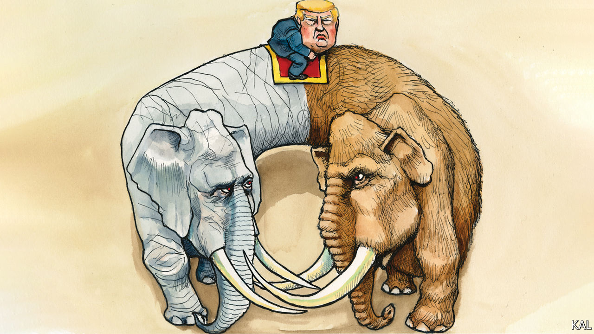

###### Lexington

# The conscience of some conservatives 

##### The Republican Party launches an overdue civil war over Donald Trump 

 

> Jan 14th 2021 


TO PARAPHRASE Samuel Johnson, nothing concentrates the mind like the prospect of being hanged. And so it has proved inside the Republican leadership. A week after Donald Trump’s MAGA mob erected a gallows besides the Capitol reflecting pool then invaded the building, the president’s party is for the first time seriously reviewing its loyalty to him. Liz Cheney—the number three Republican in the House—was among ten in her party to vote to impeach Mr Trump. Mitch McConnell, the Republican leader in the Senate, has let it be known he might be supportive. In that case Mr Trump—the first president to have been impeached twice—could become the first to be convicted and disbarred from office.


It is hard to exaggerate how dramatic a turnaround this already is. Although inciting the attack itself was worse than anything Mr Trump has done, it revealed nothing fundamentally new about his character. And his newly emboldened Republican critics did not merely stomach his earlier abuses—of ethics rules, migrant children, and so on—but vociferously defended them. Mr McConnell has had more power to check Mr Trump than anyone and has barely tried. Ms Cheney dismissed the leaked recording that led to his first impeachment—in which he coerced his Ukrainian counterpart to invent a corruption case against Joe Biden—as a “political set-up”. Up until the riot, and perhaps still, most Republican politicians expected him to be their presidential nominee in 2024. This history of supplication makes the nascent effort to purge Mr Trump and his destructive politics as astonishing as it is welcome. It also suggests how hard it will be.


To start with the obvious barrier to Republican reform, most of the party’s voters appear to be against it, which is why Mr Trump’s critics enabled him for so long. After the insurrection, almost half of Trump voters said they stood with the rioters. Even if the president is ousted, his main means of keeping his party in line—the threat of a primary challenge—may therefore endure. America has a history of rabble-rousers, but none has previously come close to achieving Mr Trump’s personal grip on millions of voters.


If his grasp does weaken, however, as he becomes less visible or ineligible, there is little to suggest the Republican base could easily be turned back to a more constructive conservatism. Mr Trump has defined himself against his party’s conventionally conservative leaders—apparently the lynch mob’s first target—almost as much as against Democrats. Below the level of Ms Cheney and Mr McConnell, he has also changed the Republican establishment—such that 147 Republican House and Senate members voted to overturn the election even after the attack on the Capitol.


He has promoted its most anti-democratic elements, in particular the Tea Party faction, whose bigotry and demonising of their leftist opponents presaged his own. One of its members, Senator Ron Johnson of Wisconsin, recently told Lexington that what distinguished Trump voters from the left was that while the former “love America with all their hearts” Mr Biden and many Democrats “don’t really care for this country”. After your columnist suggested this was untrue, Mr Johnson, a staunch proponent of Mr Trump’s election-fraud conspiracy theory, insisted, also falsely, that: “Biden rallies were protests which turned to riots in the streets.”


This was absurd even before the attempted MAGA coup. More recent additions to the Republican bench can sound positively deranged: especially the two QAnon admirers, Marjorie Taylor Greene and Lauren Boebert, in the House. With their divided base and divided elite the Republicans are splitting into two coalitions. One is large, Trumpist and incompatible with democracy; the other anti-Trumpist, anxious, and of uncertain size.


This is a crisis with deep roots. The modern conservative movement always contained contradictions: its love of limited government was belied by its support for supersized defence; the religious right was often illiberal. Such tensions were nonetheless harmonised by the fuzzier values Ronald Reagan imbued the movement with: realism, patriotism and prudence. Yet that settlement had eroded long before Mr Trump; the right’s policy agenda had become captured by vested interests and its values by pessimists. Over the past four years it has collapsed. The ideological contradictions have ballooned, as Mr Trump has slashed taxes, splurged on defence and lionised religious crackpots. Meanwhile he has substituted for Reagan’s harmonising values an ever-increasing animosity to the other side, personified by his own behaviour, and leading to the January 6th eruption.


This history suggests a necessary condition for renewal on the right may be failure. The Reagan revolution was fomented in the wilderness. Its ingredients included political space and a slow-witted Democratic opponent, grown complacent with power. Therefore the right’s most astute critics, Never Trump Republicans, mostly wanted to see it hammered in November. Yet it seems that path to creative destruction has been blocked. Extreme polarisation limits the potential losses of either party. And the Republicans are additionally sustained by the advantage their heavy rural vote gives them in the Senate and electoral college. This anomaly—which Daniel Ziblatt, a political scientist, calls “constitutional welfare”—means they have cause to think they are winning even when they are losing. It also amplifies the party’s most remote, culturally aggrieved and therefore MAGA voices. It is undemocratic, the ultimate barrier to reform on the right and presently insoluble.

Out, out damn spot


This is cause for realism; but not despair. Expunging Mr Trump from Reagan’s party is a more basic condition for progress. And thanks to the belated bravery of ten Republican House members and perhaps Mr McConnell it is imaginable. If they succeed, it will be their life’s work; Republicans and Democrats alike should back them. Mr Biden liked to say the general election was a battle for the soul of America. It is now being waged in the Republican Party.■

