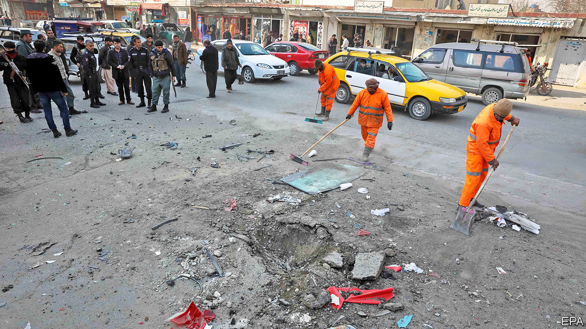

###### Negotiating with terrorists

# Assassinations rise in Afghanistan amid negotiations 

##### The Taliban’s latest targets are the brightest and the best 

 

> Jan 21st 2021 


THE TRAFFIC jams in Kabul, Afghanistan’s capital, have recently yielded a sombre new spectacle. Almost every day, drivers crawling along at rush hour have had to pass the blasted or bullet-riddled cars of those whose commute has ended in an assassin’s attack. Two female judges were shot dead on their way to work on January 17th. A car from the telecoms ministry was blown up the next day. The day after, in a province to the south, a journalist was hurt in a bomb attack. Some targets are bigwigs’ 4x4s, others are humble saloons.


The assassins’ favourite tactics are to sneak a “sticky bomb”—a magnetic one—onto or under a car when it is stationary, or simply to ride up on the back of a motorbike and open fire. Kabul’s traffic makes the targets sitting ducks.


Assassinations are nothing new. But the scale, timing and choice of victims in the latest wave are causing panic. As well as policemen and soldiers, they have included many civil servants, journalists and civil-society campaigners. The killings have proliferated despite peace talks between the government and the insurgents of the Taliban, which have been under way in Qatar for several months.


The Taliban deny involvement, but few believe them. No single group is likely to have conducted all the attacks. A variety of bomb designs has been used. Personal rivalries and organised crime may be behind some, as may other militant groups. But the Taliban are almost certainly the main perpetrators. They have long viewed government workers and the security forces as fair game. Judges responsible for jailing their comrades are also prized targets.


Moreover, violence has always been the Taliban’s main weapon. In their eyes, at least, their long campaign of both terrorist attacks and more conventional military assaults was the main reason America began negotiating with them in 2018 and struck an agreement to withdraw most of its troops from the country last year. The Taliban’s relentless violence has also helped ease doubts within the movement about negotiations with America and with the Afghan government.


American officials hint that the Taliban promised to scale back their attacks, particularly indiscriminate suicide-bombings, even though the accord the group signed in Qatar a year ago included no such pledge. There is speculation that the Taliban have upped the rate of assassinations to maintain pressure on President Ashraf Ghani’s government and to make it look weak. Humiliated by its inability to stop the killings, the government has vowed impotently to hang the culprits.


But there is a grimmer interpretation. The dead have recently included many journalists and civil-society activists, part of the thin layer of educated, modern-minded Afghans whom the Taliban may be singling out. Shaharzad Akbar, chair of the country’s human-rights commission, fears the loss of “one of [Afghanistan’s] most important gains, its educated and professional cadre, in what seems to be a systematic massacre”. Roland Kobia, the European Union’s special envoy, has likened the attacks to ethnic cleansing.


Against this backdrop, the American force in Afghanistan has shrunk to 2,500, its lowest level since it first arrived in 2001. All American troops are supposed to be out by May. President Joe Biden must decide whether to stick to this schedule or to delay on the grounds that the Taliban are violating the spirit of the deal. The insurgents’ calculus is unchanged: violence works. ■

