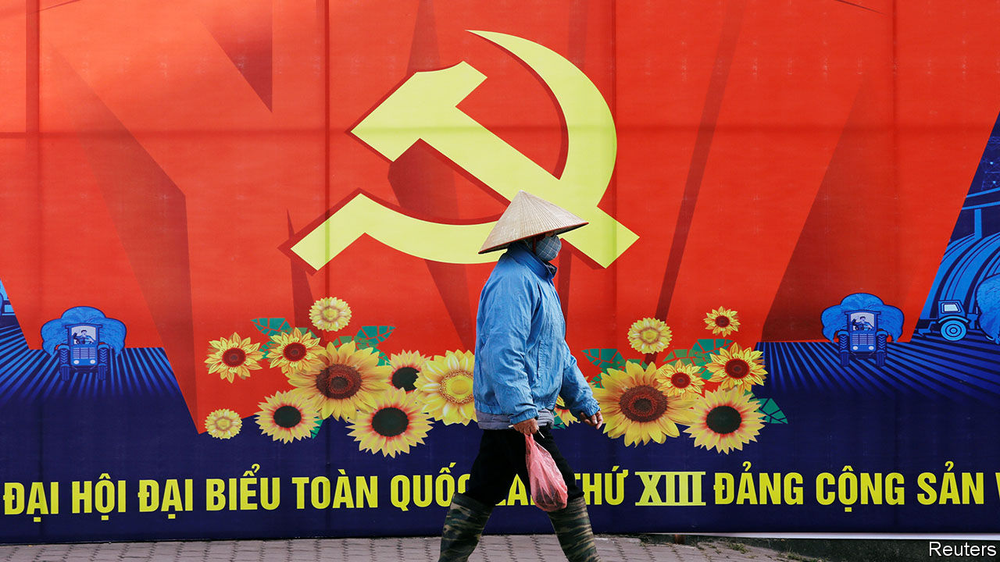

###### Hammered and sickled

# Vietnam’s Communist Party is in a weaker position than it seems 

##### Protests are mounting and economic growth will be hard to revive 

 

> Jan 21st 2021 


THOUSANDS OF SOLDIERS marched down the streets of Hanoi on January 10th in honour of the Vietnamese Communist Party’s 13th national congress. The show of muscle was in keeping with the party’s mood. Every five years apparatchiks convene to rubber stamp policies and a fresh slate of leaders. As they assemble for this year’s congress, which begins on January 25th, some may feel exultant. With just 1,544 covid-19 cases and 35 deaths to date, Vietnam has handled the pandemic well. It was one of few countries whose economy grew last year, by nearly 3%. The public approve. In a survey conducted in May, which assessed how people from 23 countries rated their governments’ response to the pandemic, Vietnam scored second best. 


But once the backslapping concludes, the new leaders are likely to knit their brows in concern. Although the party does not allow any formal opposition, informal criticism has been growing. Improved education and internet access have exposed Vietnamese to “universal values like democracy and human rights”, says Nguyen Khac Giang, an analyst who lives in New Zealand. Moreover, there were 65m social-media users in Vietnam in 2020, according to We Are Social, a British firm, out of a population of almost 100m. In contrast to the “authoritarian public sphere” offline, notes Mr Nguyen, “you have relatively liberal and free social-media platforms where you can speak out your views.” Vietnamese have been doing so, about everything from corruption to pollution.


The party is trying to change that. Over the past five years it has arrested 280 people for “anti-state” activities, up from just 68 over the previous five years. It has instructed the state-run press to scrub the phrases “civil society” and “human rights” from its pages. And in October the government secured a promise from Facebook to comply with 95% of its requests to remove “malicious” posts.


This crackdown is a sign of how worried the party is about popular discontent, says Tuong Vu of the University of Oregon. Protests are, in effect, illegal in Vietnam, yet on many occasions over the past 15 years the government has had to change course in response to public pressure. In 2018 tens of thousands of Vietnamese took to the streets to protest against a law that would have created three special economic zones that Chinese companies would have been able to lease for up to 99 years. After violent clashes between the police and the protesters, the government abandoned the scheme. Between 1995 and 2018 factory workers across the country organised over 6,600 strikes, according to Ben Kerkvliet of Australian National University. The government changed several laws in response to some of the workers’ demands.


Trade will also be keeping Vietnam’s leaders awake at night. Imports and exports were worth 208% of GDP in 2018 (the total is more than 100% because lots of components are imported, assembled into finished goods and then re-exported). That gives Vietnam’s biggest export markets—America and the EU—leverage over the government. To secure trade deals with them, Mr Nguyen notes, it has had to make concessions. It recently promised the EU it would abolish forced labour and allow independent trade unions, for example.


Ever since the party initiated a transition from a centrally planned economy to a market one in the 1980s, the authorities have staked their legitimacy on rising incomes. In just 35 years Vietnam has been transformed from one of the poorest countries in the world to a middle-income manufacturing powerhouse. The Economist Intelligence Unit, a sister company of The Economist, thinks the economy will grow by 5.2% this year. But without a swift return to the 7% growth of recent years, it will struggle to absorb new entrants to the labour market, notes Mr Nguyen. Meanwhile, inequality is rising. In some provinces the richest 20% earn more than 20 times more than the poorest 20%, write Andrew Wells-Dang and Vu Thi Quynh Hoa of Oxfam, a charity. That is a sobering thought for whoever emerges from the congress as secretary-general. ■

