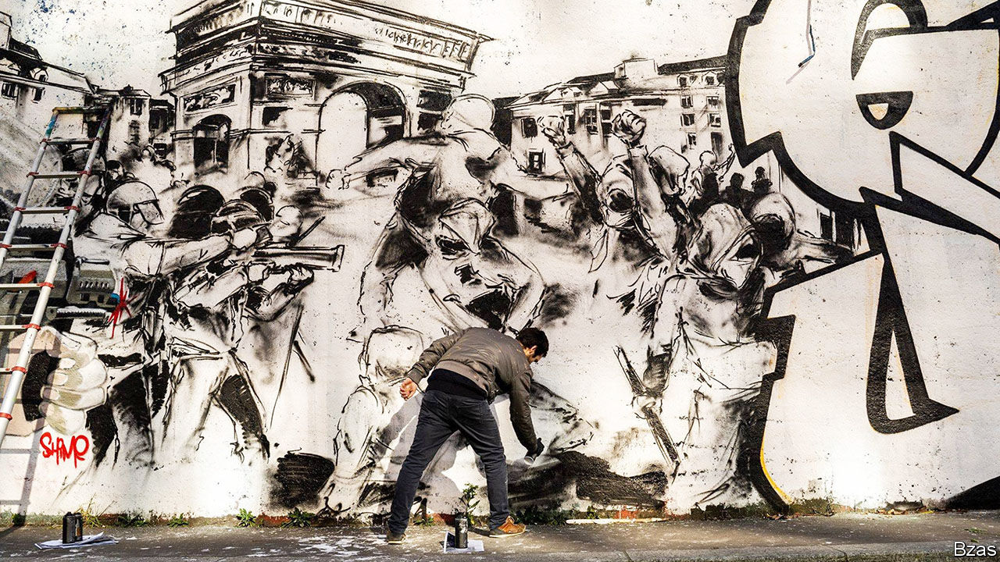

###### Walls have eyes

# Itvan Kebadian’s art of protest 

##### His murals in Paris document clashes between demonstrators and police 

 

> Jan 23rd 2021 


WHEN ITVAN KEBADIAN spray-painted the words “abolissons la police” above a mural in Paris last year, he was thinking of George Floyd, an African-American whose death under the knee of a white policeman ignited a global movement. But cases closer to home were on his mind, too—of Adama Traoré, a young black man who died in custody in France, and Théo Luhaka, who was disabled during a violent arrest, as well as the clashes Mr Kebadian had himself witnessed since he began documenting police brutality in 2016.


By then Mr Kebadian, who once liked to paint insects, had already turned to political themes. He was finishing a mural when thick black smoke began to rise from a nearby street. A police car had been set on fire; passers-by who had stopped to photograph the painter scurried away as officers moved to confront the culprits.


On impulse, Mr Kebadian painted the unfolding events in simple black lines, a sketch-like method that has become his signature style. His sharp representations of French society have appeared around the capital—and leapt from street walls to those of galleries. “His technique was far superior to that of other street artists,” says Dominique Fiat, who features Mr Kebadian’s work in her gallery.


“I try to paint reality in reality,” the artist says of his murals. They record clashes between protesters and police, depicting eyes dislodged by rubber bullets, crowds dispersed by clouds of tear gas and telescopic batons breaking jaws. The figures in these tableaux are mostly faceless, composed only of a few lines and shadows. But together they form bleak, eerie scenes of chaos. The results are akin to blurry photos taken hastily with a smartphone; screenshots in paint form, as the artist puts it.


Christophe Genin, a professor of art at Panthéon-Sorbonne University, links Mr Kebadian’s output to the tradition of protest art that evolved in the 20th century—from the Russian avant-garde of the 1920s to the artistic ferment in America in the 1960s and the political placards that appeared across Paris during the student uprising of May 1968. The murals, notes Mr Genin, also resemble Francisco Goya’s lamentations of war, evincing the same sense of despair as “The Third of May 1808”, in which Goya shows Napoleonic soldiers massacring Spaniards during the Peninsular war. He calls Mr Kebadian an “artivist”.


When he cannot attend protests himself, Mr Kebadian reproduces photos that have circulated online. There has been no shortage. In 2019, for instance, over 2,000 protests were recorded in Paris alone, compared with about 280 in the whole of Britain. The past two years have been especially busy. Most notably, Mr Kebadian has documented the rise of the gilets jaunes, a movement born of anger over an increase in the carbon tax on fuel that grew into nationwide anti-government demonstrations. With the help of Black Lines, an artists’ collective that he co-founded, he produced “L’Hiver Jaune” (“The Yellow Winter”), a 300-metre-long mural that commemorated the gilets jaunes, some of whom were seriously injured during riots.


This huge undertaking attracted media attention and helped raise his profile. But not everyone is a fan. “L’Hiver Jaune” was promptly painted over. In fact, although he uses legal graffiti walls, almost all Mr Kebadian’s murals have been covered up by the Parisian authorities.


That disapproval has not hurt his reputation, which has flourished and spread online. “Eye for an Eye”, one of his latest projects, is a series of 50 Indian-ink paintings that are sold on Instagram. They are based on the events of 2020, when in France, as in America, long-standing debates about police misconduct came to a head. The reverberations of Floyd’s death were followed in the autumn by the violent dismantling of a migrant camp and the beating of a black music producer, both of which sparked protests.


One illustration in the series portrays a man standing on top of a car and waving a black flag as other people riot. The scene is reminiscent of Eugène Delacroix’s “Liberty Leading the People”, a painting of 1830 that shows a bare-chested Marianne (a personification of France) brandishing a tricolour amid a crowd. Like Delacroix’s, Mr Kebadian’s art strives to capture the essence of his times—but also to change them. ■

