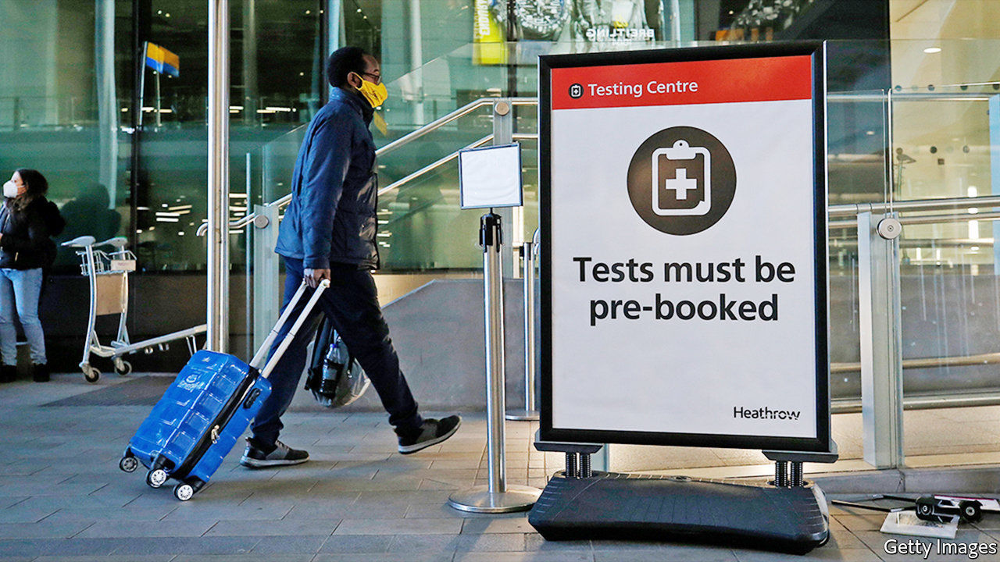

###### Papers, please

# Britain belatedly beefs up its borders 

##### With new variants worrying ministers and gaps remaining, stronger restrictions may arrive soon 

 

> Jan 23rd 2021 


THROUGHOUT THE covid-19 pandemic, Britain has had some of the loosest travel restrictions in the rich world. It was slow to introduce quarantine, and offered exemptions both to countries with low rates of the virus and to a wide range of travellers (including journalists and executives on business trips). Jeremy Hunt, a former foreign and health secretary, thinks this reflects the national self-image: “It is painful for a country like Britain, which sees its entire economic success as being one of the most international Western economies, to do any restrictions.”


Yet the government is becoming increasingly willing to bear the pain. On January 15th it banned arrivals from South America and Portugal. Three days later, it closed travel corridors—which had allowed people from those countries with low rates of the virus to avoid self-isolating for ten days on arrival—and required all travellers to provide proof of a negative covid-19 test in the past 72 hours. Ministers promised strict enforcement of the rules.


The change of heart was inspired by the emergence of new covid-19 variants across the world and by the early success of the vaccine roll-out in Britain. The worry that new variants may reduce the efficacy of jabs explains the decision to close the border to South America (Brazil is home to a particularly concerning one—see Americas section), and also the shift in the government’s cost-benefit calculation about other rules.


Countries such as Australia, Taiwan and South Korea have shown that strict border controls can help keep the virus out. In Britain, where the goal has been suppression rather than elimination, their benefits did not seem worth the pain. As Matt Hancock, the health secretary, put it: “If there is a country where the case rates are lower than the UK...there is not necessarily any higher risk from somebody coming here.” Even when European neighbours began to ask for a test, Britain held off—pleasing airline bosses, who dislike extra barriers.


Despite the new restrictions, plenty of holes remain. The arrivals your correspondent quizzed at Luton Airport assured him that, of course, they would follow the rules. But there is little way of knowing if this is true. Lucy Moreton of the ISU, the border guards’ union, says quarantine rules were and still are “unenforceable”. Guards cannot check if the contact details provided by arrivals are correct, she notes, nor if the test results are genuine. Public Health England, which is in charge of checking if people are following isolation rules, has just 90-odd people on the job.


Many of those who obey the rules will still take public transport to their place of isolation. The easiest route to lots of addresses in London from Luton Airport involves a bus, a train and a tube journey. Reports suggest that the government is therefore considering going further still: either with “enhanced monitoring” where travellers are tracked with GPS data (as in Poland) or an enforced two-week stay in an airport hotel (as in a number of countries, including Australia, Taiwan and New Zealand). That would offer more protection against new variants—and even provide solace to miserable hoteliers, or at least those near airports. ■


Editor’s note: Some of our covid-19 coverage is free for readers of The Economist Today, our daily . For more stories and our pandemic tracker, see our 

