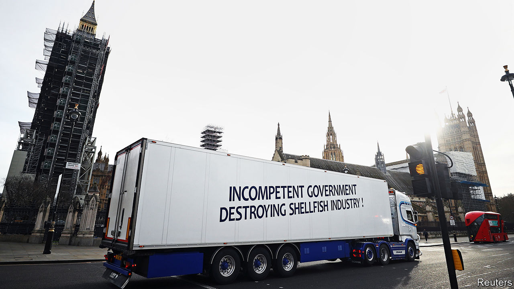

###### Brexit and trade

# Delays to fish and meat exports are not just teething problems 

##### The profit margin of smaller exporters could be wiped out 

 

> Jan 23rd 2021 


EARLY EVIDENCE of the economic damage from Britain’s thin trade deal with the EU has been more olfactory than visual. Rather than the spectacle of queues of trucks outside Dover or empty British supermarket shelves, Brexit has instead brought the stench of pork rotting in Rotterdam and shellfish going off in its pallets. The government blames “teething problems”, but the new arrangements pose a long-term threat to farmers and fishers who want to export to the EU.


The Scottish fishing industry reckons it has lost around £1m ($1.4m) a day of sales so far in January. Border delays and disruption are an issue for any sort of firm involved in international trade but pose a particular problem for those moving fresh produce. “It’s incredibly grim at the moment,” says James Withers, the head of Scotland Food and Drink, a trade association. “We’ve gone from a seamless border to a slow and expensive one.”


Customs are part of the problem. Britain and the EU have agreed to tariff-free and quota-free trade but goods crossing the border need forms, which must be correctly filled. Transposing a 6 and 9 in a 15-digit code can lead to hours of delays; mistakes can be made by either the exporting firm or the receiving one. Add in inexperienced border staff and mostly new and untested IT systems, and there are multiple potential points of failure.


Food is now subject to sanitary and phytosanitary (SPS) procedures to check it meets EU standards. According to industry bosses Britain has mostly waived such checks to ensure that supermarket shelves remained stocked, but the Europeans are enforcing the rules more rigorously. “Groupage” is a particular problem. A trailer loaded with a single type of good from a single firm needs only one customs declaration and one set of SPS checks. But multiple goods from multiple firms grouped together all need individual checks. That can take hours; meat can rot and shellfish go off.


About 40% of British meat shipments to the EU are usually subject to groupage, according to the British Meat Processors Association (BMPA), an industry body. Shellfish-exporting firms are usually small, so groupage is common. The problems, says Duncan Buchanan, the Road Haulage Association’s policy director, is that the current EU rules on SPS are designed for dealing with containers of frozen lamb from New Zealand rather than for mixed loads of fresh produce.


Some of the wrinkles should be ironed out in the weeks and months ahead. Importers and exporters will get to grips with the new arrangements, customs officials will gain experience and IT bugs will be fixed. But firms will still be looking at extra costs of £20 to £150 per shipment from customs charges alone—enough to wipe out the profit margin for smaller exporters. Nick Allen of the BMPA says the new system is “convoluted, archaic and badly implemented” and worries that it will make lower-value exports unviable.


Some British fishing vessels have already started making the 72-hour round trip to land their catch in Denmark to get around the new customs frontier. If that continues, Britain’s processing firms will suffer. Meat traders warn that French supermarkets are talking of replacing British suppliers with their Spanish and eastern European peers. More trade friction will mean less trade.■


For more coverage of matters relating to Brexit, visit our 

