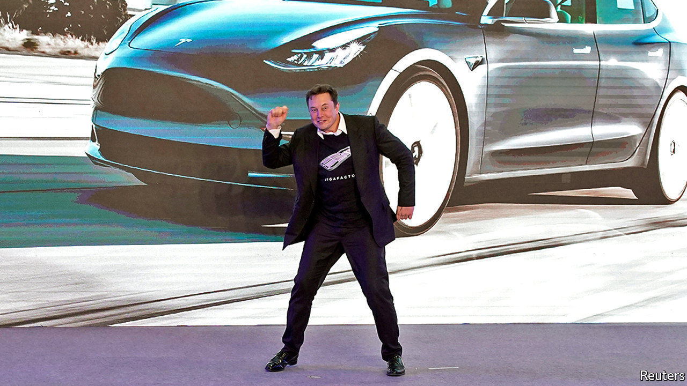
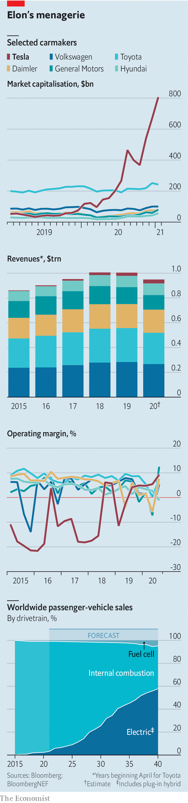

###### Electric shock and awe

# A Tesla bull debates a Tesla bear 

##### It is easy to make a positive and a negative case for the electric-car maker's $800bn market capitalisation 

 

> Jan 23rd 2021 

Electric awe


TESLA’S SHARE price will travel in only one direction—up. Despite accelerating in “ludicrous” mode, by more than 700% in 2020, Tesla has plenty left in the tank, to borrow a phrase that the firm is consigning to history. Its impact on the car industry cannot be overstated. But it is a mistake to judge it by the standards of the firms it will leave in its tracks. Tesla is a technology firm, set to disrupt not just carmaking but personal transport, energy (thanks to its battery technology and solar power), robotics, health care and more besides.


Its valuation is justified by its potential to dominate the future of mobility alone. Operating margins were close to 7% in the first nine months of 2020, higher than any big rival’s—and rising. Its market is exploding. Electric vehicles (EVs) now make up around 3% of all car sales, of which Tesla accounts for a fifth. As regulations tighten and ranks of climate-worriers swell, a third of all cars sold globally will be electric by 2030—rising to over half ten years later. Even if Tesla won’t make 20m EVs a year by 2030, as its boss, Elon Musk, hopes, it could control 25-30% of the EV market.

 


Tesla’s “production hell” is in the past. It just about hit a pre-pandemic delivery target of 500,000 cars in 2020 and rapidly erected a new factory in China—which on January 18th delivered its first Model Y, a small SUV. Another will come online shortly in Germany. So will a new battery “gigafactory” in Texas. This, and the ease with which it raised $12bn of capital amid the covid-19 crisis, shows it can expand at will.


The firm’s proven knack for speedy innovation will let it keep an unassailable technology lead over both established carmakers, struggling to free themselves of the legacy of internal combustion, and newcomers looking to steal its crown. Like other tech Goliaths such as Apple, its products will continue to define the category. Mr Musk has remade the car into a connected electronics device that will soon drive itself. Autonomous technology is already fitted to many Teslas, awaiting regulators to approve it. This will put Mr Musk in the front seat of the robotaxi as the world moves towards mobility services. 


Tesla’s greatest asset is Mr Musk, a visionary spearheading rocket trips to Mars, neuroscience, grid-scale batteries and other transformational technologies. Investing in Tesla is a bet on his genius for turning the future into dollars.

Electric shock


TESLA’S SHARE price can travel in only one direction—reverse. A market value of $800bn, equal to that of the next eight biggest carmakers combined, is predicated on Elon Musk’s shake-up of the industry. Building a brand swiftly and making electric cars trendy is a real achievement. But Tesla’s revenues come from selling cars. Sales are rising—yet would need to swell seven-fold to match Toyota’s. Good luck.


Yes, Tesla missed a delivery target of 500,000 cars in 2020 by a mere whisker. But it once said it would be making 1m a year by now. A goal of 20m electric cars by 2030 looks like another wild over-promise. Mr Musk has admitted that unless costs are contained the share price may be “crushed like a soufflé under a sledgehammer”.


Competition is getting fiercer. Big firms dragged their feet on electrification for a reason. Batteries were costly—and electric cars, niche products for the rich. But prices have fallen, regulations have tightened and buyers want electric vehicles (EVs). The giants promise a traffic jam’s worth: General Motors says it will have 30 models on the market by 2025; Volkswagen Group is eyeing 70 by 2030. Startups, many in China, are powering up. Mr Musk’s technology lead is running out of road.


Rising profits in 2020 might reassure investors, but come mostly from selling carbon credits. And Tesla is not immune to the traditional forces that govern carmaking. Some models are ageing. Sales of Model S and Model X are falling and the firm is losing market share in Europe. In the first nine months of 2020 vw, Renault-Nissan-Mitsubishi and Hyundai-Kia all sold more EVs in Europe than Tesla did, according to Schmidt Automotive Research.

 


The hype about autonomous cars has worn off as developing self-driving systems has proven tricky. Tesla’s pseudo-autonomous system requires constant monitoring by the driver. The full autonomy that would give robotaxis the freedom of the open road is years away. All this suggests Tesla will remain a niche luxury firm.


Then there is Mr Musk. He has toned down erratic tweets, like the one in 2018 implying Tesla was about to go private, which got him into hot water with regulators. But he is spreading himself too thinly between Tesla, SpaceX’s rocketry and other ventures. The strains from Tesla’s expansion could again bring out his demons—and spell disaster for shareholders.■


For more coverage of climate change, register for The Climate Issue, our fortnightly , or visit our 

