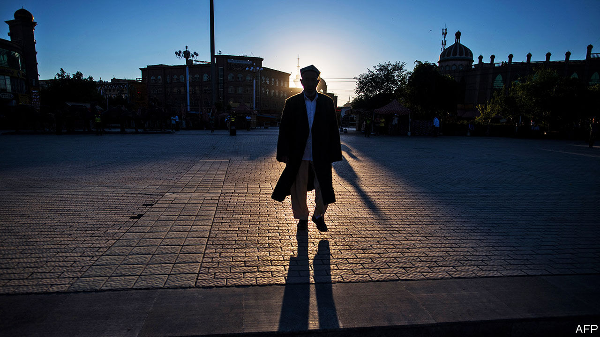

###### Xinjiang’s shadow

# Before leaving office, Mike Pompeo accused China of genocide 

##### His assessment of the plight of Uyghurs will add to tension between China and America 

 

> Jan 23rd 2021 


IN ONE OF his last acts as Donald Trump’s secretary of state, Mike Pompeo declared that China’s repression of Uyghurs in Xinjiang was an act of “genocide”. Antony Blinken, President Joe’s Biden nominee to succeed Mr Pompeo, said he agreed. In the fog of a presidential transition, America thereby adopted the harshest language of any country in its description of the atrocities in China’s far west. This will raise tensions and complicate relations between China and the new administration.


Mr Pompeo’s use of the term “genocide” was not a formal legal judgment. It does not oblige Mr Biden to take any further action to punish China for its repression of Uyghurs, a mainly Muslim ethnic group. The Trump administration had already imposed financial sanctions and visa restrictions on numerous Chinese government entities, companies and officials—including Chen Quanguo, who is the Communist Party boss of Xinjiang and a member of China’s Politburo. This month it declared a ban on imports of goods made with cotton or tomatoes from Xinjiang, a big producer of both, because of the alleged use of Uyghur forced labour to produce them.


But Mr Pompeo’s statement, and Mr Blinken’s agreement with it, mark a step change in American rhetoric surrounding Xinjiang, where more than 1m Uyghurs and other Muslims have been sent to camps for “deradicalisation” (often, in fact, for showing pride in their culture and faith), and where women have been subjected to forced sterilisations and abortions to limit the growth of the Uyghur population.


State Department lawyers argued over whether “genocide” was the right term. Most dictionaries would say it is not. Genocide means the mass killing of a people or an ethnic group, and no one has accused China of that in Xinjiang. However, the UN’s genocide convention defines the term much more broadly, so that it need not involve any killing at all. “Measures intended to prevent births” count, so long as the aim is to “destroy, in whole or in part”, a national, ethnic, racial or religious group. So, with the same aim, does inflicting “serious mental harm” on members of the group.


Governments have long been reluctant to take the convention literally, perhaps because it might then apply to rather a lot of them. America’s State Department has previously described as genocide only atrocities that fit the dictionary definition, such as the slaughter of Tutsis in Rwanda or Yazidis by Islamic State.


However, according to a State Department official, information that came to light in 2020 about the extent of forced sterilisations in Xinjiang helped to convince some colleagues that “genocide” was an appropriate word. That Mr Pompeo deployed it only on his last full day in office, when he would not have to deal with the consequences, struck some observers as opportunistic. He may run for president in 2024.


China is furious. On January 21st it imposed sanctions on 28 Americans, including Mr Pompeo and other Trump administration officials, for their “crazy moves” against China. They will not be allowed to visit the country (including Hong Kong) and face restrictions on doing business there. A Chinese foreign-ministry official said Mr Pompeo was making himself “a laughing stock and a clown”. But she avoided attacking the new administration. There may be hope in Beijing that, even if not in areas relating to human rights, Mr Biden will try to restore calm to the relationship.


Still, now that America has uttered the word genocide, the question is whether other Western governments will say it, too. Some may prefer to stick with a term like “crimes against humanity”, which Mr Pompeo also used, and which is far harder for China to dismiss. No doubt China’s government would rather argue about words than the facts on the ground.


Whatever the world calls the persecution of Uyghurs, it will be hard to stop. This month Canada and Britain made vague announcements about steps they would take to block imports of goods made with forced labour. But no government has yet followed America in imposing sanctions and no international body has tried to hold China to account. Many multinational firms have quietly been trying to extricate their supply chains from Xinjiang, but only a few have made public statements. Last month the European Union agreed an investment treaty with China that paid only lip service to the issue of forced labour.


Mr Biden may pay more attention to the Uyghur cause. Mr Trump appeared not to care: according to John Bolton, his former national security adviser, he told his Chinese counterpart, Xi Jinping, in 2019 that building camps for Uyghurs was “exactly the right thing to do”. Mr Trump withdrew America from the UN Human Rights Council in Geneva; the Biden administration is expected to restore its place. The council has never introduced a resolution on China’s atrocities in Xinjiang, but that could change with Mr Biden’s backing.


Mr Trump’s treasury secretary, Steve Mnuchin, hesitated to let human rights get in the way of trade. An official under Mr Pompeo says the State Department recommended sanctions against about a dozen Chinese officials and entities that were never acted on by the Treasury Department because of the potential impact on Sino-American ties. Those targeted would have included the Xinjiang Political and Legal Affairs Committee. This powerful security body remained untouched by the Trump administration. Mr Biden’s Treasury Department may take a different view.


The winter Olympics are scheduled to be held in Beijing in February 2022. Human-rights groups have called for a boycott, and some American senators have called for the games to be moved to another country. Mr Biden’s officials have not said whether they favour any such action. Regardless, some athletes and fans may choose to stay at home. ■

