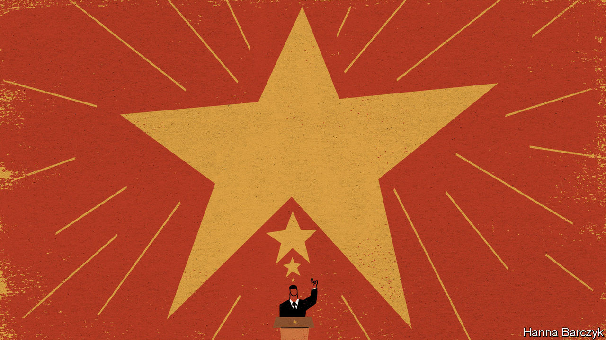

###### Chaguan

# China’s Communist Party turns 100 this year. Expect mixed signals 

##### There will be reassuring words for foreigners and radical ones for the audience at home 

 

> Jan 21st 2021 


IN LATE MAY 1949, as China’s civil war neared a blood-soaked end, America’s consul-general in Shanghai, John Cabot, was startled when resident Western businessmen cheered the city’s capture by Communist soldiers. Foreign traders and factory bosses admired the discipline of the troops, who declined gifts of food and handed out notices in English promising safety for “normal” businesses.


Blithely discounting the Communists’ pro-Soviet, anti-imperialist rhetoric, the Westerners focused on the party’s stated mission to save the country from hunger and want. That would surely involve trade with the West, and thus them. At the American Chamber of Commerce a day after Shanghai’s takeover, Cabot found members convinced that they would thrive under Communist rule. “The rejoicing couldn’t have been greater if the city had been liberated by American forces,” the diplomat recorded drily. “I can’t think why.” He was right to be cynical. Before long Western businessmen were begging to sell assets and pleading for exit permits.


Scenes of wishful thinking fill an excellent new book about the founding year of the People’s Republic, “China 1949: Year of Revolution” by Graham Hutchings. Those delusions were carefully nurtured by the Communist Party. Westerners were told, in effect, that economics would trump ideology. Chinese tycoons were assured by Mao that he planned to restrain, not abolish, capitalism. Several stayed. The luckiest endured only the nationalisation of their firms in the mid-1950s. Later, others were persecuted to death.


Back in 1949 this quelling of panic among the outgoing elites involved deft rhetorical conjuring by Mao and party leaders. For even as they downplayed their radicalism when addressing the old establishment, they successfully wooed ordinary Chinese with visions of transformation and revolution. Peasants were recruited to Communist armies with promises of land after the war, when rural property-owners would be destroyed as a class. Urban workers were led to expect liberation from exploitative bosses. Intellectuals and students were urged to help to build a modern country and end centuries of humiliation by foreign powers. Somehow the party managed to sell these two competing stories at the same time. One group found no place in either narrative, Mr Hutchings shrewdly notes. Liberal Chinese intellectuals, lawyers and journalists were losers in 1949, because their attachment to individual rights and accountable government amounted to a creed of opposition. Mao had no tolerance for dissent, even from loyal patriots. Declaring China in need of salvation from domestic and external foes, the party’s response involved strong, even iron-fisted, rule.


Jump to 2021, the centenary of the party’s founding, and China’s rulers face a revealingly similar challenge. Once again, they must tell two, contradictory stories about their country and its future. The first will be soothing. After four years of open competition with the Trump administration, involving tariff wars, tit-for-tat visa fights and barriers to trade in sensitive technologies, China would like to call a truce. Its rulers will ask to revive old economic dialogues and to seek new avenues for co-operation with President Joe Biden, in such fields as climate change or pandemic control. They have no illusions about returning to the days when American leaders actively welcomed China’s rise. Still, in part to buy time while they seek greater self-reliance, Chinese leaders will portray their country as a source of stability and economic growth. China last year agreed two modest trade agreements, one with 14 Pacific neighbours and a second with the European Union. Its paramount leader, Xi Jinping, has suggested that China may join the 11-member Comprehensive and Progressive Trans-Pacific Partnership, a more ambitious trade pact that was proposed by America under Barack Obama, but which Donald Trump snubbed. In private, Chinese elites insist that Western critics mistakenly view their country as a threat because it is run by a Communist Party. They say the party is more pragmatic than ideological, with a doctrine that resembles a mishmash of nationalism, traditional Chinese culture and a vaguely leftish belief that capitalists, while good at innovation, should pay more heed to the national interest and not flaunt their wealth.

Talking about a revolution, just not to foreigners


The headache for China’s leaders is that they must tell a different, intensely political, story to domestic audiences, as their party turns 100 in July. To inspire the masses and guide the work of officials, leaders must explain their vaulting ambitions for the country and the centrality of the party to them. They have already begun. On January 11th Mr Xi declared that China was entering a “new development stage”, having achieved a first centennial goal of building a “moderately prosperous society”. China’s new goal is to be a “great modern socialist country” by 2049, when the People’s Republic turns 100. In plainer language, China wants to be a superpower of unchallenged strength and influence.


In 1949 the party won power with offers of domestic redistribution. Today, the promise involves a global redistribution of wealth and geopolitical clout. On January 15th a senior security official, Chen Yixin, told colleagues that the great trend of the moment was “a rising East and a declining West”. China has much to gain, he declared, if it can manage a protracted struggle with America and public-security risks at home. Once again liberals will be losers, for there is no room in Mr Xi’s China for checks and balances on an all-powerful, all-controlling party and state.


China’s smoothest envoys will spend 2021 assuring foreigners that these are slogans about long-term ambitions, and should not be taken literally. That is too glib. The world should take seriously Mr Xi’s talk of China “becoming strong”, after a period of “standing up” (a reference to nation-building under Mao), and decades of “getting rich” (a nod to market reforms unleashed by Deng Xiaoping). In China, leaders’ speeches are not mere words. They are political marching orders. A turbulent year looms.■

