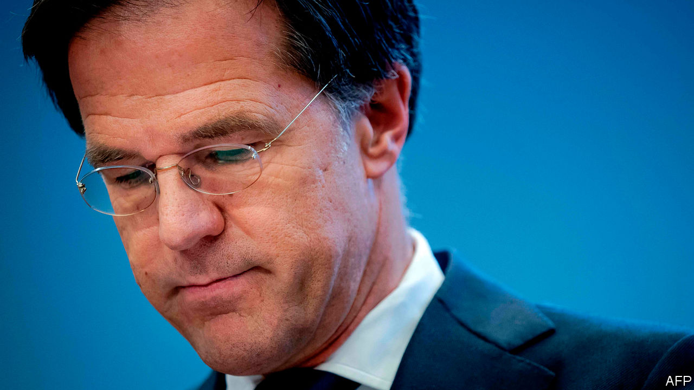

###### The fraud that wasn’t

# A benefits scandal sinks the Dutch government 

##### But the prime minister will doubtless return 

 

> Jan 21st 2021 


EVERY COUNTRY’S welfare state is a reflection of its soul. Take the Netherlands, an egalitarian country but also a deeply Calvinist and bureaucratic one. Dutch benefits are generous. Income inequality is among the lowest in the EU. But benefits are subject to complicated rules meant to exclude the undeserving. These can run amok. Over the past decade, systems meant to snoop out abuse of child-care benefits wrongly labelled more than 20,000 parents as fraudsters and drove many into penury. On January 15th Mark Rutte, the prime minister, and his cabinet resigned over the scandal. It may herald a modest shift to the left in Dutch social policy.


Child care in the Netherlands is private, but the tax authority gives parents subsidies to pay the fees, depending on income. After Mr Rutte and his centre-right Liberal (VVD) party took office in 2010, laws to fight benefit fraud were repeatedly sharpened, especially in 2013 after Bulgarian scammers were discovered collecting payments. The tax authority was given new powers to hunt cheats and encouraged to cover the cost with funds it seized.


Soon Dutch lawyers began getting complaints from parents who had not only had their benefits cut off but had been told to repay everything they had ever received. Those who did not repay fast were hit with fines. Without child care, many parents gave up their jobs. Some lost their homes. A disproportionate number had immigrant backgrounds. Parents had to prove they had applied correctly, but when they tried, the tax authority failed to respond.


“They would promise to look into it, and then you wouldn’t hear from them,” says Leigh Ann Janssen, a British-Dutch dual citizen who was a full-time student with a young daughter when her benefits were cut off in 2014. She and her husband, who is Turkish-Dutch, were ordered to pay back about €30,000 ($36,000). Because the authorities refused to provide evidence, parents could not appeal.


A report by the national ombudsman in 2017 criticised the tax authority for mistreating parents, yet the benefit stops continued. Parliamentary investigations got skimpy information from ministries, with large sections redacted. By late 2019 the government acknowledged wrongdoing and set aside money for compensation (estimated at €1.3bn), but almost no payments have been made. Last July the personal-data authority found that the tax service had used algorithms in which parents with dual nationality (such as Ms Janssen and her husband) were labelled fraud risks. That violated the constitution.


The final straw for the government was a parliamentary report in December that labelled the mistreatment of citizens an “unheard-of injustice”. “There were a few really nasty things: the ethnic profiling, blacklists and citizens labelled as fraudsters for no reason and financially ruined,” says Pieter Omtzigt, an MP who was instrumental in uncovering the scandal.


The cabinet’s resignation is in a sense an empty gesture: a general election had already been scheduled for March 17th. Mr Rutte is running again, and polls put support for his VVD at about 25%, far ahead of any other party. The only party leader to resign has been Labour’s Lodewijk Asscher, who served as deputy PM while the anti-fraud policies were developed. It seems unlikely that Mr Rutte, who led the Netherlands throughout the benefits scandal, will face any political reckoning for it.


However, the VVD says it is willing to discuss proposals from the Labour and GreenLeft parties for direct government financing of child care. Mr Rutte has lately moved away from small-government orthodoxy, saying the pandemic has shown the public’s desire for a “strong state”.


The parents are at last seeing some justice. The government has promised each family at least €30,000. Incredibly, the tax authority at first said it would claw back much of that, but on January 18th the government abruptly cancelled the parents’ debts. Even that was frustrating to some. “All these years we have heard it is too complex, nothing can be done,” says Eva González Pérez, a lawyer who represents 40 of the families. “Now suddenly it can?” ■

