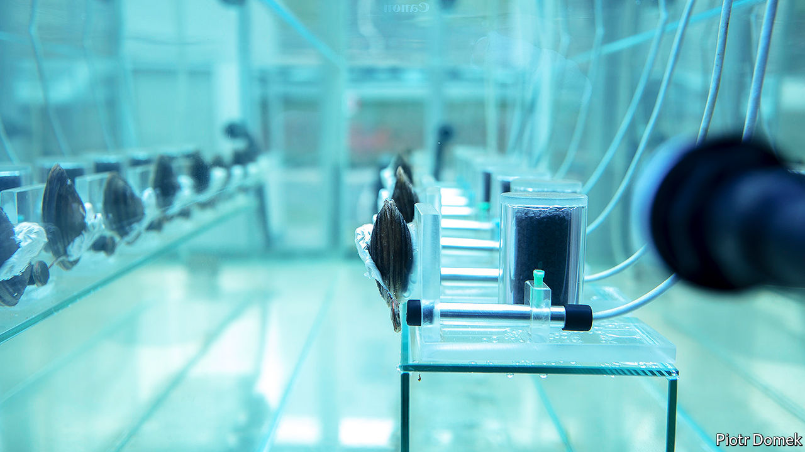

###### Invaluable bivalves

# How clams help keep Polish water clean 

##### The molluscs are remarkably good at detecting pollution 

 

> Jan 23rd 2021 


A WATER PUMP known as Gruba Kaska (Fat Kathy) is a local landmark in Warsaw. To get there, you must walk 300 metres through a slimy tunnel under the Vistula river. There you will find eight clams hooked up to computers. They are monitoring the city’s drinking water.


The system is nifty. When the molluscs encounter heavy metals, pesticides or other pollutants, they close their shells, explains Piotr Domek of Adam Mickiewicz University in Poznan, who has worked on the project for three decades. To create a natural early-warning system, Mr Domek and his colleagues collect the clams from rivers or reservoirs, and attach a coil and a magnet to their shells. Computers register whether their shells are open or closed by detecting changes in the magnetic field.


“In the case of a terrorist attack, an ecological disaster or another contamination of the water supply, the clams will close,” says Mr Domek. This, in turn, will automatically cut off the water supply. The clams, he thinks, are life-savers. “If contaminated water goes straight to our taps, we will get poisoned,” he says in “Fat Kathy”, a short film that celebrates the invaluable bivalves.


Today 50 Polish waterworks (and one in Russia) use clams in this way. There are drawbacks. Clams, as the proverb reminds us, cannot talk. So they never reveal which toxin is causing them to clam up. Also, it seems that they may be less good at detecting dangerous pharmaceuticals. Still, Piotr Klimaszyk, who leads the team that developed the system, thinks it ought to be used everywhere. It is cheap: all you need is clams and computers. “It allows you to check the water quality hour by hour, minute by minute, so why not?”


Mr Domek is now so fond of clams that he tries to deter people from eating them. He mischievously suggests that they “have a negative effect on [sexual] potency”. Julia Pelka, the film-maker behind “Fat Kathy”, has also stopped gobbling them. We use them “to protect ourselves from ourselves”, she says.

