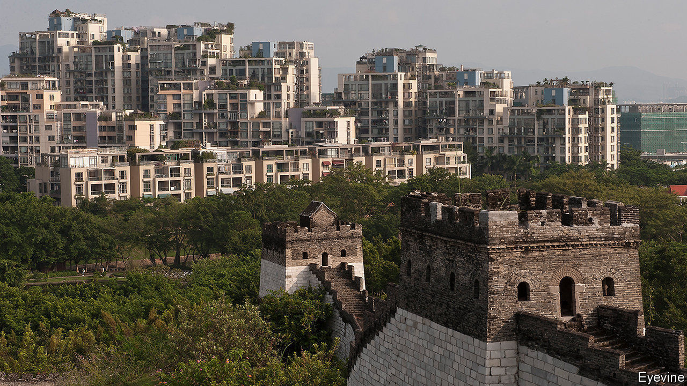
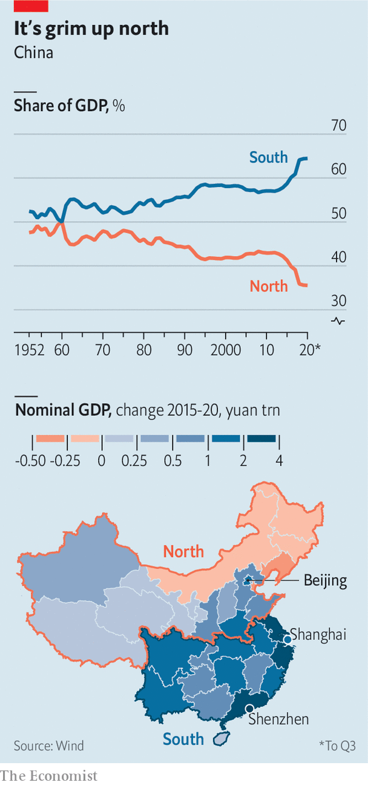

###### Southern tiger

# China’s regional gap is worsening 

##### While entrepreneurship flourishes in the south, a rust-belt malaise deepens in the north 

 

> Jan 23rd 2021 


“DON’T INVEST beyond Shanhaiguan” is a popular quip in China, referring to a pass in the Great Wall that leads to the north-eastern rust belt. Online pundits have updated the maxim to “don’t invest outside the Southern Song”, a dynasty that fell almost 750 years ago whose territory was roughly the same as China’s southern half today. The joke has a nub of truth: China’s southern provinces are outperforming the north in nearly every economic dimension.


Figures released on January 18th showed that China’s GDP grew by 2.3% in 2020. The recovery was unbalanced, with factories at full throttle but consumption subdued. That should improve after the pandemic ends. The north-south imbalance, though, is likely to outlast it.

 


The south’s share of GDP has risen to a peak of 65%, from 59% in 2015. Some of that is down to luck. The north, home to China’s largest coal mines and oil reserves, was caught out by falls in commodity prices after 2013. It also boasts big industrial firms; China’s shift from construction-fuelled growth towards consumption and services has hurt.


Northern officials have tried harder to goose up growth, to the region’s detriment. In 2013, the peak of China’s building frenzy, investment in assets such as roads and factories reached an eye-watering 66% of GDP in the north versus 51% in the south. Southern officials have been more hands-off. China’s two most dynamic regions are in the south, anchored by Shanghai and Shenzhen. The south also makes the smartphones and sofas lapped up globally. Its foreign-trade surplus last year was about 7% of GDP. The north ran a 2% deficit.


To add insult to injury, the north has also been disrupted more by sporadic covid-19 outbreaks. Geography is part of the problem: a harsher winter makes the virus more transmissible. The north is stuck out in the cold.

