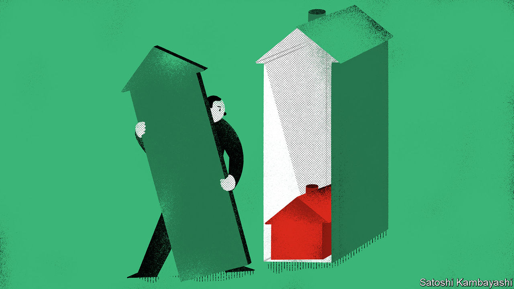

###### University challenge

# Property investment: some hard truths 

##### New research suggests returns are not what they are cracked up to be 

 

> Jan 21st 2021 


BRITS, IT IS said, have a penchant for nostalgia. So take a trip down memory lane to the autumn of 1997, a happier time. The British economy appeared to be gathering speed. The Bank of England raised interest rates to 7.25%. But how resilient was the consumer? A drop in retail sales could be put down to Princess Diana’s funeral. The bigger puzzle was the property market. House-price inflation on the Halifax measure was in the mid-single digits. The Nationwide index had it rising into the teens. It was unclear which of these gauges was right.


Trying to work out whether the economy is strong or very strong is a nice problem to have. But this episode from the 1990s highlights something else. Measuring house prices is trickier than measuring the price of shares or a basket of consumer goods. Getting a good handle on total returns is harder still. Long-run ground-level data on rental income and maintenance costs are rather scarce.


A new paper* deals with these difficulties by drawing on the archives of the endowment funds of four Oxbridge colleges, which for centuries have been big investors in property. Two of them (Trinity College, Cambridge, and Christ Church, Oxford) were founded by Henry VIII, who conferred a portfolio of land on both. The study finds that after-cost returns to housing were considerably lower in the 20th century than previously thought. Property is a far less attractive investment than you might expect.


Only a small fraction of houses change hands each year. They may not be representative of the overall stock, and thus of changes in housing wealth. The average sales price might rise from one period to the next simply because more houses that are bigger, of better quality or in nicer locations are being bought and sold this year than last year. This is why most closely watched gauges, including the Halifax and Nationwide indices, adjust transactions for characteristics such as the number of bedrooms. Still, some quality improvements (or degradations) will evade even the most careful statistician.


The Oxbridge archives are rich enough to allow for the construction of something like an ideal property index, however. The study’s authors dredged for detailed data on sales and purchases (from transaction ledgers) and on rents and maintenance costs (from rent books) over the period from 1901 to 1983. To keep quality constant, they tracked the growth in rents on the same properties from one year to the next. They then linked these annual rates in a chain to create a quality-adjusted long-run series of income growth. This series has the added advantage of being based on cashflows, rather than the rent required by the lease, which is not always paid. (Rent holidays were a thing before this pandemic.) Alongside this, the authors put together a long-run series of gross yields by matching the transaction data with the income figures. They arrive at a net yield by subtracting maintenance costs.


The authors used these ingredients to derive a consistent measure of long-run returns. The results are fascinating. The net annual real return on residential property was 2.3%. That is surprisingly low. By comparison “The Rate of Return on Everything”, an oft-cited study published in the Quarterly Journal of Economics in 2019, puts the net returns on British housing at 4.7% over the same period.


What explains the discrepancy? Perhaps the Oxbridge sample is not representative of the returns that could have been achieved. Put bluntly, the colleges might have had duff portfolios (or especially bad tenants). The evidence on whether college endowments are good investors is mixed. But the study is clear that portfolios were well diversified by region and type, and were managed with a strong eye to long-term returns. Another explanation is that the bottom-up Oxbridge-based study is closer to the truth, because it has a better handle on the more distant past. Top-down housing data in Britain before around 1970 adjusts for neither mix nor quality. What looks like price appreciation or rising real rents may simply be quality improvement.


Look ahead, and there are big challenges for property investors. The pandemic will change how people live and work, and thus where they live and work. Understanding the past is scarcely any easier. In the current circumstances it is not only Britons who might be wallowing in nostalgia. But it would be a mistake to exaggerate how good the past was.


